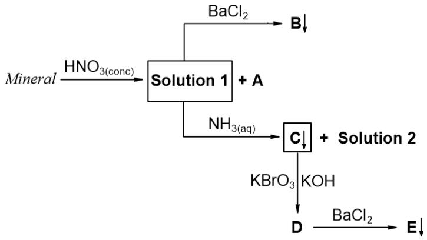
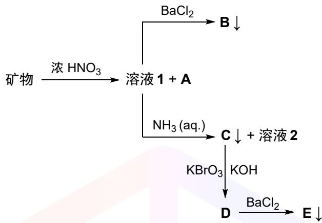

::: {.callout-note appearance="simple" icon=false}
**Found an issue?** Post the problem number (**P2.02**) and the **step** on Discord.
[💬 Discuss on Discord →](https://discord.gg/CHANGE-ME){.discord-cta}
:::

The philosopher Avicenna took a vial with a strange brownish-bronze mineral inside. Avicenna performed many reactions with this mineral and created a scheme to help to clearly identify the composition of the mineral.

Avicenna dissolved $1.00\ \mathrm{g}$ of the mineral in an excess of concentrated nitric acid and observed a release of a brown gas **A** with a volume of $1.65\ \mathrm{L}$ under standard conditions $(0\,°\mathrm{C},\ 1\,\mathrm{atm})$ . The solution formed (**Solution 1**) was divided into two equal parts for further analysis. To the first half of **Solution 1**, he added an excess of $\mathbf{BaCl}_{2}$ , which led to $0.929\ \mathrm{g}$ of white precipitate **B**. He added excess aqueous

ammonia solution to the second half of **Solution 1**, causing the formation of brown precipitate **C** and deep-blue **Solution 2**. **C** was filtered off, dissolved in an alkaline solution of ${\mathrm{KBrO}}_{3}$ , giving a purple solution of compound **D**. **D** reacted with $\mathrm{BaCl}_{2}$ to form $0.256\ \mathrm{g}$ of the red precipitate **E**.

1. **Determine** the possible elemental composition of the mineral.

> **Solution (Q1 — qualitative elements from the reaction scheme).**
>
> Each observation pins a specific element:
>
> | Observation | Diagnostic | Element |
> |---|---|---|
> | Brown gas A on dissolution in conc. $\mathrm{HNO_3}$ | $\mathrm{NO_2}$ from $\mathrm{HNO_3}$ reduction | (oxidant is HNO₃; does not identify mineral elements, but fixes the redox budget) |
> | White ppt B with $\mathrm{BaCl_2}$ in acidic solution | $\mathrm{BaSO_4}$ (only common white Ba-ppt insoluble in $\mathrm{HNO_3}$) | **S** (as sulfide, oxidised by $\mathrm{HNO_3}$ to $\mathrm{SO_4^{2-}}$) |
> | Deep-blue Solution 2 with excess aq. $\mathrm{NH_3}$ | $[\mathrm{Cu(NH_3)_4}]^{2+}$ | **Cu** |
> | Brown ppt C with aq. $\mathrm{NH_3}$; dissolves in alkaline $\mathrm{KBrO_3}$ giving a **purple** solution; the purple anion forms a **red** Ba-salt | $\mathrm{C}=\mathrm{Fe(OH)_3}$; alkaline $\mathrm{BrO_3^-}$ oxidises $\mathrm{Fe^{III}}\to\mathrm{FeO_4^{2-}}$ (purple ferrate); $\mathrm{Ba^{2+}}+\mathrm{FeO_4^{2-}}\to\mathrm{BaFeO_4}\!\downarrow$ (red) | **Fe** |
>
> $$\boxed{\text{Mineral elements: } \mathbf{Cu},\ \mathbf{Fe},\ \mathbf{S}.}$$
>
> (Permanganate $\mathrm{MnO_4^-}$ is also purple, but $\mathrm{BaMnO_4}$ is **green** and $\mathrm{Ba(MnO_4)_2}$ is dark red-violet — only $\mathrm{BaFeO_4}$ is the classical **red** Ba-salt precipitate here, and $\mathrm{Mn(OH)_2}$ would not be described as a **brown** ammonia precipitate. So the purple species is ferrate, not permanganate.)

2. **Determine** the molecular formula of the mineral and compounds **A**–**E**. **Show** your calculations where necessary.

> **Solution (Q2 — stoichiometry fixes Cu₅FeS₄ and identifies A–E).**
>
> All amounts below are computed from the **full** 1.00 g sample (each half-portion is doubled).
>
> **Sulfur (from B = $\mathrm{BaSO_4}$, $M = 233.39$ g mol⁻¹):**
> $$n(\mathrm{S}) = 2\cdot\frac{0.929}{233.39} = 2\cdot 3.981\times 10^{-3} = \mathbf{7.96\times 10^{-3}\ mol}.$$
>
> **Iron (from E = $\mathrm{BaFeO_4}$, $M = 257.18$ g mol⁻¹):**
> $$n(\mathrm{Fe}) = 2\cdot\frac{0.256}{257.18} = 2\cdot 9.95\times 10^{-4} = \mathbf{1.99\times 10^{-3}\ mol}.$$
>
> **Copper (by mass balance):**
> $$m(\mathrm{Cu}) = 1.000 - n(\mathrm{S})\,M_\mathrm{S} - n(\mathrm{Fe})\,M_\mathrm{Fe} = 1.000 - 0.2553 - 0.1112 = 0.634\ \mathrm{g},$$
> $$n(\mathrm{Cu}) = \frac{0.634}{63.55} = \mathbf{9.98\times 10^{-3}\ mol}.$$
>
> **Molar ratio.**
> $$\mathrm{Cu}:\mathrm{Fe}:\mathrm{S} = 9.98 : 1.99 : 7.96 = 5.01 : 1.00 : 4.00.$$
>
> $$\boxed{\text{Mineral} = \mathbf{Cu_5FeS_4}\ (\text{bornite, ``peacock ore''}),\quad M = 501.84\ \mathrm{g\,mol^{-1}}.}$$
>
> Indeed $n_\text{mineral} = 1.00/501.84 = 1.993\times 10^{-3}$ mol, consistent with the Fe balance (one Fe per formula unit).
>
> **Cross-check with gas A.** Brown gas from concentrated $\mathrm{HNO_3}$ is $\mathbf{A=NO_2}$. In bornite the formal oxidation states are $(\mathrm{Cu^{I}})_5(\mathrm{Fe^{III}})(\mathrm{S^{-II}})_4$ (charge check: $5{+}3{-}8 = 0\checkmark$). Full oxidation to the products observed gives
> $$5\,\mathrm{Cu^{I}}\!\to\!5\,\mathrm{Cu^{II}}\ (5\,\mathrm{e^-}),\quad \mathrm{Fe^{III}}\to\mathrm{Fe^{III}}\ (0),\quad 4\,\mathrm{S^{-II}}\to 4\,\mathrm{S^{VI}}\ (32\,\mathrm{e^-}),$$
> i.e. **37 e⁻ per mineral unit**; each $\mathrm{NO_2}$ accepts $1\,\mathrm{e^-}$, so expected $n(\mathrm{NO_2}) = 37\,n_\text{mineral} = 7.37\times 10^{-2}$ mol. Observed: $n(\mathrm{NO_2}) = 1.65/22.414 = 7.36\times 10^{-2}$ mol. **Match** to 0.1 %.
>
> **Identification of A–E.**
>
> | Label | Formula | Colour / state |
> |---|---|---|
> | **A** | $\mathrm{NO_2}$ | brown gas |
> | **B** | $\mathrm{BaSO_4}$ | white ppt |
> | **C** | $\mathrm{Fe(OH)_3}$ | brown ppt |
> | **D** | $\mathrm{K_2FeO_4}$ (ferrate(VI), $\mathrm{FeO_4^{2-}}$) | purple solution |
> | **E** | $\mathrm{BaFeO_4}$ | red ppt |
> | Solution 2 | $[\mathrm{Cu(NH_3)_4}](\mathrm{NO_3})_2$ | deep-blue |

3. **Write** all the reaction equations described in the scheme.

> **Solution (Q3 — balanced equations).**
>
> **(i) Dissolution of bornite in hot conc. $\mathrm{HNO_3}$ (37 e⁻ per formula unit):**
> $$\mathrm{Cu_5FeS_4} + 50\,\mathrm{HNO_3} \longrightarrow 5\,\mathrm{Cu(NO_3)_2} + \mathrm{Fe(NO_3)_3} + 4\,\mathrm{H_2SO_4} + 37\,\mathrm{NO_2}\!\uparrow + 21\,\mathrm{H_2O}.$$
> Atom / charge check: Cu 5, Fe 1, S 4, N $50=10+3+37$ ✓; H $50 = 8 + 42$ ✓; O $150 = 30+9+16+74+21$ ✓.
>
> **(ii) Sulfate test (first half of Solution 1):**
> $$\mathrm{H_2SO_4} + \mathrm{BaCl_2} \longrightarrow \mathrm{BaSO_4}\!\downarrow + 2\,\mathrm{HCl}.$$
>
> **(iii) Ammonia addition to the second half of Solution 1 (simultaneously precipitates $\mathrm{Fe(OH)_3}$ and complexes $\mathrm{Cu^{2+}}$):**
> $$\mathrm{Fe(NO_3)_3} + 3\,\mathrm{NH_3\cdot H_2O} \longrightarrow \mathrm{Fe(OH)_3}\!\downarrow + 3\,\mathrm{NH_4NO_3},$$
> $$\mathrm{Cu(NO_3)_2} + 4\,\mathrm{NH_3\cdot H_2O} \longrightarrow [\mathrm{Cu(NH_3)_4}](\mathrm{NO_3})_2 + 4\,\mathrm{H_2O}.$$
>
> **(iv) Oxidation of $\mathrm{Fe(OH)_3}$ to ferrate(VI) by alkaline $\mathrm{KBrO_3}$** (Fe: $+3\!\to\!+6$, 3 e⁻; Br: $+5\!\to\!-1$, 6 e⁻; so 2 Fe per 1 Br):
> $$2\,\mathrm{Fe(OH)_3} + \mathrm{KBrO_3} + 4\,\mathrm{KOH} \longrightarrow 2\,\mathrm{K_2FeO_4} + \mathrm{KBr} + 5\,\mathrm{H_2O}.$$
> Check: K $5=4+1$ ✓, H $10=10$ ✓, O $13=8+5$ ✓.
>
> **(v) Ba²⁺ test on the purple ferrate solution:**
> $$\mathrm{K_2FeO_4} + \mathrm{BaCl_2} \longrightarrow \mathrm{BaFeO_4}\!\downarrow + 2\,\mathrm{KCl}.$$

---

## 中文版 / Chinese translation
## 第2题 伊本·西纳

译者注：阿维森纳 (Avicenna)，即伊本·西纳，是波斯著名哲学家、医学家。

哲学家伊本·西纳拿到了一个装着奇特青铜褐色矿物样品的小瓶。他用这种矿物做了一些实验，如下图所示，用于确定该矿物的组成。

伊本·西纳将 $1.00\ \mathrm{g}$ 矿物样品溶解在过量浓硝酸中，观察到放出一种棕色气体 A，标准状况 $(0\,°\mathrm{C},\ 1\,\mathrm{atm})$ 下体积为 $1.65\ \mathrm{L}$ 。所得溶液 1 均分为两份，以供后续分析。向第一份溶液中加入过量 $\mathrm{BaCl}_{2}$ ，生成了 $0.929\ \mathrm{g}$ 白色沉淀B。向第二份溶液中加入过量氨水，形成了棕色沉淀C和深蓝色溶液2。将过滤出的C溶解于 $\mathrm{KBrO}_{3}$ 的碱性溶液中，可得到含有紫色化合物D的溶液。D与 $\mathrm{BaCl}_{2}$ 反应，生成 $0.256\ \mathrm{g}$ 的红色沉淀E。

2-1 推断该矿物可能由哪些元素组成。

2-2 推断该矿物以及化合物A–E的化学式。必要时写出计算过程。

2-3 写出该方案中的全部反应方程式。

---

## 教学点评 / 解题分析

又是一道苏联风格的无机推断题：突破口清晰，但"第三元素"的识别设置了一道极具迷惑性的思维陷阱，稍不留神便会走上死胡同。

**前两元素——送分题。** 两条线索几乎一眼可见：

- 样品溶于浓硝酸后，第一份溶液与 $\mathrm{BaCl}_{2}$ 生成**白色**沉淀 B——这是 $\mathrm{BaSO}_{4}$ 的经典信号，指向**硫元素**（矿物中以硫化物形式存在）；
- 第二份溶液加入过量氨水后得到**深蓝色溶液 2**——$[\mathrm{Cu}(\mathrm{NH}_{3})_{4}]^{2+}$ 是无机化学最标志性的深蓝色配离子之一，指向**铜元素**。

至此，矿物含 $\mathrm{Cu}$ 与 $\mathrm{S}$ 已无悬念。

**第三元素——陷阱重重。** 真正考验思维严谨性的在这里。加入氨水时同时生成了**棕色沉淀 C**，这一条件与 $\mathrm{Mn}$ 的化学行为看似高度吻合：

- $\mathrm{Mn}^{2+}$ 在氨水中可先沉淀为 $\mathrm{Mn}(\mathrm{OH})_{2}$，后被空气氧化为棕色 $\mathrm{MnO}_{2}$ ✓
- $\mathrm{MnO}_{2}$ 在碱性氧化剂 $\mathrm{KBrO}_{3}$ 作用下可进一步氧化为高价态锰酸盐 ✓

看上去一切都对——但仔细核验颜色信息就会发现**两处硬伤**：

1. $\mathrm{MnO}_{2}$ 在**碱性**条件下被 $\mathrm{KBrO}_{3}$ 氧化的产物是锰酸根 $\mathrm{MnO}_{4}^{2-}$，它是**绿色**的，而题目明确指出 D 为**紫色**；
2. 即便勉强认为氧化继续推进到 $\mathrm{MnO}_{4}^{-}$（确为紫色），$\mathrm{Ba}(\mathrm{MnO}_{4})_{2}$ 也并非**红色**沉淀，与题目中"D + $\mathrm{BaCl}_{2}$ → **红色**沉淀 E"不符。

这就是此题最考验人的地方：是否愿意在"大部分信息都对、只差颜色一点点"的诱惑下将就收场，还是**推翻重来，另起炉灶**。竞赛选手的素养恰恰体现在这里——**颜色信息是硬约束，不容妥协**。

**突破——高铁酸根。** 推翻锰假设后，紫色 + 与 $\mathrm{Ba}^{2+}$ 生成红色沉淀这两条线索共同指向**高铁酸根 $\mathrm{FeO}_{4}^{2-}$**：

- $\mathrm{FeO}_{4}^{2-}$ 存在显著的 LMCT（配体–金属电荷转移）吸收带，溶液呈深紫色；
- 其钡盐 $\mathrm{BaFeO}_{4}$ 恰为**红色**难溶沉淀。

这两条都属于**冷门知识**：多数人或能从 LMCT 的角度猜到紫色，但 $\mathrm{BaFeO}_{4}$ 颜色几乎无人记得。于是矿物含有 $\mathrm{Cu}$、$\mathrm{Fe}$、$\mathrm{S}$ 三种元素——**斑铜矿 $\mathrm{Cu}_{5}\mathrm{FeS}_{4}$** 呼之欲出。

若题目能提供一些**定量信息**（例如棕色沉淀 C 烘干后的质量）来早一步坐实第三元素为 $\mathrm{Fe}$，解题门槛会显著降低；但这也正是本题风格使然——苏联题的精髓就是让定性颜色信息先扛起主要判决权，定量数据仅用于收官。

**定量收官。** 三元素锁定后，用两次沉淀质量反推物质的量：

$$n(\mathrm{S}) = 2 \times \frac{0.929}{233.39} = 7.96 \times 10^{-3}\ \mathrm{mol}$$

$$n(\mathrm{Fe}) = 2 \times \frac{0.256}{257.18} = 1.99 \times 10^{-3}\ \mathrm{mol}$$

> **Revision note:** Revised by Codex on 2026-04-30. Tracked in `CODEX_REVISION_LOG_2026-04-30.md`; pre-Codex PDF baseline archived in `codex_revision_baselines/2026-04-30/`.
>
铜由质量平衡给出 $n(\mathrm{Cu}) \approx 9.98 \times 10^{-3}\ \mathrm{mol}$，从而得 $\mathrm{Cu}:\mathrm{Fe}:\mathrm{S} = 5:1:4$，矿物化学式 $\mathbf{Cu_{5}FeS_{4}}$。

最后用气体 A（$\mathrm{NO}_{2}$）的体积做独立交叉验证：斑铜矿中可采用形式氧化态 $(\mathrm{Cu}^{I})_{5}\mathrm{Fe}^{III}(\mathrm{S}^{-II})_{4}$。浓硝酸氧化时，$5\mathrm{Cu}^{I}\!\to\!5\mathrm{Cu}^{II}$ 失去 $5$ 个电子，$\mathrm{Fe}^{III}$ 不变，$4\mathrm{S}^{-II}\!\to\!4\mathrm{S}^{VI}$ 失去 $32$ 个电子，合计每个化学式单元失去 $37$ 个电子。每个 $\mathrm{NO}_{2}$ 对应硝酸得 $1$ 个电子，故 $n(\mathrm{NO}_{2}) = 37 \times 1.99 \times 10^{-3} = 7.37 \times 10^{-2}\ \mathrm{mol}$，与 $1.65/22.414 = 7.36 \times 10^{-2}\ \mathrm{mol}$ 吻合至千分之一——判决性证据。

**经验总结。**

1. **颜色是硬约束**——遇到"大部分信息对、只差颜色一点点"的诱惑时，切忌将就；推翻假设重来，往往比硬凑更快。
2. **冷门物种是苏联题的常客**——$[\mathrm{Li}(\mathrm{NH}_{3})_{4}]\mathrm{O}_{3}$（题 1）、$\mathrm{FeO}_{4}^{2-}/\mathrm{BaFeO}_{4}$（本题）、$\mathrm{K}[\mathrm{IO}_{2}\mathrm{F}_{4}]$（题 3）——平时读题多积累几类"反常"物种的颜色与溶解性是有效投资。
3. **定性锁定优先于定量**——定量数据是用来**确认**（或证伪）定性猜测的，而不是用来盲目反推元素的；元素一旦猜错，定量只会给出毫无物理意义的摩尔比。
4. **独立路径交叉验证**——此题的 $\mathrm{NO}_{2}$ 电子衡算与摩尔比推导完全独立，两者同时匹配才真正锁定 $\mathrm{Cu}_{5}\mathrm{FeS}_{4}$。

**难度评级：★★★★☆**——题眼不深，但第三元素的识别陷阱极具迷惑性；胜在定量数据较充分，最终能通过独立交叉验证将解答稳稳钉死。典型的苏联风格无机推断，中上难度。
