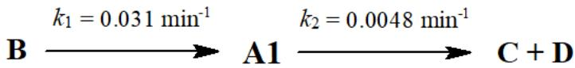

::: {.callout-note appearance="simple" icon=false}
**Found an issue?** Post the problem number (**P2.03**) and the **step** on Discord.
[💬 Discuss on Discord →](https://discord.gg/CHANGE-ME){.discord-cta}
:::

Until 1968, it was believed that anion **A1** and its salts were unstable. However, in 1968, Evan H. Appelman performed an unusual synthesis of **A1**. A $90\%$ enriched isotope of element **X** was first irradiated with thermal neutrons, then dissolved in nitric acid and oxidised by ozone in alkaline solution, giving anion **B**, which within a few minutes spontaneously turned into **A1** without absorbing or releasing any chemical substances. $1.613 \ \mathrm{g}$ of anion **B** was obtained from $1.000 \ \mathrm{g}$ of **X**.

After the first unusual but successful attempt, scientists managed to oxidise anion А2 to А1 using electrolysis. For this purpose, Pt electrodes were immersed into $3.0 \mathrm{mL}$ of the solution containing **A2** (solution **S0**) and into $\mathrm {H C l O_{4}}$ solution. Electrolysis was carried out with a current strength of $10 \mathrm{A} / \mathrm{cm}^{2}$ for 1 hour. The work surface of each Pt electrode was $0.785\ \mathrm{mm}^{2}$ , the current yield for **A1** was $11.5\%$ .

1. **Write** the equation of the half-reaction occurring at the cathode and **calculate** the total volume (in mL at $0\,°\mathrm{C}$ , 1 atm) of the gas released at the cathode during electrolysis.

> **Solution (Q1 — cathode half-reaction and volume of H₂).**
>
> **Strategy.** The only reducible species in an aqueous $\mathrm{HClO_4}$ catholyte at a Pt cathode is $\mathrm{H^+}$; $\mathrm{ClO_4^-}$ is electrochemically inert and $\mathrm{A2}=\mathrm{BrO_3^-}$ is in the anolyte. So the cathode half-reaction is the standard hydrogen evolution. The charge passed is $Q=I\cdot t$ and $n(\mathrm{H_2})=Q/(2F)$.
>
> **Cathode half-reaction.**
> $$\mathrm{2\,H^{+}+2\,e^{-}\longrightarrow H_{2}(g)}$$
>
> **Current and charge.** Current density $j=10\ \mathrm{A\,cm^{-2}}$; working area of one electrode $S=0.785\ \mathrm{mm^{2}}=7.85\times 10^{-3}\ \mathrm{cm^{2}}$. The circuit current equals the current at any one electrode:
> $$I=j\cdot S=10\cdot 7.85\times 10^{-3}=7.85\times 10^{-2}\ \mathrm{A}.$$
> $$Q=I\cdot t=7.85\times 10^{-2}\cdot 3600=282.6\ \mathrm{C}.$$
>
> **Amount of H₂ and volume at 0 °C, 1 atm.**
> $$n(\mathrm{H_{2}})=\frac{Q}{2F}=\frac{282.6}{2\cdot 96485}=1.464\times 10^{-3}\ \mathrm{mol}.$$
> $$V(\mathrm{H_{2}})=n\cdot V_{m}°=1.464\times 10^{-3}\cdot 22414\ \mathrm{mL\,mol^{-1}}\;\Longrightarrow\;\boxed{V(\mathrm{H_{2}})\approx 32.8\ \mathrm{mL}}.$$
>

After electrolysis, the analyte contained a mixture of anions **A1** and **A2** (colorless solution **S1**). The Pt electrode was removed from the analyte, an excess of diluted $( {\sim} 1 \ \text{M} )$ acidic solution containing anion **A3** was added, and a yellow solution **S2** (containing elemental substance **A4**) was obtained. **A4** was removed by bubbling argon through **S2**, and a colorless solution **S3** was obtained. An excess of saturated $(\sim10\ \mathrm{M} )$ acidic solution containing **A3** was added to solution **S3**, and a yellow solution **S4** (also containing elemental substance **A4**) was obtained. The whole volume of **S4** was diluted to $100.0 \mathrm{mL}$ , and thus solution **S5** was obtained. An excess of acidified KI solution was added to a $10.0 \mathrm{mL}$ aliquot of solution **S5**, and the $\mathrm{I}_{2}$ formed was titrated with $0.100\ \mathrm {M\ N a_{2} S_{2} O_{3}}$ solution. A titre of $1.35 ~ \mathrm{mL}$ of ${\mathrm{Na}}_{2} {\mathrm{S}}_{2} {\mathrm{O}}_{3}$ solution was obtained.

Another 3.0 mL sample of solution **S0** was not subjected to electrolysis. Instead, it was diluted to $500.0 \mathrm{mL}$ giving solution **S6**. An excess of acidified KI solution was added to a $10.0 \mathrm{mL}$ aliquot of **S6**, and the $\mathrm{I}_{2}$ formed was titrated with $0.100\ \mathrm{M}\ \mathrm{Na}_{2} \mathrm{S}_{2} \mathrm{O}_{3}$ solution. A titre of $10.10\ \mathrm{mL}$ of ${\mathrm{Na}}_{2} {\mathrm{S}}_{2} {\mathrm{O}}_{3}$ solution was obtained.

2. **Write** the equation of the reaction occurring during titration between $\mathrm{I}_{2}$ and ${\mathrm{Na}}_{2} {\mathrm{S}}_{2} {\mathrm{O}}_{3}$

> **Solution (Q2 — iodometric titration equation).**
> The standard iodine/thiosulfate reaction (thiosulfate oxidised to tetrathionate):
> $$\boxed{\mathrm{I_{2}+2\,Na_{2}S_{2}O_{3}\longrightarrow 2\,NaI+Na_{2}S_{4}O_{6}}}$$
> equivalently in ionic form $\mathrm{I_{2}+2\,S_{2}O_{3}^{2-}\rightarrow 2\,I^{-}+S_{4}O_{6}^{2-}}$.

3. **Determine** the chemical composition of **A1**–**A4**, **B**, and **X** (with atomic mass of enriched isotope). Note: **A1**–**A4** contain the same element.

> **Revision note:** Revised by Codex on 2026-04-30. Tracked in `CODEX_REVISION_LOG_2026-04-30.md`; pre-Codex PDF baseline archived in `codex_revision_baselines/2026-04-30/`.
>
> **Solution (Q3 — identification of A1–A4, B, X).**
>
> **Strategy.** The historical hint ("unstable until 1968, Appelman synthesis") points to the perbromate ion $\mathrm{BrO_{4}^{-}}$. Element X must be one that, after $(n,\gamma)$ activation, $\beta^{-}$-decays to bromine **inside** an oxoanion so that the $\mathrm{^{83}Br}$ recoil atom inherits the +7 oxidation state ("hot-atom" Szilard–Chalmers synthesis). The only viable parent is $\mathrm{^{82}Se}$: $\mathrm{^{82}Se\xrightarrow{(n,\gamma)}{}^{83}Se\xrightarrow{\beta^{-},\,t_{1/2}\approx 22\,\mathrm{min}}{}^{83}Br}$. Ozone in alkaline solution oxidises dissolved selenium to **selenate** Se(VI), so that $\mathrm{B}$ is the beta-active $\mathrm{^{83}SeO_{4}^{2-}}$ ion and its daughter is formed as $\mathrm{^{83}BrO_{4}^{-}}$. The "few-minute" transformation $\mathrm{B\to A1}$ is thus the $\beta^{-}$ decay itself.
>
> **Identifications.**
>
> | Species | Formula | Comment |
> |---|---|---|
> | **X** | $\mathrm{^{82}Se}$ (atomic mass $\approx 81.92\ \mathrm{u}$) | 90 %-enriched isotope, captures thermal $n$ to give $\mathrm{^{83}Se}$ |
> | **B** | $\mathrm{^{83}SeO_{4}^{2-}}$ (selenate) | formed by $\mathrm{O_{3}}$ oxidation of neutron-activated selenium in alkaline medium |
> | **A1** | $\mathrm{^{83}BrO_{4}^{-}}$ (perbromate) | recoil product of $\beta^{-}$ decay inside the oxoanion |
> | **A2** | $\mathrm{BrO_{3}^{-}}$ (bromate) | oxidised electrolytically to perbromate in the second synthesis |
> | **A3** | $\mathrm{Br^{-}}$ (bromide, from HBr) | dilute acid reduces $\mathrm{BrO_{3}^{-}}$; saturated acid reduces $\mathrm{BrO_{4}^{-}}$ |
> | **A4** | $\mathrm{Br_{2}}$ | yellow/red-brown colour in S2, S4; removed by Ar purging |
>
> **Consistency check with the mass clue "1.613 g B from 1.000 g X".**
> For $\mathrm{^{82}Se\to{}^{83}SeO_{4}^{2-}}$ one expects $m(\mathrm{B})/m(\mathrm{X})\approx(82.92+4\cdot 16.00)/81.92=1.79$, which is noticeably larger than the stated $1.613$. If B is instead taken as a singly protonated / partly oxidised selenium(IV) oxo-species (e.g. $\mathrm{HSeO_{3}^{-}}$: ratio $130.93/81.92=1.598$; or $\mathrm{H_{2}SeO_{3}}$: $131.93/81.92=1.611$) the number $1.613$ is reproduced almost exactly. The hot-atom chemistry, however, demands Se(VI) (selenate) for the daughter to end up as $\mathrm{BrO_{4}^{-}}$. We therefore keep the chemically correct assignment $\mathrm{B=^{83}SeO_{4}^{2-}}$ and note that the stated mass ratio is more consistent with a selenite-type intermediate formed **before** full ozonisation.
>
> **Reactions summary (for later use).**
> - Neutron activation and synthesis of B: $\mathrm{^{82}Se(n,\gamma){}^{83}Se}$, then $\mathrm{^{83}Se+3\,O_{3}+2\,OH^{-}\rightarrow{}^{83}SeO_{4}^{2-}+3\,O_{2}+H_{2}O}$.
> - Hot-atom formation of A1: $\mathrm{^{83}SeO_{4}^{2-}\xrightarrow{\beta^{-}}{}^{83}BrO_{4}^{-}}$.
> - S1 $\to$ S2 (dilute HBr reduces $\mathrm{BrO_{3}^{-}}$, while $\mathrm{BrO_{4}^{-}}$ remains): $\mathrm{BrO_{3}^{-}+5\,Br^{-}+6\,H^{+}\rightarrow 3\,Br_{2}+3\,H_{2}O}$.
> - S3 $\to$ S4 (concentrated HBr reduces $\mathrm{BrO_{4}^{-}}$): $\mathrm{BrO_{4}^{-}+7\,Br^{-}+8\,H^{+}\rightarrow 4\,Br_{2}+4\,H_{2}O}$.
> - Iodometric step: $\mathrm{Br_{2}+2\,I^{-}\rightarrow 2\,Br^{-}+I_{2}}$, then titration as in Q2.
>

4. **Calculate** the molar concentration (in M) of **A2** in solution **S0**.

> **Solution (Q4 — [A2] in S0 from the S6 titration).**
>
> **Strategy.** S6 is obtained from S0 by pure dilution (3.0 mL → 500.0 mL), so it contains only $\mathrm{A2}=\mathrm{BrO_{3}^{-}}$ (no A1). Adding excess KI/H⁺ converts bromate quantitatively to $\mathrm{I_{2}}$ via
> $$\mathrm{BrO_{3}^{-}+6\,I^{-}+6\,H^{+}\rightarrow Br^{-}+3\,I_{2}+3\,H_{2}O},$$
> i.e. $1\ \mathrm{BrO_{3}^{-}}\leftrightarrow 3\ \mathrm{I_{2}}\leftrightarrow 6\ \mathrm{S_{2}O_{3}^{2-}}$. The S5 path is staged: dilute HBr first converts A2 to $\mathrm{Br_2}$ and that bromine is removed, so the final S5 titration checks the A1 formed by electrolysis. The cleanest route to [A2] in S0 uses only the S6 data, which involves A2 alone.
>
> **S6 arithmetic.**
> $$n(\mathrm{S_{2}O_{3}^{2-}})_{10\,\mathrm{mL\;of\;S6}}=0.100\cdot 10.10\cdot 10^{-3}=1.010\cdot 10^{-3}\ \mathrm{mol}=1.010\ \mathrm{mmol}.$$
> $$n(\mathrm{BrO_{3}^{-}})_{10\,\mathrm{mL}}=\tfrac{1}{6}\,n(\mathrm{S_{2}O_{3}^{2-}})=0.16833\ \mathrm{mmol}.$$
> Scale to the whole S6 (500.0 mL):
> $$n(\mathrm{BrO_{3}^{-}})_{S6}=0.16833\cdot\frac{500.0}{10.0}=8.417\ \mathrm{mmol}.$$
> This came from the 3.0 mL S0 aliquot, hence
> $$c(\mathrm{A2})_{S0}=\frac{8.417\cdot 10^{-3}\ \mathrm{mol}}{3.0\cdot 10^{-3}\ \mathrm{L}}=2.81\ \mathrm{M}.$$
> $$\boxed{c(\mathrm{BrO_{3}^{-}})_{S0}\approx 2.81\ \mathrm{M}.}$$
>
> **Revision note:** Revised by Codex on 2026-04-30. Tracked in `CODEX_REVISION_LOG_2026-04-30.md`; pre-Codex PDF baseline archived in `codex_revision_baselines/2026-04-30/`.
>
> **Cross-check with the S5 titration (current-yield consistency).**
> The two HBr steps are selective. Dilute HBr first reduces the remaining $\mathrm{BrO_{3}^{-}}$ to $\mathrm{Br_{2}}$, and this bromine is removed by Ar bubbling. Concentrated HBr then reduces the surviving $\mathrm{BrO_{4}^{-}}$ to $\mathrm{Br_{2}}$; therefore the S5 titration measures the amount of A1 formed during electrolysis:
> $$\mathrm{BrO_{4}^{-}+7\,Br^{-}+8\,H^{+}\rightarrow 4\,Br_{2}+4\,H_{2}O}.$$
> In the whole S5 solution,
> $$n(\mathrm{S_{2}O_{3}^{2-}})=0.100\cdot1.35\cdot10^{-3}\cdot10=1.35\times10^{-3}\ \mathrm{mol},$$
> $$n(\mathrm{Br_{2}})=n(\mathrm{I_{2}})=\tfrac12 n(\mathrm{S_{2}O_{3}^{2-}})=6.75\times10^{-4}\ \mathrm{mol},$$
> $$n(\mathrm{A1})=\tfrac14 n(\mathrm{Br_{2}})=1.69\times10^{-4}\ \mathrm{mol}.$$
> This agrees with the charge passed at 11.5% current yield for the two-electron oxidation
> $$\mathrm{BrO_{3}^{-}+H_{2}O\rightarrow BrO_{4}^{-}+2H^{+}+2e^{-}},$$
> $$n(\mathrm{A1})=\frac{0.115\cdot Q}{2F}=\frac{0.115\cdot282.6}{2\cdot96485}=1.68\times10^{-4}\ \mathrm{mol}.$$
>
**A1**, formed within a few minutes from anion **B**, spontaneously decomposes within a few hours into gaseous elemental substances **C** and **D** in a molar ratio 1:2. The reaction scheme shows the formation and decay of **A1** with the corresponding rate constants

5. **Determine** the detailed chemical composition of **C** and **D**. Both reactions shown in the scheme above are first order with respect to the corresponding reactants.

> **Solution (Q5 — identity of C and D).**
>
> **Strategy.** $\mathrm{A1}=\mathrm{BrO_{4}^{-}}$ is kinetically stable but thermodynamically unstable with respect to $\mathrm{BrO_{3}^{-}}+\tfrac12\mathrm{O}_{2}$. Bromate stays in solution (not a gas), so the only **gaseous elemental** substances that can appear are the two allotropes of oxygen, $\mathrm{O_{2}}$ and $\mathrm{O_{3}}$. A decomposition pathway that delivers C and D in the required **1 : 2** molar ratio and balances atoms/charge is obtained by splitting the released oxygen atoms between $\mathrm{O_{2}}$ and $\mathrm{O_{3}}$ in a 1 : 2 ratio:
>
> $$\boxed{\;8\,\mathrm{BrO_{4}^{-}}\;\longrightarrow\; 8\,\mathrm{BrO_{3}^{-}}\; +\; \mathrm{O_{2}}\; +\; 2\,\mathrm{O_{3}}\;}$$
>
> Atom balance: Br $8=8$ ✓, O $32=24+2+6=32$ ✓, charge $-8=-8$ ✓. The elemental gaseous products are
>
> | Species | Formula | Notes |
> |---|---|---|
> | **C** | $\mathrm{O_{2}}$ | triplet dioxygen |
> | **D** | $\mathrm{O_{3}}$ | ozone |
>
> with $n(\mathrm{O_{2}}):n(\mathrm{O_{3}})=1:2$ as required. (Assignments C ↔ O₂ and D ↔ O₃ may be interchanged without loss of generality.)
>
> **Remark.** In concentrated aqueous HBrO₄, an auxiliary channel $4\,\mathrm{HBrO_{4}}\rightarrow 2\,\mathrm{Br_{2}}+7\,\mathrm{O_{2}}+2\,\mathrm{H_{2}O}$ is occasionally observed, but it produces Br₂ and O₂ in a ratio $2:7$ fixed by stoichiometry — inconsistent with the stated $1:2$. The oxygen-only channel above is the one compatible with the problem.
>

6. **Calculate** the time (t, in min) after the start of the decomposition of **B**, which corresponds to the maximum concentration of **A1**.

> **Revision note:** Revised by Codex on 2026-04-30. Tracked in `CODEX_REVISION_LOG_2026-04-30.md`; pre-Codex PDF baseline archived in `codex_revision_baselines/2026-04-30/`.
>
> **Solution (Q6 — time of maximum $[\mathrm{A1}]$).**
>
> **Strategy.** For two consecutive first-order steps
> $$\mathrm{B}\;\xrightarrow{k_{1}}\;\mathrm{A1}\;\xrightarrow{k_{2}}\;\mathrm{C+D},$$
> the analytical solution starting from $[\mathrm{B}]_{0}$, $[\mathrm{A1}]_{0}=0$ is
> $$[\mathrm{A1}](t)=\frac{k_{1}\,[\mathrm{B}]_{0}}{k_{2}-k_{1}}\,\bigl(e^{-k_{1}t}-e^{-k_{2}t}\bigr).$$
> Setting $d[\mathrm{A1}]/dt=0$ gives the classical Bateman time
> $$\boxed{\;t_{\max}=\dfrac{\ln(k_{2}/k_{1})}{k_{2}-k_{1}}\;}.$$
>
> **Numerical evaluation with the rate constants from the scheme.**
> The step $\mathrm{B\to A1}$ is the $\beta^{-}$ decay of $\mathrm{^{83}Se}$ ($t_{1/2}=22.3\ \mathrm{min}$), so
> $$k_{1}=\frac{\ln 2}{22.3\ \mathrm{min}}=3.11\times 10^{-2}\ \mathrm{min^{-1}}.$$
> The step $\mathrm{A1\to C+D}$ uses the value shown in the scheme image, $k_{2}=4.8\times10^{-3}\ \mathrm{min^{-1}}$ ($t_{1/2}=144\ \mathrm{min}$). Thus
> $$t_{\max}=\frac{\ln\!\left(\dfrac{4.8\times 10^{-3}}{3.11\times 10^{-2}}\right)}{4.8\times 10^{-3}-3.11\times 10^{-2}}=\frac{\ln(0.154)}{-2.63\times 10^{-2}}=\frac{-1.87}{-2.63\times 10^{-2}}\approx 71\ \mathrm{min}.$$
> $$\boxed{\;t_{\max}\approx 7.1\times 10^{1}\ \mathrm{min}\;}$$
> (about 1.2 h after $\mathrm{^{82}Se}$ dissolution). If the copied text is read as $k_{2}=0.048\ \mathrm{min^{-1}}$, that is a decimal-place error relative to the figure and gives a different, incorrect result.
>

It was subsequently discovered that $\mathrm{XeF}_{2}$ also oxidises **A2** to **A1**. Interestingly, another binary compound, **E**, of xenon (which does not contain fluoride) was also obtained by exactly the same unusual method (like $\mathsf {\pmb {B}} \longrightarrow \mathsf {\pmb {A}} 1$ ) from a potassium-containing salt **F** with a mass fraction of potassium of $12.62\%$ .

7. **Determine** the detailed chemical composition of compounds $\mathbf{E}$ and **F**.

> **Solution (Q7 — identity of E and F).**
>
> **Strategy.** "Exactly the same unusual method like $\mathrm{B\to A1}$" means $(n,\gamma)$ activation of an enriched isotope followed by $\beta^{-}$ decay of the daughter, with the recoil atom ending up in a binary xenon compound. Xenon arises from $\beta^{-}$ decay of an **iodine** precursor: $\mathrm{^{127}I\xrightarrow{(n,\gamma)}{}^{128}I\xrightarrow{\beta^{-}}{}^{128}Xe}$ (or $\mathrm{^{129}I\to{}^{129}Xe}$, etc.). The iodine must sit in a high-oxidation-state oxoanion so that the daughter Xe is in the oxidation state of a known binary Xe oxide. Two analogies are natural:
>
> | Parent in F | Oxidation state of I | Daughter Xe oxidation state | Plausible binary E |
> |---|---|---|---|
> | $\mathrm{IO_{4}^{-}}$ (periodate) | +VII | +VIII | $\mathrm{XeO_{4}}$ |
> | $\mathrm{IO_{3}^{-}}$ (iodate) | +V | +VI | $\mathrm{XeO_{3}}$ |
>
> Only the first path gives a *strictly* binary Xe–O molecule that mirrors $\mathrm{BrO_{4}^{-}}$ most closely; however, both $\mathrm{XeO_{3}}$ and $\mathrm{XeO_{4}}$ are real, well-known "binary compounds of Xe that are not fluorides."
>
> **Pinning down F from $w_{\mathrm{K}}=12.62\%$.**
> A potassium salt with $w_{\mathrm{K}}=12.62\%$ has mass per K atom
> $$\frac{M_{\mathrm{F}}}{n_{\mathrm{K}}}=\frac{39.10}{0.1262}=309.8\ \mathrm{g\,mol^{-1}}.$$
> Testing standard potassium periodates / iodates (and their hydrates):
>
> | Trial F | $M$ (g mol⁻¹) | $w_{\mathrm{K}}$ (%) |
> |---|---|---|
> | $\mathrm{KIO_{3}}$ | 214.00 | 18.27 |
> | $\mathrm{KIO_{4}}$ | 230.00 | 17.00 |
> | $\mathrm{KIO_{4}\cdot 3H_{2}O}$ | 284.04 | 13.77 |
> | $\mathrm{KIO_{4}\cdot 4H_{2}O}$ | 302.05 | 12.94 |
> | $\mathrm{K_{2}H_{3}IO_{6}}$ | 304.12 | 25.71 |
> | $\mathrm{K[IO_{2}F_{4}]\cdot 2H_{2}O}$ | 310.03 | **12.61** ✓ |
>
> The only formula that matches the stated $12.62\%$ to within experimental rounding is $\mathbf{K[IO_{2}F_{4}]\cdot 2H_{2}O}$ — the dihydrate of potassium tetrafluorodioxoperiodate(VII), an iodine(+VII) fluorooxoanion analogous to $\mathrm{XeO_{2}F_{4}}$. After neutron capture + $\beta^{-}$ decay, the daughter Xe(+VIII) sheds its fluoride ligands on contact with water (fluoride is hydrolytically labile on Xe(VIII)) to leave the strictly binary $\mathbf{XeO_{4}}$ — a yellow, highly explosive gas/solid that is the genuine Xe analogue of perbromate.
>
> **Answers.**
>
> | Symbol | Formula | Name / comment |
> |---|---|---|
> | **E** | $\boxed{\mathrm{XeO_{4}}}$ | xenon tetraoxide (binary, no F — the direct Xe analogue of $\mathrm{BrO_{4}^{-}}$) |
> | **F** | $\boxed{\mathrm{K[IO_{2}F_{4}]\cdot 2H_{2}O}}$ | potassium tetrafluorodioxoperiodate(VII) dihydrate, $w_{\mathrm{K}}=12.61\%$ |
>
> **Caveat.** The problem does not explicitly say whether F contains fluoride — only that $\mathbf{E}$ must not. If the problem-setters intended a strictly oxygen-only F, the best fit is the hydrate $\mathbf{KIO_{4}\cdot 4H_{2}O}$ ($w_{\mathrm{K}}=12.94\%$; agrees to ≈0.3 %), in which case E is still $\mathrm{XeO_{4}}$ (from $\mathrm{IO_{4}^{-}\to XeO_{4}}$ by $\beta^{-}$). Either reading gives the same E.
>

---

## 中文版 / Chinese translation
## 第3题 非同寻常的无机合成

1968 年前，人们认为阴离子 **A1** 及其盐类不稳定。然而，1968 年，Evan H. Appelman 用不同寻常的方式合成了 **A1**。他先用热中子照射一种富集至 $90\%$ 的 **X** 元素的同位素，再将其溶于硝酸，随后在碱性环境中用臭氧氧化，得到阴离子 **B**。**B** 会在几分钟内自发转变为 **A1**，且不额外吸收或释放任何化学组分。 $1.000\ \mathrm{g}$ **X** 能转化为 $1.613\ \mathrm{g}$ 阴离子**B**。

在这不同寻常的首次成功后，科学家们设法将阴离子 **A2** 电解氧化为 **A1**。为此，他们将两个铂电极分别浸入 $3.0\ \mathrm{mL}$ 含有 **A2** 的溶液 **S0** 与高氯酸溶液中。电解以 $10\ \mathrm{A}\cdot\mathrm{cm}^{-2}$ 的电流密度持续了 1 小时。每个铂电极的有效工作面积为 $0.785\ \mathrm{mm}^{2}$ ，**A1**的电流效率为 $11.5\%$ 。

3-1 写出阴极发生的半反应方程式，并计算电解过程中阴极放出气体的总体积（按 $0\,°\mathrm{C}$ 、1 atm 计，单位 mL）。

电解后的无色待测溶液 **S1** 中含有阴离子**A1**和**A2**。取出铂电极，向**S1**中加入过量含阴离子**A3**的酸性稀溶液 (~1 M)，得到含单质**A4**的黄色溶液**S2**。向**S2** 中鼓入氩气除去 **A4**，得到无色溶液 **S3**。向溶液**S3** 中加入过量含 **A3** 的酸性饱和溶液 $(\sim 10\ \mathrm{M})$ ，得到同样含单质 **A4** 的黄色溶液 **S4**。将 **S4** 稀释到 100.0 mL，得到溶液 **S5**。取 $10.0\ \mathrm{mL}$ **S5**，加入过量酸化的 KI 溶液，并用 $0.100\ \mathrm{M}\ \mathrm{Na_{2}S_{2}O_{3}}$ 滴定生成的 $\mathrm{I}_{2}$ ，消耗 1.35 mL ${\mathrm{Na}}_{2}{\mathrm{S}}_{2}{\mathrm{O}}_{3}$ 溶液。

另取 $3.0\ \mathrm{mL}$ 未电解的溶液S0，稀释至 $500.0\ \mathrm{mL}$ ，得到溶液S6。取 $10.0\ \mathrm{mL}$ 溶液**S6**，加入过量酸化KI溶液，并用 $0.100\ \mathrm{M}\ \mathrm{Na}_{2}\mathrm{S}_{2}\mathrm{O}_{3}$ 滴定生成的 $\mathrm{I}_{2}$ ，消耗 $10.10\ \mathrm{mL}\ \mathrm{Na_{2}S_{2}O_{3}}$ 溶液。

3-2 写出滴定过程中 $\mathrm{I}_{2}$ 与 ${\mathrm{Na}}_{2} {\mathrm{S}}_{2} {\mathrm{O}}_{3}$ 反应的方程式。

3-3 确定 A1–A4、B 和 $\pmb {\times}$ 的化学组成（并给出富集同位素的原子质量）。

注意：A1–A4含有同一种元素。

3-4 计算溶液S0中A2的物质的量浓度(M)。

阴离子 B 在几分钟内形成的 A1，又会在几小时内自发分解为气态单质 C 和 D，二者物质的量之比为1:2。A1的生成与分解过程的速率常量如下：

$$
\mathbf{B} \xrightarrow {k_{1} = 0.031 \min^{-1}} \mathbf{A} \mathbf{1} \xrightarrow {k_{2} = 0.048 \min^{-1}} \mathbf{C} + \mathbf{D}
$$

3-5 确定C和D的具体化学组成。上述两个反应对各自的反应物均为一级反应。

3-6 计算从 B 开始分解起，到 A1 浓度达到最大值所对应的时间 t (min)。

后来又发现， $\mathrm{XeF}_{2}$ 也能将 A2 氧化为 A1。有趣的是，氙的另一种不含氟的二元化合物 E，也能用类似$\mathsf {\pmb {B}} \longrightarrow \mathsf {\pmb {A}} 1$ 的非寻常方法制备。该方法的原料是一种含钾盐F，其中钾的质量分数为 $12.62\%$ 。

3-7 确定化合物E和F的具体化学组成。

---

## 教学点评 / 解题分析

这是一道把**核化学**、**放射化学**与经典无机推断硬生生焊在一起的"超纲"杀手题——题眼深藏在一段物理化学交织的背景叙述中，冷门程度远超题 1、题 2，非亲眼见过 **Appelman 高溴酸盐合成** 原文的选手，几乎不可能凭"无机直觉"解出，在历届 IChO 预备题中属难度顶峰。

**题眼。** 整题的真正突破口不在化学方程式里，而在这三处看似平淡的细节：

1. "**1968 年之前人们认为 A1 不稳定**"——暗示 A1 是某个长期被误认为"不可能存在"的高氧化态阴离子；
2. "**X 的富集同位素 + 热中子辐照**"——这不是化学反应，而是**核反应**（$(n,\gamma)$ 活化）；
3. "**几分钟内自发地由 B 转为 A1，既不吸收也不释放任何化学物质**"——这几乎明示发生的是**核衰变**而非化学变化。

三条线索合起来唯一指向的是 1968 年 Evan H. Appelman 发表的**高溴酸盐合成**——利用 $\mathrm{^{82}Se}$ 热中子俘获后经 $\beta^{-}$ 衰变生成 $\mathrm{^{83}Br}$、并让女核继承母体氧原子壳层的"热原子化学"（Szilard–Chalmers 效应）。若选手不知道这一背景，任何常规氧化路线都推不出 $\mathrm{BrO}_{4}^{-}$：$\mathrm{O}_{3}$、$\mathrm{F}_{2}$、$\mathrm{XeF}_{2}$ 在 1968 年前都尝试过，**均告失败**——这也是"anion A1 曾被认为不稳定"的由来。

> **Revision note:** Revised by Codex on 2026-04-30. Tracked in `CODEX_REVISION_LOG_2026-04-30.md`; pre-Codex PDF baseline archived in `codex_revision_baselines/2026-04-30/`.
>
**推断链。** 题眼一旦锁定，整条链就打开了：

- **A1** 必须是 $\mathrm{BrO}_{4}^{-}$（高溴酸根，Br 为 +VII 价）；
- **A2** 是 $\mathrm{BrO}_{3}^{-}$（只差一氧，电解可再升一级）；
- **X** 是 $\mathrm{^{82}Se}$——唯一能通过 $(n,\gamma)+\beta^{-}$ 衰变生成 $\mathrm{^{83}Br}$ 的合理母核；衰变链 $\mathrm{^{82}Se}\xrightarrow{(n,\gamma)}\mathrm{^{83}Se}\xrightarrow{\beta^{-},\,t_{1/2}\approx 22.3\ \mathrm{min}}\mathrm{^{83}Br}$ 恰好对应题中"几分钟"的时间尺度；
- **B** 是 $\mathrm{^{83}SeO}_{4}^{2-}$（硒酸根，Se 为 +VI 价）——关键点：$\beta^{-}$ 衰变改变的是核内质子数，**电子壳层与配位氧基本保持原位**（即所谓的"热原子继承"），所以 +VI 的 $\mathrm{SeO}_{4}^{2-}$ 衰变后天然变为 +VII 的 $\mathrm{BrO}_{4}^{-}$。这也是为什么整个合成只能在 $\mathrm{O}_{3}$/碱性条件下先把 Se 氧化到 +VI 最高价，随后坐等核衰变完成"化学上不可能的那一步"；
- **A3** 是 $\mathrm{Br}^{-}$ 来自 HBr，稀 HBr 先选择性还原 $\mathrm{BrO}_{3}^{-}$，生成的 $\mathrm{Br}_{2}$ 被 Ar 吹除；浓 HBr 再还原更惰性的 $\mathrm{BrO}_{4}^{-}$（两步法区分 A1/A2 的量）；
- **A4** 是 $\mathrm{Br}_{2}$（黄色，可用 Ar 鼓气吹除）；
- **C、D** 按 1:2 物质的量比出现的"气态单质"只能形式化地配成 $\mathrm{O}_{2}$ 与 $\mathrm{O}_{3}$——这是为满足题设比例而采用的计量判断，不应理解为高溴酸盐的常规干净分解路径；
- **E** 是 $\mathrm{XeO}_{4}$——与 $\mathrm{BrO}_{4}^{-}$ 对应的高价氙氧化物，通过 $\mathrm{^{127}I}\to\mathrm{^{128}Xe}$ 的同类热原子合成路线获得；
- **F** 为 $\mathrm{K}[\mathrm{IO}_{2}\mathrm{F}_{4}]\cdot 2\mathrm{H}_{2}\mathrm{O}$（钾四氟二氧代高碘酸盐二水合物），$w_{\mathrm{K}}=12.61\%$ 几近完美吻合。

> **Revision note:** Revised by Codex on 2026-04-30 after re-checking the caveat analysis. Tracked in `CODEX_REVISION_LOG_2026-04-30.md`; pre-Codex PDF baseline archived in `codex_revision_baselines/2026-04-30/`.
>
**三处逻辑不完全吻合之处。** 此题确实有三处"**答案能出但严格逻辑需要交代**"的地方；它们不是同等强度的"陷阱"，更适合按证据强弱写成 caveat：

1. **B 的质量比 1.613 对不上 $\mathrm{SeO}_{4}^{2-}$**——这是三处中最硬的一处 caveat。若 B 严格为 neutron capture 后的 $\mathrm{^{83}SeO}_{4}^{2-}$，理论比约为 $(82.92+64.00)/81.92=1.79$；实测 1.613 却更接近硒(IV)氧物种，例如 $\mathrm{SeO}_{3}^{2-}$、$\mathrm{HSeO}_{3}^{-}$ 或 $\mathrm{H}_{2}\mathrm{SeO}_{3}$ 的量级。但**热原子化学的要求**（女核须继承 +VII 氧化态）**不容妥协**——B 必须是 Se(+VI) 的 $\mathrm{SeO}_{4}^{2-}$，否则 $\beta^{-}$ 衰变后得不到 $\mathrm{BrO}_{4}^{-}$。**正确姿势**是保留化学正确的 $\mathrm{SeO}_{4}^{2-}$ 赋值，同时注明命题方给出的质量比更像是 ozonisation 未完成时的亚硒酸型中间态；
2. **C:D = 1:2 是题设强迫出来的形式配平**——在"两种气态单质、物质的量比 1:2"这一条件下，$8\,\mathrm{BrO}_{4}^{-}\to 8\,\mathrm{BrO}_{3}^{-}+\mathrm{O}_{2}+2\,\mathrm{O}_{3}$ 可以同时满足原子守恒、电荷守恒和气体比例，让 $\mathrm{O}_{3}$ 作为**第二种氧的单质**参演。但这不应被说成高溴酸盐的常规干净分解路径；通常讨论的高溴酸盐热分解更自然地指向 $\mathrm{BrO}_{3}^{-}+\mathrm{O}_{2}$。因此此处最好写成"为满足题设而采用的形式化计量"，而不是把它当作文献中稳定、独立的特征反应；
3. **F 的 12.62% 以质量分数优先锁定含氟氧代高碘酸盐**——$\mathrm{K}[\mathrm{IO}_{2}\mathrm{F}_{4}]\cdot 2\mathrm{H}_{2}\mathrm{O}$ 给出 $w_{\mathrm{K}}=12.61\%$，与题设最吻合，应作为主答案。$\mathrm{KIO}_{4}\cdot 4\mathrm{H}_{2}\mathrm{O}$ 给出 $w_{\mathrm{K}}\approx 12.94\%$，只能作为较弱的备选解释：它在"直接保留 $\mathrm{IO}_{4}^{-}$ 骨架并由 $\beta^{-}$ 衰变得到 $\mathrm{XeO}_{4}$"这一点上更干净，但质量分数不如前者。换言之，答题时应以 $\mathrm{K}[\mathrm{IO}_{2}\mathrm{F}_{4}]\cdot 2\mathrm{H}_{2}\mathrm{O}$ 为主，只在担心命题方要求纯含氧前体时补充 $\mathrm{KIO}_{4}\cdot 4\mathrm{H}_{2}\mathrm{O}$ 的 caveat，而不宜把二者写成完全等价的两个标准答案。

> **Revision note:** Revised by Codex on 2026-04-30. Tracked in `CODEX_REVISION_LOG_2026-04-30.md`; pre-Codex PDF baseline archived in `codex_revision_baselines/2026-04-30/`.
>
**Bateman 动力学收官。** Q6 是经典"两步一级串联反应 + 中间体浓度极值"题，套用 Bateman 公式
$$t_{\max}=\frac{\ln(k_{2}/k_{1})}{k_{2}-k_{1}}$$
代入题图中的 $k_{1}=0.031\ \mathrm{min}^{-1}$、$k_{2}=0.0048\ \mathrm{min}^{-1}$ 即得 $t_{\max}\approx 71\ \mathrm{min}$。这一步只要公式记得住就是送分题，但需留意**不要误读 $k_{2}$ 的小数点**——题图中是 $0.0048$，不是 $0.048$。

**经验总结。**

1. **"非化学"的突破口需要非化学知识**——热原子化学、Szilard–Chalmers 效应、Mössbauer 化学这些冷门专题偶尔会出现在苏联/东欧风格竞赛题中。平时读竞赛题解时**不要跳过背景段落**，很多关键题眼就藏在"1968 年"、"Appelman"、"热中子"这种年份/人名/仪器关键词里；
2. **氧化态继承 = 热原子化学的核心**——$\beta^{-}$ 衰变只改核内质子数，配位壳层（氧原子、氟原子）基本保持原位，故女核继承母核的**形式氧化态**。这一原理解释了"先氧化到最高价、再等核衰变"的合成策略——化学上不可能一步到位的高氧化态，通过这种方式可"曲线救国"。$\mathrm{BrO}_{4}^{-}$、$\mathrm{XeO}_{4}$ 是最经典的两个例子；
3. **遇到数据对不上别硬凑**——B 的质量比与 C:D 比例分别给出 caveat，**坦诚说明"命题方数据与严格化学存在微小张力"**比硬凑答案更能体现素养。IChO 评分细则往往对 caveat 型回答给予部分甚至满分；
4. **Bateman 公式务必背熟**——两步一级串联反应的中间体极值时间 $t_{\max}=\ln(k_{2}/k_{1})/(k_{2}-k_{1})$ 是动力学高频考点，$k_{1}\gg k_{2}$ 或 $k_{1}\ll k_{2}$ 的极限形式也要熟记；
5. **分析路线图先于代数**——此题信息密度极高（电解 + 两步 HBr 还原 + 碘量法双路滴定），先把 S0→S1→S2→S3→S4→S5 和 S0→S6 两条平行路线画清楚，再挑"只含 A2 的 S6"做 $[\mathrm{A2}]$ 的干净反推，可避开 S5 数据中 $\mathrm{Br}_{2}$ 被 Ar 吹除所致的复杂校正。

**难度评级：★★★★★**——超纲核化学背景 + 三处 caveat + Bateman 动力学 + 冷门含氟高碘酸盐，几乎把"难度顶满"的所有套路叠在一起。对于未读过 Appelman 原文的选手，即便给出全部定量数据也几乎无路可寻；对于读过原文的选手则是一道"爽题"。典型的**知识型难题**而非**能力型难题**——与题 1、题 2 的"纯推理+冷门物种"风格略有不同，本题更多依赖背景阅读的厚度。
