::: {.callout-note appearance="simple" icon=false}
**Found an issue?** Post the problem number (**P2.10**) and the **step** on Discord.
[💬 Discuss on Discord →](https://discord.gg/CHANGE-ME){.discord-cta}
:::

What makes Earth unique is that it has life. As far as we know, it is the only place in the universe where complex forms of life exist. The impact of life has been so great that it has changed the planet's air, water, and climate. Therefore, a central goal of science is to understand what life is, how it works, and ultimately, how it emerged from non-living matter. This leads to the core mysteries of prebiotic chemistry: what conditions and processes on the early Earth transformed simple chemicals into the first self-replicating systems that kickstarted biological evolution?

One of the possible routes of how complex molecules like RNA and ribonucleotides formed from simple molecules cyanamide **1**, glycoaldehyde **2**, formaldehyde **3**, and cyanoacetylene **4** in prebiotic Earth was suggested by Powner et al.:

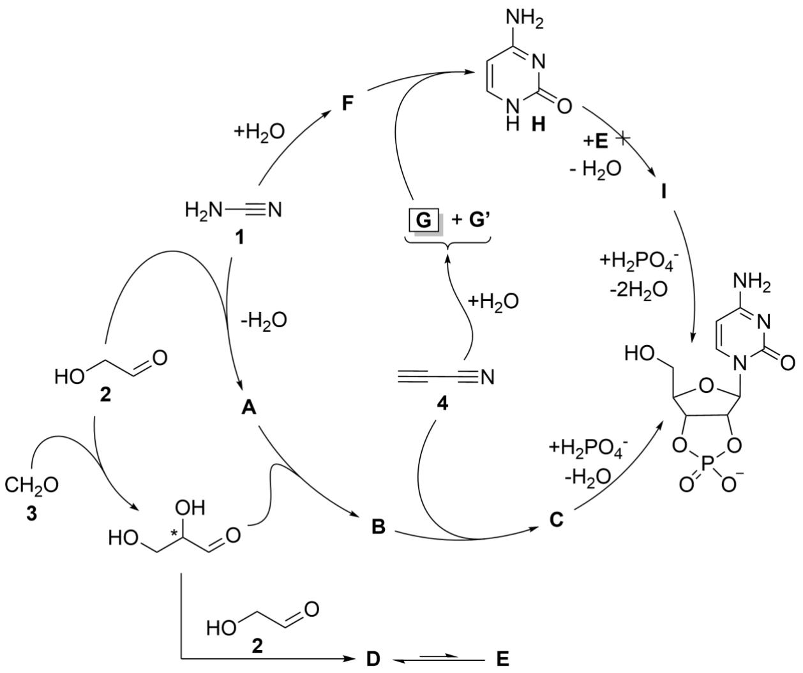

In this scheme, direct reaction between sugar $\mathbf{E}$ and cytosine **H** (which is formed via reaction of **G**) yields no product **I**, presumably because of the low nucleophilicity of **H**. Therefore, the $\mathbf{1} + \mathbf{2} \to \mathbf{A} \to \mathbf{B} \to \mathbf{C}$ prebiotic route was suggested by researchers, where in each step the number of rings in the product increases by one.

1. **Draw** molecular structures of compounds **A**–**G**, **G’** and **I**.

> **Solution (Q1 — Powner/Sutherland prebiotic ribonucleotide synthesis).**
>
> **Logic.** The route $1+2\to A\to B\to C$ increases the number of rings by one in each step: cyanamide **1** plus glycolaldehyde **2** gives monocyclic **2-aminooxazole A**; addition of glyceraldehyde gives bicyclic **arabinose amino-oxazoline B**; reaction with cyanoacetylene gives tricyclic **2,2'-anhydroarabinonucleoside C**. The separate "ribose + cytosine" route fails: six-membered ribose hemiacetal **D** equilibrates with ribofuranose **E**, but direct condensation of **E** with cytosine **H** does not give cytidine **I** in useful yield. If the glyceraldehyde feedstock is racemic, **D/E** are formed as enantiomeric sugar series; for the RNA branch, draw the D-ribose/D-ribofuranose series.
>
> The upper nucleobase branch should be read as cyanamide hydration plus the labelled cyanoacetylene-derived $\mathrm{C_3H_3NO}$ products: **F** is urea, **G** is propiolamide (丙炔酰胺, $\mathrm{HC{\equiv}C{-}C(=O)NH_2}$), and **G'** is cyanoacetaldehyde ($\mathrm{NC{-}CH_2{-}CHO}$).
>
> | Label | Structure / name to draw | Rings |
> |---|---|---|
> | **1** | $\mathrm{H_2N-C{\equiv}N}$ (cyanamide) | 0 |
> | **2** | $\mathrm{HOCH_2{-}CHO}$ (glycolaldehyde) | 0 |
> | **3** | $\mathrm{HCHO}$ (formaldehyde) | 0 |
> | **4** | $\mathrm{HC{\equiv}C{-}CN}$ (cyanoacetylene) | 0 |
> | **A** | 2-aminooxazole, the five-membered $\mathrm{O{-}C(H){=}C(H){-}N{=}C(NH_2)}$ ring | 1 |
> | **B** | arabinose amino-oxazoline, i.e. 2-amino-$\beta$-D-arabinofurano[1',2':4,5]oxazoline; draw a furanose ring fused to a 2-aminooxazoline ring | 2 |
> | **C** | 2,2'-anhydro-$\beta$-D-arabinofuranosylcytosine (the arabinose anhydronucleoside); draw furanose + cytosine + the 2,2'-anhydro bridge | 3 |
> | **D** | D-ribopyranose, the six-membered cyclic hemiacetal form of ribose; if the anomer is not specified, draw either anomer or use a wavy anomeric OH | 1 |
> | **E** | D-ribofuranose, the five-membered cyclic hemiacetal form of ribose used for the attempted glycosidation with cytosine | 1 |
> | **F** | urea, $\mathrm{H_2N{-}C(=O){-}NH_2}$, from hydration of cyanamide | 0 |
> | **G** | propiolamide, $\mathrm{HC{\equiv}C{-}C(=O)NH_2}$ | 0 |
> | **G′** | cyanoacetaldehyde, $\mathrm{NC{-}CH_2{-}CHO}$ | 0 |
> | **H** | cytosine, 4‑amino‑pyrimidin‑2(1H)‑one | 1 |
> | **I** | cytidine, 1‑β‑D‑ribofuranosyl‑cytosine (the product that is *not* formed by direct E + H glycosidation) | 2 |
>
> **Structure plate.** Best practice here is to keep the names/formulae in the answer table and put the drawings in a separate local image gallery, so the solution remains readable and the structure assets can be checked independently. PubChem/PubChemLite depictions were used where matching entries exist. For **D**, the image is a representative D-ribopyranose anomer; if the scheme does not specify $\alpha/\beta$, the anomeric OH may be drawn wavy.
>
> <table>
> <tr>
> <td align="center" width="33%"><strong>A</strong><br>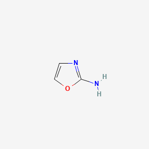<br>2-aminooxazole</td>
> <td align="center" width="33%"><strong>B</strong><br>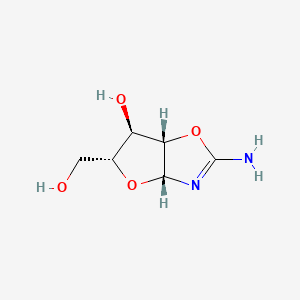<br>arabinose amino-oxazoline</td>
> <td align="center" width="33%"><strong>C</strong><br>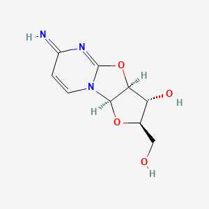<br>2,2'-anhydroarabinonucleoside</td>
> </tr>
> <tr>
> <td align="center"><strong>D</strong><br>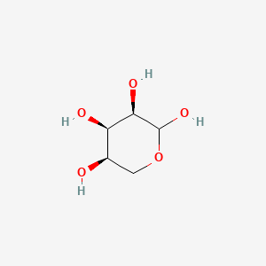<br>D-ribopyranose</td>
> <td align="center"><strong>E</strong><br>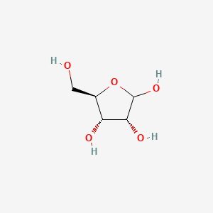<br>D-ribofuranose</td>
> <td align="center"><strong>F</strong><br>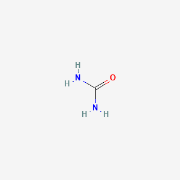<br>urea</td>
> </tr>
> <tr>
> <td align="center"><strong>G</strong><br>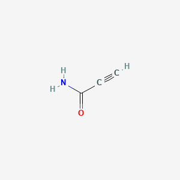<br>propiolamide</td>
> <td align="center"><strong>G′</strong><br>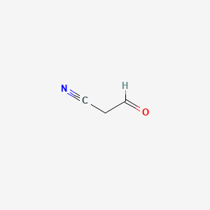<br>cyanoacetaldehyde<br><code>NC-CH2-CHO</code></td>
> <td align="center"><strong>I</strong><br>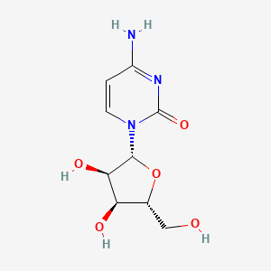<br>cytidine</td>
> </tr>
> </table>
>
> Source IDs for the downloaded depictions: **A** PubChem CID 558521, **B** PubChem CID 11116544, **C** PubChem CID 25051, **D** PubChem CID 10975657, **E** PubChem CID 5779, **F** PubChem CID 1176, **G** PubChem CID 101445, **G′** PubChem CID 151404, and **I** PubChem CID 6175.
>
> $$\boxed{\begin{aligned}
> \mathbf{A} &= \text{2-aminooxazole} \\
> \mathbf{B} &= \text{arabinose amino-oxazoline} \\
> \mathbf{C} &= \text{2,2'-anhydroarabinonucleoside} \\
> \mathbf{D} &= \text{D-ribopyranose} \\
> \mathbf{E} &= \text{D-ribofuranose} \\
> \mathbf{F} &= \text{urea} \\
> \mathbf{G} &= \text{propiolamide} \\
> \mathbf{G'} &= \text{cyanoacetaldehyde} \\
> \mathbf{I} &= \text{cytidine}
> \end{aligned}}$$

2. What is the reason behind the low nucleophilicity of **H**? **Choose** the correct answer(s):

a) electron delocalisation due to the aromaticity of pyrimidine ring;

b) extreme ring strain in cytosine that interrupts the reaction;

c) the positive charge due to the formation of ammonium salts that repels other molecules.

> **Solution (Q2 — Low nucleophilicity of cytosine H).**
>
> The correct answer is **(a)**. Cytosine is an aromatic pyrimidine: the nitrogen lone pairs and the exocyclic –NH₂ group are delocalised into the aromatic π-system and into the C=O, so the ring N1 (which would have to attack the anomeric carbon of ribose) has a lone pair of strongly diminished nucleophilicity. Option (b) is wrong — cytosine is planar, aromatic, and not strained. Option (c) is wrong — at near-neutral prebiotic pH cytosine is essentially neutral (pKₐ of cytosinium ≈ 4.6), so protonation cannot be the general cause; moreover a protonated ring would still be a poor nucleophile for the same aromatic-delocalisation reason. This is precisely the problem the Powner/Sutherland route bypasses by assembling the pyrimidine *on* the sugar (via B → C) rather than by direct N-glycosidation.

The fact that life relies almost exclusively on single molecular handedness (homochirality) is still not fully understood. It is well established that, in biological systems, most amino acids in proteins occur in the so-called L-configuration, while most sugars adopt the D-configuration.

3. In the scheme above, glycoaldehyde **2** and formaldehyde **3** react to form glyceraldehyde – the simplest sugar molecule that contains a stereocentre. **Depict** the structural formulae of L- and D-glyceraldehyde with the shown absolute configuration of the stereocentre.

> **Solution (Q3 — L- and D-glyceraldehyde).**
>
> Glyceraldehyde is $\mathrm{HOCH_2{-}CH(OH){-}CHO}$. At C2 the CIP order is $\mathrm{OH > CHO > CH_2OH > H}$. In the Fischer projection the CHO group is drawn at the top and CH₂OH at the bottom; the horizontal bonds point toward the viewer.
>
> The corresponding online Fischer-projection depictions are:
>
> <table>
> <tr>
> <td align="center" width="50%"><strong>D-glyceraldehyde</strong><br>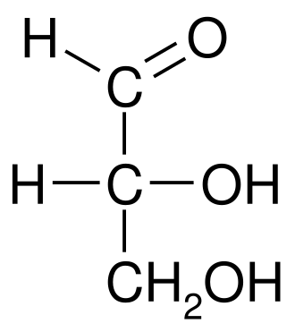<br>&ndash;OH on the <strong>right</strong>.</td>
> <td align="center" width="50%"><strong>L-glyceraldehyde</strong><br>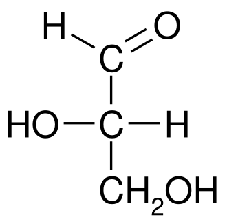<br>&ndash;OH on the <strong>left</strong>.</td>
> </tr>
> </table>
> 
>Image sources: Wikimedia Commons, *D-Glyceraldehyde 2D Fischer.svg* and *L-Glyceraldehyde 2D Fischer.svg*.

There are several hypotheses about the origin of such a unique property as homochirality. A plausible early Earth scenario involves shallow lakes with magnetite deposits. UV light (200- $300 \mathrm{nm} )$ shining on magnetite can generate spin-polarised electrons – special electrons with aligned spins – that act as reducing agents. These electrons interact differently with left- and righthanded molecules due to the chiral-induced spin selectivity (CISS) effect, changing reaction rates selectively. This spin-based interaction could break chiral symmetry in prebiotic chemistry, favouring one enantiomer and possibly leading to life’s homochirality.

In this case, it is useful to present the term of electron helicity, which is a physical property describing the direction of the electron’s spin relative to its direction of motion. For example, if helicity is right-handed, then the electron’s spin is parallel to its momentum, and vice versa.

Consider a process that occurs in a prebiotic lake of reactants:

$$
\mathrm{LX} + \mathrm{De}^{-} \rightarrow \mathrm{LY}
$$

$$
\mathrm{DX} + \mathrm{De}^{-} \rightarrow \mathrm{DY}
$$

The L-/D- isomer of **X** reacts with a right-handed electron donor $\mathrm{De}^{-}$ and produces the L-/D- isomer of compound **Y**. The spin-chirality coupling hypothesis states that the interaction of the L-isomer with the D-electron is more kinetically favoured. The amount of this preference can be expressed via the rate constant formula:

$$
k_ {\mathrm{(L)}} = A \cdot \exp \left(- \frac {(E_{a} - H_ {\mathrm{SO}})}{k_ {\mathrm{B}} T}\right),
$$

$$
k_ {\mathrm{(D)}} = A \cdot \exp \left(- \frac {(E_{a} + H_{SO})}{k_ {\mathrm{B}} T}\right),
$$

where $k_ {\mathrm{L/D}}$ is the rate constant of the reaction, $E_{a}$ is the activation energy of the process, $H_ {\mathrm{SO}}$ is the spin-orbit energy, and $k_\mathrm{B}$ is the Boltzmann constant.

The enantiomeric excess, ee, is a measure of the purity of a chiral substance in terms of the predominance of one enantiomer over the other in a mixture:

$$
e e = \frac {[ \mathrm{LY} ] - [ \mathrm{DY} ]}{[ \mathrm{LY} ] + [ \mathrm{DY} ]}
$$

4. Given $H_ {\mathrm{SO}} = 0.5\ \mathrm{meV}$ , considering that the $A$ factor is equal for L- and D-isomers and the substrate is a racemic mixture $\mathrm{([LX]=[DX])}$ , **determine** the $ee$ of the reaction product **Y** at $T {=} 313\ \mathrm{K}\ ({\sim}40\,°\mathrm{C})$ , which is a good assumption for the average surface temperature of water bodies during the prebiotic era.

> **Solution (Q4 — ee from CISS kinetic bias).**
>
> Let the right-handed electron donor be present in the same effective concentration for both enantiomeric substrates. Then the initial rates are
> $$\frac{d[\mathrm{LY}]}{dt}=k_L[\mathrm{LX}][\mathrm{De^-}],\qquad \frac{d[\mathrm{DY}]}{dt}=k_D[\mathrm{DX}][\mathrm{De^-}].$$
> For a racemic substrate, $[\mathrm{LX}]=[\mathrm{DX}]$. Over the same short time interval, or at low conversion where the substrate concentrations have not changed appreciably,
> $$\frac{[\mathrm{LY}]}{[\mathrm{DY}]}=\frac{d[\mathrm{LY}]/dt}{d[\mathrm{DY}]/dt}=\frac{k_L[\mathrm{LX}][\mathrm{De^-}]}{k_D[\mathrm{DX}][\mathrm{De^-}]}=\frac{k_L}{k_D}.$$
> Therefore the product ee can be calculated directly from the two rate constants:
> $$ee=\frac{k_L-k_D}{k_L+k_D}.$$
> Now substitute the two rate expressions:
> $$k_L=A\exp\!\left[-\frac{E_a-H_{SO}}{k_BT}\right]
> =A\exp\!\left(-\frac{E_a}{k_BT}\right)\exp\!\left(\frac{H_{SO}}{k_BT}\right),$$
> $$k_D=A\exp\!\left[-\frac{E_a+H_{SO}}{k_BT}\right]
> =A\exp\!\left(-\frac{E_a}{k_BT}\right)\exp\!\left(-\frac{H_{SO}}{k_BT}\right).$$
> The factor $A\exp(-E_a/k_BT)$ is common to both $k_L$ and $k_D$, so it cancels in the ratio:
> $$\frac{k_L-k_D}{k_L+k_D}
> =\frac{A e^{-E_a/k_BT}\left(e^{H_{SO}/k_BT}-e^{-H_{SO}/k_BT}\right)}
> {A e^{-E_a/k_BT}\left(e^{H_{SO}/k_BT}+e^{-H_{SO}/k_BT}\right)}
> =\frac{e^{H_{SO}/k_BT}-e^{-H_{SO}/k_BT}}{e^{H_{SO}/k_BT}+e^{-H_{SO}/k_BT}}.$$
> By definition, $\tanh x=(e^x-e^{-x})/(e^x+e^{-x})$, so
> $$ee=\tanh\!\left(\frac{H_{SO}}{k_BT}\right).$$
> With $H_{SO}=0.5$ meV $=0.5\times 10^{-3}\times 1.602\times 10^{-19}=8.01\times 10^{-23}$ J and $k_BT=1.381\times 10^{-23}\times 313=4.323\times 10^{-21}$ J,
> $$\frac{H_{SO}}{k_BT}=\frac{8.01\times10^{-23}}{4.323\times10^{-21}}=0.01853.$$
> Hence
> $$\boxed{ee_{q4}=\tanh(0.01853)\approx 0.01853\;(\approx 1.85\%).}$$

5. Consider some racemic solution of L-/D-isomers in water with a total concentration of $1\ \mathbf{M}$, where symmetry breaking (i.e. conversion of one isomer into another) occurs, resulting in overall chiral amplification of the system. **Depict** possible symmetry-breaking trajectories in a phase portrait of the system.

   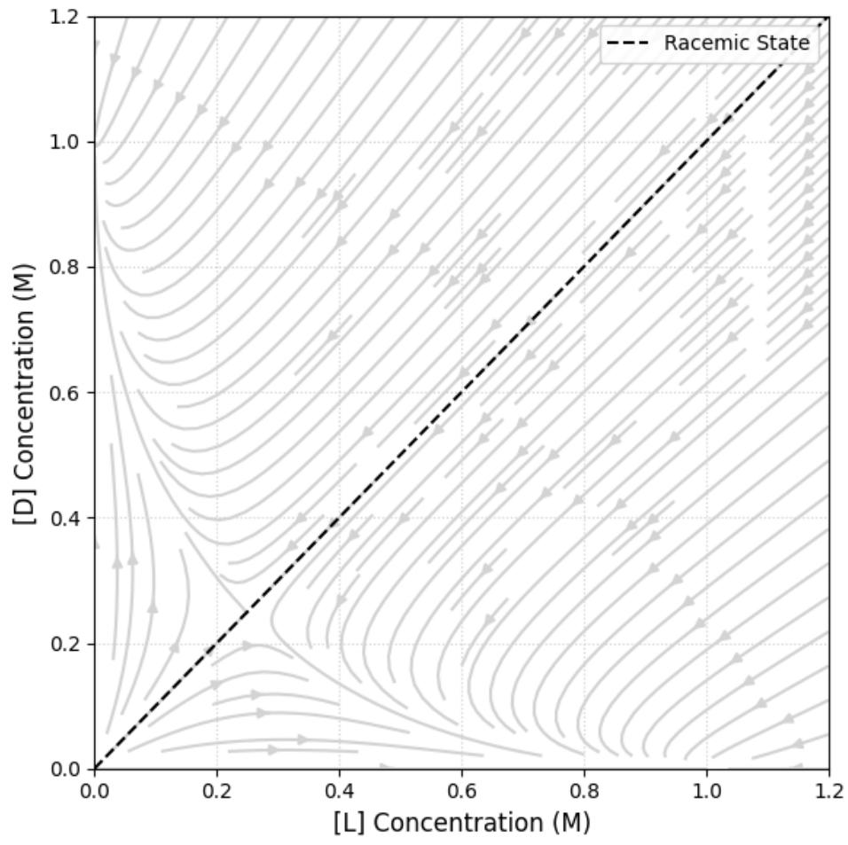

> **Solution (Q5 — Symmetry-breaking phase portrait).**
>
> With the conservation constraint $[L]+[D]=1$ M, the accessible states lie on the diagonal line segment from $(1,0)$ to $(0,1)$ in the $([L],[D])$ plane. The racemic point $(0.5,0.5)$ is an **unstable fixed point** (saddle along the $[L]-[D]$ axis); the two **stable fixed points** are the homochiral corners $(1,0)$ and $(0,1)$.
>
> Trajectories starting from any initial condition on the diagonal with even an infinitesimal ee (i.e. $[L]\ne[D]$) flow along the conservation line away from the racemic centre and toward whichever homochiral attractor is favoured by the initial bias:
>
> ```
>   [D]
>   1 *———————————————————————
>     \  <—————   racemic      \
>      \     (unstable)          \
>       \        •                 \
>        \       | |                \
>         \      v v                 \
>          \  ————>————> (1,0)        \
>           \                           \
>    (0,1)   \___________________________\———> [L]
>   stable                                      stable
>   attractor                                   attractor
> ```
>
> Schematically: two arrows leave the racemic saddle $(0.5,0.5)$ along the line $[L]+[D]=1$, one pointing to $(1,0)$ (pure L) and the other to $(0,1)$ (pure D). Small stochastic fluctuations select which branch is followed — this is the symmetry-breaking/chiral-amplification "pitchfork".
>
> **Reference basis.** This is the standard qualitative phase portrait of a Frank-type homochirality model: autocatalytic self-production plus mutual inhibition/antagonism makes the racemic state unstable and the two homochiral states stable attractors. See Frank, F. C. "On spontaneous asymmetric synthesis", *Biochimica et Biophysica Acta* **11** (1953) 459-463; Blackmond, D. G. "The Origin of Biological Homochirality", *Cold Spring Harbor Perspectives in Biology* **2** (2010) a002147; and the Wikimedia Commons reference image "Frank's model phase portrait".

This example of kinetic resolution has demonstrated the chiral amplification of single monomeric units. However, the origin of life requires processes for the ligation of monomers into the homochiral polymeric molecules that constitute proteins and enzymes and the genetic polymers of RNA. Can a pool of partially enantioenriched monomers successfully produce homochiral polymers?

Let’s consider two amino acids in their L- and D- forms. The possible reactions between them are listed below:

$$
\mathrm{L}_{1} + \mathrm{L}_{2} \rightarrow \mathrm{L}_{1} \mathrm{L}_{2}, \quad r = k_ {\text{homo}} [ \mathrm{L}_{1} ] [ \mathrm{L}_{2} ]
$$

$$
\mathrm{D}_{1} + \mathrm{L}_{2} \rightarrow \mathrm{D}_{1} \mathrm{L}_{2}, \quad r = k_ {\text{hetero}} [ \mathrm{D}_{1} ] [ \mathrm{L}_{2} ]
$$

$$
\mathrm{L}_{1} + \mathrm{D}_{2} \rightarrow \mathrm{L}_{1} \mathrm{D}_{2}, \quad r = k_ {\text{hetero}} [ \mathrm{L}_{1} ] [ \mathrm{D}_{2} ]
$$

$$
\mathrm{D}_{1} + \mathrm{D}_{2} \rightarrow \mathrm{D}_{1} \mathrm{D}_{2}, \quad r = k_ {\text{homo}} [ \mathrm{D}_{1} ] [ \mathrm{D}_{2} ],
$$

where $k_ {\mathrm{homo}}$ and $k_ {\mathrm{hetero}}$ denote the homochiral and heterochiral dimer formation rate constants, respectively.

6. Considering that $k_ {\mathrm{homo}} = k_ {\mathrm{hetero}}$ and thus neglecting kinetic control, **derive** that:

$$
e e_ {\mathrm{homochiral}} = \frac {[ \mathrm{L}_{1} \mathrm{L}_{2} ] - [ \mathrm{D}_{1} \mathrm{D}_{2} ]}{[ \mathrm{L}_{1} \mathrm{L}_{2} ] + [ \mathrm{D}_{1} \mathrm{D}_{2} ]} = \frac {e e_{1} + e e_{2}}{1 + e e_{1} e e_{2}}
$$

where $ee_1$ and $ee_2$ stand for:

$$
e e_{1} = \frac {[ \mathrm{L}_{1} ] - [ \mathrm{D}_{1} ]}{[ \mathrm{L}_{1} ] + [ \mathrm{D}_{1} ]}, \qquad e e_{2} = \frac {[ \mathrm{L}_{2} ] - [ \mathrm{D}_{2} ]}{[ \mathrm{L}_{2} ] + [ \mathrm{D}_{2} ]}
$$

> **Solution (Q6 — Derivation of the ee-combination law).**
>
> With $k_{\text{homo}}=k_{\text{hetero}}\equiv k$, the homochiral dimer concentrations (after a fixed short time) are proportional to the product of the monomer concentrations:
> $$[L_1L_2]=k[L_1][L_2]\,\Delta t,\qquad [D_1D_2]=k[D_1][D_2]\,\Delta t.$$
> Therefore
> $$ee_{\text{homochiral}}=\frac{[L_1][L_2]-[D_1][D_2]}{[L_1][L_2]+[D_1][D_2]}.$$
> Divide numerator and denominator by $([L_1]+[D_1])([L_2]+[D_2])$. Using
> $$\frac{[L_i]}{[L_i]+[D_i]}=\tfrac12(1+ee_i),\qquad \frac{[D_i]}{[L_i]+[D_i]}=\tfrac12(1-ee_i),$$
> the numerator becomes $\tfrac14[(1+ee_1)(1+ee_2)-(1-ee_1)(1-ee_2)]=\tfrac12(ee_1+ee_2)$, and the denominator becomes $\tfrac14[(1+ee_1)(1+ee_2)+(1-ee_1)(1-ee_2)]=\tfrac12(1+ee_1ee_2)$. Hence
> $$\boxed{ee_{\text{homochiral}}=\dfrac{ee_1+ee_2}{1+ee_1\,ee_2}.}$$
> (Formally identical to the relativistic velocity-addition rule.)

7. **Calculate** $ee_\mathrm{homochiral}$ for the prebiotic lake system from question 4 with $e e_{1} = e e_{2} = e e_ {\mathrm{q} 4}$. *Note: If you could not solve question 4, consider $e e_{q4} = 0.05\ (5\%)$ .*

> **Solution (Q7 — Dimer ee from Q4 monomer ee).**
>
> With $ee_1=ee_2=ee_{q4}=0.01853$:
> $$ee_{\text{dimer}}=\frac{2\,ee_{q4}}{1+ee_{q4}^{\,2}}=\frac{2(0.01853)}{1+(0.01853)^2}=\frac{0.03706}{1.000343}\approx 0.0370\;(3.70\%).$$
> (If one uses the fallback $ee_{q4}=0.05$: $ee_{\text{dimer}}=2(0.05)/(1+0.0025)=0.0998\approx 9.98\%$.) Essentially the ee roughly doubles on dimerisation — this is the "addition" rule.

8. Now, considering that only homochiral oligomers are responsible for chain propagation, **find** the smallest number of amino acid residues needed for a resulting polymeric chain to have $ee_\mathrm{homochiral}$ $> 0.99$ . For initial amino acids, **assume** each amino acid has an $e e = 0.05$ .

> **Solution (Q8 — Chain length for ee > 0.99).**
>
> Because only homochiral ligation propagates, at each step the new residue combines with an already-homochiral chain. Generalising Q6 to an n-mer, the distribution of all-L vs all-D chains from n independent monomers (each with ee₀) gives
> $$ee_n=\frac{(1+ee_0)^n-(1-ee_0)^n}{(1+ee_0)^n+(1-ee_0)^n}=\tanh\!\left[n\cdot\operatorname{artanh}(ee_0)\right].$$
> Requiring $ee_n>0.99$ gives
> $$n>\frac{\operatorname{artanh}(0.99)}{\operatorname{artanh}(0.05)}=\frac{2.6467}{0.05004}=52.89.$$
> The smallest integer satisfying this is $\boxed{n=53}$ residues. (Check: for $n=53$, $(1.05/0.95)^{53}=e^{53\cdot0.10008}=e^{5.304}=201.2$, so $ee=(201.2-1)/(201.2+1)=0.9901>0.99$ ✓; for $n=52$ one gets $ee=0.9891<0.99$.)

The mathematical model above was found valid for a real biochemical system, where the initial transamination reaction with pyridoxamine catalysed by a strictly homochiral dipeptide molecule **aa1-aa2** yields a racemic amino acid molecule **aa** and pyridoxal. The amino acid molecules formed react with another amino acid’s derivative molecule **K**, which results in a dipeptide derivative. The latter yields the dipeptide **aa1-aa2**, thus looping the cycle:

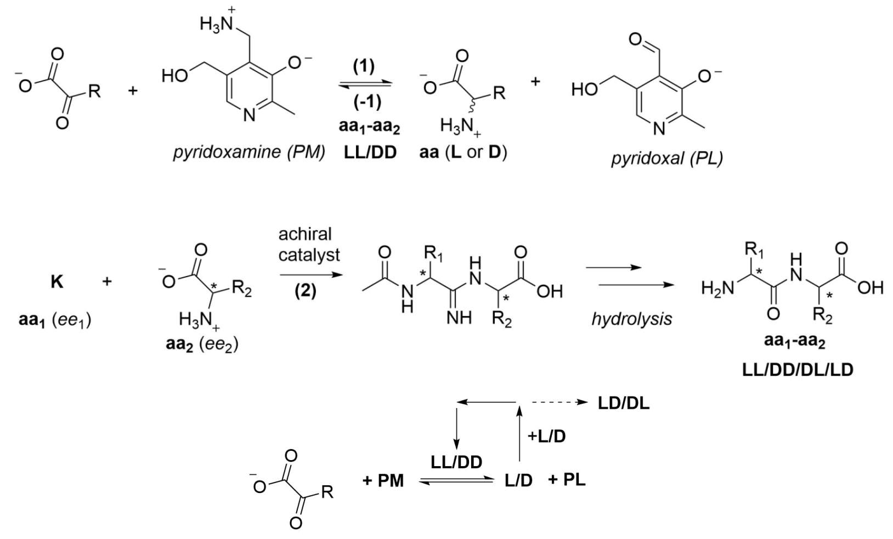

9. **Draw** the structure of **K**.

> **Solution (Q9 — Structure of K).**
>
> K must be the **N-acetyl α-aminonitrile of aa₁**, not a thioester:
> $$\boxed{\mathrm{K = AcNH{-}CH(R_1){-}C{\equiv}N}}$$
> where $\mathrm{R_1}$ is the side chain of aa₁ and the stereochemistry at $\mathrm{CH(R_1)}$ carries the ee of aa₁. This assignment is forced by the next structure in the question scheme: reaction of K with amino acid aa₂ gives an N-acetyl **amidine**,
> $$\mathrm{AcNH{-}CH(R_1){-}C(=NH){-}NH{-}CH(R_2){-}CO_2H},$$
> and hydrolysis/deprotection then gives the dipeptide
> $$\mathrm{H_2N{-}CH(R_1){-}C(=O){-}NH{-}CH(R_2){-}CO_2H}.$$

The role of the dipeptide catalyst in reaction **(1)** is based on promoting a hydrogen atom transfer (HAT) reaction. For instance, Yu et al. proposed the mechanism below for the L-prolinyl-L-valinecatalysed alanine synthesis reaction from pyruvate:

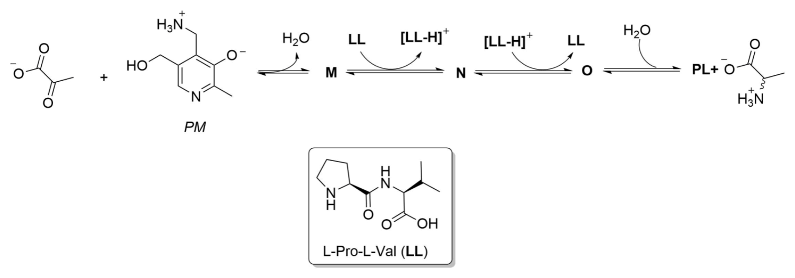

10. **Mark** the functional group(s) in the **LL** molecule involved in the hydrogen atom transfer process.

> **Solution (Q10 — HAT-active groups in L-prolinyl-L-valine).**
>
> In L-Pro–L-Val, the groups to mark on **LL** are:
>
> - the **secondary amine of the N-terminal proline ring**; this is the most direct acid/base site and can be protonated to give the drawn $\mathrm{[LL-H]^+}$ form;
> - the **C-terminal valine carboxylic acid/carboxylate group**, especially its O–H/CO₂H proton-relay and hydrogen-bonding site.
>
> These two sites form the bifunctional H-transfer pocket in the proposed mechanism. The backbone peptide amide can help organize the transition state by hydrogen bonding, but it is not the functional group the problem is asking students to mark as the main H-transfer pair. Mark the Pro ring **secondary amine** and the Val terminal **CO₂H/CO₂⁻** on the provided structure. If only one site is allowed, the Pro secondary amine is the site most directly associated with formation of $\mathrm{[LL-H]^+}$.

11. **Draw** the structures of compounds **M**–**O**.

> **Solution (Q11 — Intermediates M, N, O in the Pro-Val HAT cycle).**
>
> **🟡 HAT language — read as a formal H shift, not a free-radical step.** The drawn catalyst state $\mathrm{[LL-H]^+}$ is *not* produced by pure neutral hydrogen-atom abstraction. It is produced when LL acts as a Brønsted base, removes the C4′ proton from the PM-derived ketimine, and leaves the C–H bonding electrons delocalised over the vitamin-B6 imine system. Thus the problem's "HAT" language should be read as a **formal H shift** rather than as a free-radical HAT step.
>
> In the Yu et al. pyruvate → alanine mechanism, pyruvate condenses with pyridoxamine (PM) to give a **ketimine**, which is converted by the LL-mediated formal H-transfer/1,3-proton-shift sequence into a PL-derived **aldimine**, then hydrolysed to alanine + pyridoxal (PL). Let $\mathrm{Py}$ denote the vitamin-B6 pyridine ring fragment.
>
> - **M — PM ketimine of pyruvate:**
> $$\boxed{\mathrm{Py{-}CH_2{-}N{=}C(CH_3){-}CO_2^-}}$$
> The C=N bond is between the PM amino nitrogen and the former pyruvate C2.
>
> - **N — quinonoid/azaallyl tautomerisation intermediate, paired with $\mathrm{[LL-H]^+}$:**
> $$\boxed{\mathrm{Py{-}CH^-{-}N{=}C(CH_3){-}CO_2^- \;\longleftrightarrow\; Py{-}CH{=}N{-}C^-(CH_3){-}CO_2^-}}$$
> Draw it as the resonance-stabilised deprotonated intermediate obtained after LL abstracts the PM C4′ proton. The second resonance form shows why reprotonation at the pyruvate-derived carbon converts the PM ketimine framework into the PL aldimine framework. The formal charges in this shorthand depend on the protonation state used for the pyridine/phenolate/carboxylate sites, but the chemically essential feature is **deprotonation followed by reprotonation**, not a neutral radical.
>
> - **O — PL aldimine of alanine:**
> $$\boxed{\mathrm{Py{-}CH{=}N{-}CH(CH_3){-}CO_2^-}}$$
> Hydrolysis of O liberates alanine and regenerates pyridoxal (PL). The stereochemistry at alanine is set when $\mathrm{[LL-H]^+}$ reprotonates N at the pyruvate-derived carbon; with LL-Pro-Val in the forward pyruvate → alanine half-reaction, the major product in the cited study is D-Ala, while the reverse kinetic resolution preferentially removes D-Ala and enriches L-Ala.
>
> ```
>   pyruvate + PM  ->  M (PM ketimine)  ->  N + [LL-H]+ (quinonoid/azaallyl intermediate)  ->  O (PL aldimine)  ->  Ala + PL
> ```
>
> **Source-article structure images.** The closest matching online images are not separate database entries for M/N/O, but the source-paper schemes. In those schemes, the problem's **M** corresponds to the PM + pyruvate **ketimine**, and **O** corresponds to the PL + alanine **aldimine A**. The problem's **N** is the formal quinonoid/azaallyl tautomerisation state between those two endpoints; the source paper represents this part of the network through the ketimine/species B/aldimine cycle rather than by a separately isolated structure named N.
>
> | Source image | How it supports Q10.11 |
> |---|---|
> | 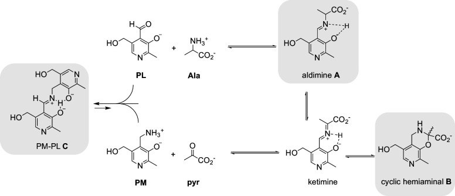 | Scheme 3 shows the actual PL/PM transamination network: **PM + pyruvate ⇌ ketimine** and **PL + alanine ⇌ aldimine A**. This is the direct source-image support for **M** and **O**. |
> | 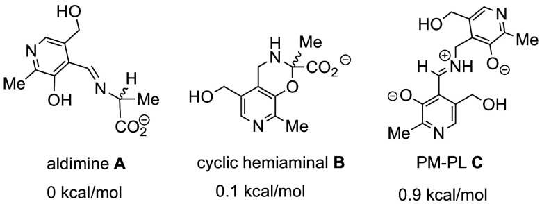 | Scheme 5 gives cleaner standalone drawings of **aldimine A** and the related cyclic hemiaminal reservoir. It is useful for drawing **O**, but it does not provide a separate N-labelled quinonoid/azaallyl intermediate. |
> | 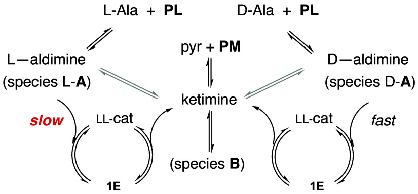 | Scheme 6 places the **ketimine** between the aldimine branches in the LL-catalysed cycle and supports the mechanistic assignment **M → N → O**. |
>
> Source: Yu, J.; Darú, A.; Deng, M.; Blackmond, D. G. *Prebiotic access to enantioenriched amino acids via peptide-mediated transamination reactions*, **PNAS** 2024, 121, e2315447121. DOI: [10.1073/pnas.2315447121](https://doi.org/10.1073/pnas.2315447121); PMC article: <https://pmc.ncbi.nlm.nih.gov/articles/PMC10873602/>. For the proton-transfer interpretation of aldimine/ketimine tautomerisation, see also Cai et al., *Nature Communications* 2021, 12, 5174; Boutin et al., *Inorganics* 2023, 11, 381; and the RSC *Chemical Society Reviews* discussion of PLP transamination as a catalysed 1,3-proton-shift process.

Yu et al. also discovered that in the reverse reaction $( \mathbf{-1} )$ , which leads to pyruvate from alanine, D-alanine reacts faster than L-alanine, thus enriching the prebiotic system with the L-enantiomer.

12. Which intermolecular forces (or their absence) between alanine and **PL**-**LL** in the corresponding transition state could be behind the faster reaction of D-Ala compared to that of L-Ala? **Choose** the correct statement(s):

a) Hydrogen bonds

b) $\pi$ -stacking

c) Steric repulsion

d) Alignment of stereocentres

> **Solution (Q12 — Origin of D-Ala > L-Ala selectivity in the reverse step).**
>
> The best answer is **(a), (b), and (d)**.
>
> The reference calculation compares the reaction of $\mathrm{rac}$-Ala with PL catalysed by Pro-Val (PV, corresponding to the LL-Pro-Val catalyst in this problem):
>
> 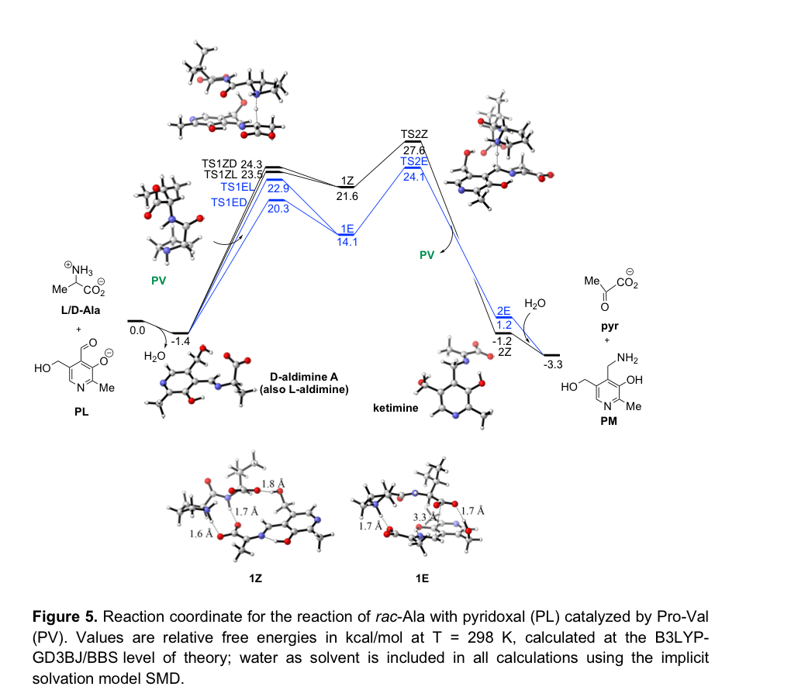
>
> The figure supports the selectivity assignment in three ways.
>
> - **Hydrogen bonding, option (a): yes.** The calculated low-energy ion-pair structures show short H-bond contacts of about 1.6-1.8 Å. These contacts hold the PL-alanine aldimine and the Pro-Val catalyst in the geometry needed for aldimine deprotonation/proton transfer.
> - **π-stacking, option (b): yes.** The source text states that the lower-energy **1E** arrangement has greater overlap between PV and aldimine A, described as nearly flat overlap through π-stacking, with a ca. 3.3 Å separation between the two moieties. In contrast, **1Z** places PV more to the side of aldimine A and loses that π-stacking interaction.
> - **Alignment of stereocentres, option (d): yes.** The key comparison is diastereomeric: with the LL catalyst, the D-Ala-derived pathway reaches the lower barrier **TS1ED = 20.3 kcal/mol**, while the corresponding L-Ala-derived E pathway is higher, **TS1EL = 22.9 kcal/mol**. This lower barrier means D-Ala is consumed faster, leaving L-Ala enriched in the kinetic resolution.
>
> The same figure also shows why the E arrangement is preferred overall: **1E** is lower than **1Z** by about 7.5 kcal/mol (14.1 vs 21.6 kcal/mol), and **TS2E** is lower than **TS2Z** by about 3.5 kcal/mol (24.1 vs 27.6 kcal/mol). Thus the source-backed explanation is not just "D is faster"; it is that the LL-Pro-Val/PL/D-Ala three-component complex can adopt a better H-bonded, π-stacked, stereochemically matched geometry.
>
> Option **(c)** is not a primary selected force in the reference explanation. Steric mismatch may help make the competing L-Ala arrangement less favourable, so it can be mentioned as a caveat if the phrase "or their absence" is interpreted broadly. However, the explicit source discussion attributes the stabilisation of the favoured pathway to **hydrogen bonding**, **π-stacking/overlap**, and the **diastereomeric alignment** of the chiral catalyst-substrate complex. Therefore the clean answer is:
> $$\boxed{\text{a, b, d}}$$

Constructive and destructive mechanisms, where the corresponding amino acid was formed or destroyed, respectively, were investigated in open systems with a flow rate, $\boldsymbol{\varphi}$ , of corresponding reactants in each case.

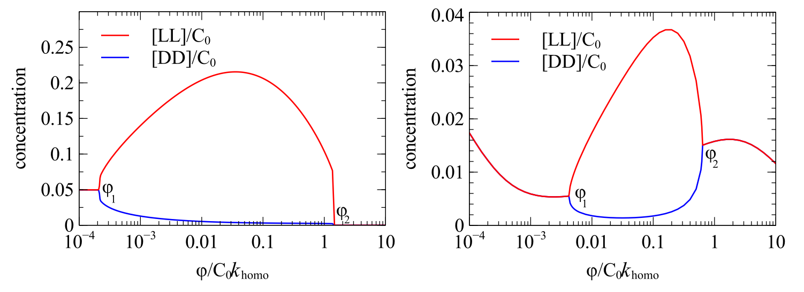

Figure 2. Concentration of homochiral dipeptides vs flow rate of (a) ketoacid (left, constructive mechanism); (b) amino acid (right, destructive mechanism).

13. **Deduce** the value of $\boldsymbol{\varphi}$ , at which the maximum chiral asymmetry is observed.

> **Solution (Q13 — Flow rate of maximum chiral asymmetry).**
>
> The chiral asymmetry is measured by the branch separation,
> $$\Delta(\varphi)=|[LL](\varphi)-[DD](\varphi)|.$$
> Therefore $\varphi_{\max}$ is **inside the symmetry-broken interval** $\varphi_1<\varphi<\varphi_2$, at the point where the red and blue curves are farthest apart.
>
> Reading the two plots:
>
> - **constructive mechanism, ketoacid inflow (Fig. 2a):** $\varphi_{\max}/(C_0k_{\mathrm{homo}})\approx 3\times10^{-2}$ to $5\times10^{-2}$;
> - **destructive mechanism, amino-acid inflow (Fig. 2b):** $\varphi_{\max}/(C_0k_{\mathrm{homo}})\approx 2\times10^{-1}$.
>
> The qualitative answer is the most important one:
> $$\boxed{\varphi_1<\varphi_{\max}<\varphi_2,\ \text{where } |[LL]-[DD]| \text{ is maximal.}}$$

14. **Explain** the concentration behaviour of [LL] and [DD] when:

a) $\varphi < \varphi_1$

b) $\displaystyle \psi_{1} < \varphi < \varphi_{2}$

c) $\varphi > \varphi_2$

> **Solution (Q14 — Three flow-rate regimes).**
>
> The open-flow system is bistable: the autocatalytic loop (LL catalyses formation of more LL, DD catalyses more DD) competes with convective wash-out by the flow $\Phi$.
>
> - **a) $\varphi<\varphi_1$ (low flow — low-asymmetry/racemic branch).** Both enantiomeric catalytic loops remain populated, so the two homochiral dipeptide concentrations are similar. Result: $[LL]\approx[DD]$, and the dipeptide $ee$ is small.
>
> - **b) $\varphi_1<\varphi<\varphi_2$ (intermediate flow — symmetry-broken regime).** One homochiral loop survives while the other is suppressed. The system selects one of the two mirror branches: $[LL]\gg[DD]$ or $[DD]\gg[LL]$. This is the region of large chiral asymmetry, with the maximum at the largest separation of the two branches.
>
> - **c) $\varphi>\varphi_2$ (high flow — symmetry-broken branch lost).** The asymmetric steady state no longer persists. In the **constructive/ketoacid** plot, both homochiral dipeptides are essentially washed out, so $[LL]\approx[DD]\approx0$. In the **destructive/amino-acid** plot, the separated branches merge back into a common low-asymmetry branch rather than continuing as one high and one low branch.
>
> Thus $\varphi_1$ and $\varphi_2$ are bifurcation thresholds: below $\varphi_1$ the system is nearly racemic, between them it is symmetry-broken, and above $\varphi_2$ the symmetry-broken solution disappears.

---

## 中文版 / Chinese translation
## 第 10 题 前生命化学

地球最独特之处，正在于它孕育了生命。据我们目前所知，它是浩瀚宇宙中唯一承载复杂生命的星球。生命亦对地球影响深远，它改变了这颗星球的大气、水体与气候。正因如此，理解生命的本质、运作的规律，以及究竟如何由无生命的物质世界萌发而出，始终是科学最核心的目标之一。而这，正引向前生命化学最核心的谜题：早期地球的何种环境与过程，使简单化学物质孕育出最初的自我复制体系，并由此拉开生物演化的序幕？

Powner等人提出了一条前生命地球环境下，由氰酰胺1、乙醇醛2、甲醛3与氰基乙炔4等简单分子，构建RNA、核糖核苷酸等复杂分子的可能路径：

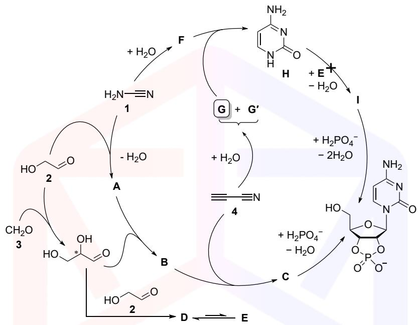


在该合成路线中，若糖 E 与胞嘧啶 H（由 $\pmb {\ 6}$ 反应生成）直接反应，无法得到产物 I，推测原因是 H 的亲核性过低。因此研究者提出了 $1 + 2 \mathsf{A} \longrightarrow \mathsf{B} \longrightarrow \mathsf{C}$ 的前生命合成路线，该路线中每一步产物的环数均增加 1。

10-1 画出化合物 A–G、 $\pmb {\mathsf{G}}^{\prime}$ 与 I 的分子结构。

10-2 选出H亲核性过低的原因，可多选：

(a)嘧啶环的芳香性导致电子离域；

(b)胞嘧啶的环张力过大，阻碍反应；

(c)形成铵盐带正电荷，与其他分子产生排斥作用。

生命几乎完全依赖单一手性（同手性），其原因至今仍未完全阐明。众所周知，生物体系中，蛋白质中的绝大多数氨基酸为 L 构型，而绝大多数糖为D 构型。

10-3 上述路线中，乙醇醛2与甲醛3反应生成甘油醛— 最简单的手性糖分子。画出L–甘油醛与D–甘油醛的结构式，并标注出手性中心的绝对构型。

关于同手性的起源，学界提出了多种假说。其中一种可以模拟早期地球环境的合理场景，是一片磁铁矿矿床上的浅湖。波长 $200 {-} 300 \mathrm{nm}$ 的紫外光照射磁铁矿，可产生自旋取向一致的特殊电子，作为还原剂。基于手性诱导自旋选择性 (CISS) 效应，这些电子与左旋、右旋分子的相互作用存在差异，可选择性改变反应速率。这种基于自旋的相互作用可打破前生命化学中的手性对称，使之优先生成一种对映体，并最终促成了生命的同手性。

在这一情境中，有必要引入电子螺旋度的概念。这是描述电子自旋方向与其运动方向相对关系的物理量。例如，右旋螺旋度表示电子自旋方向与其动量方向平行，左旋则相反。

考虑前生命湖泊中发生的如下反应：

$$
\mathrm{LX} + \mathrm{De}^{-} \rightarrow \mathrm{LY}
$$

$$
\mathrm{D} \mathbf{X} + \mathrm{De}^{-} \rightarrow \mathrm{DY}
$$

X的L/D型异构体与右旋电子给体 $\mathrm{De}^{-}$ 反应，分别生成Y的L/D型异构体。自旋–手性耦合假说认为，其 L 型异构体与右旋电子的反应在动力学上更具优势。这种反应偏好可通过速率常量公式表示：

$$
k_ {\mathrm{L}} = A \cdot \exp \left(- \frac {E_ {\mathrm{a}} - H_ {\mathrm{SO}}}{k_ {\mathrm{B}} T}\right),
$$

$$
k_ {\mathrm{D}} = A \cdot \exp \left(- \frac {E_ {\mathrm{a}} + H_ {\mathrm{SO}}}{k_ {\mathrm{B}} T}\right),
$$

其中， $k_ {\mathrm{L/D}}$ 为对应反应的速率常量， $E_ {\mathrm{a}}$ 为反应的活化能， $H_ {\mathrm{SO}}$ 为反应的自旋–轨道能。

对映体过量 (ee) 是衡量手性物质纯度的指标，用于表示混合物中一种对映体相对另一种的过量程度：

$$
e e = \frac {[ \mathrm{LY} ] - [ \mathrm{DY} ]}{[ \mathrm{LY} ] + [ \mathrm{DY} ]}
$$

10-4 已知 $H_ {\mathrm{SO}} = 0.5\ \mathrm{meV}$ ，L、D 型异构体的指前因子 $A$ 相等，且底物为外消旋混合物 $( [ \mathbf{L} \mathbf{X} ] = [ \mathbf{D} \mathbf{X} ] )$ 。计算 $T = 313\ \mathrm{K}$ 下（约 $40\,°\mathrm{C}$ ）时产物 $\pmb {\gamma}$ 的 $e e$ 值。该温度可视为前生物时代水体平均表面温度的合理近似。

10-5 考虑某L/D 型异构体的外消旋水溶液，其总浓度为 $1 \mathrm{mol} / \mathrm{L}$ 。体系中发生对称性破缺（即一种异构体转化为另一种），最终实现了体系的手性放大。在体系的相平面图中，画出可能的对称性破缺轨迹。

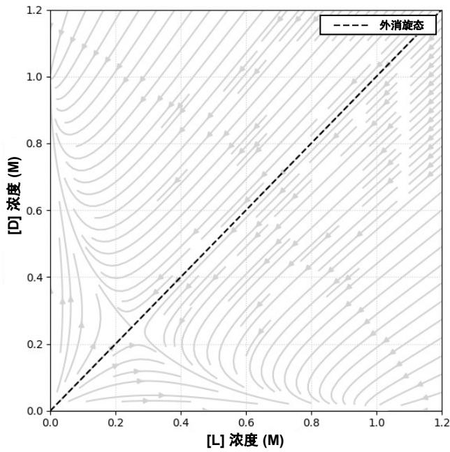


上述动力学拆分的例子表明，单体分子本身可以发生手性放大。然而，生命的起源还要求单体进一步连接形成同手性聚合物。而这些聚合物正是构成了蛋白质、酶，以及RNA等遗传物质的基础。那么，仅有部分对映体富集的单体库中，能否成功制备出同手性聚合物？我们以两种氨基酸的 L、D 构型为例，可能发生的反应如下：

$$
\mathrm{L}_{1} + \mathrm{L}_{2} \rightarrow \mathrm{L}_{1} \mathrm{L}_{2}, \quad r = k_ {\text{h o m o}} [ \mathrm{L}_{1} ] [ \mathrm{L}_{2} ]
$$

$$
\mathrm{D}_{1} + \mathrm{L}_{2} \rightarrow \mathrm{D}_{1} \mathrm{L}_{2}, \quad r = k_ {\text{h e t e r o}} [ \mathrm{D}_{1} ] [ \mathrm{L}_{2} ]
$$

$$
\mathrm{L}_{1} + \mathrm{D}_{2} \rightarrow \mathrm{L}_{1} \mathrm{D}_{2}, \quad r = k_ {\text{h e t e r o}} [ \mathrm{L}_{1} ] [ \mathrm{D}_{2} ]
$$

$$
\mathrm{D}_{1} + \mathrm{D}_{2} \rightarrow \mathrm{D}_{1} \mathrm{D}_{2}, \quad \mathrm{r} = k_ {\text{h o m o}} [ \mathrm{D}_{1} ] [ \mathrm{D}_{2} ]
$$

其中， $k_ {\mathrm{homo}}$ 与 $k_ {\mathrm {{h e t e r o}}}$ 分别为同手性、异手性二聚体的生成速率常量。

10-6 假设 $k_ {\mathrm{homo}} = k_ {\mathrm{hetero}}$ ，忽略动力学控制效应，推导证明：

$$
e e_ {\mathrm{homochiral}} = \frac {\left[ \mathrm{L}_{1} \mathrm{L}_{2} \right] - \left[ \mathrm{D}_{1} \mathrm{D}_{2} \right]}{\left[ \mathrm{L}_{1} \mathrm{L}_{2} \right] + \left[ \mathrm{D}_{1} \mathrm{D}_{2} \right]} = \frac {e e_{1} + e e_{2}}{1 + e e_{1} e e_{2}}
$$

其中， $e e_{1}$ 与 $e e_{2}$ 的定义为：

$$
e e_{1} = \frac {\left[ \mathrm{L}_{1} \right] - \left[ \mathrm{D}_{1} \right]}{\left[ \mathrm{L}_{1} \right] + \left[ \mathrm{D}_{1} \right]}, \quad e e_{2} = \frac {\left[ \mathrm{L}_{2} \right] - \left[ \mathrm{D}_{2} \right]}{\left[ \mathrm{L}_{2} \right] + \left[ \mathrm{D}_{2} \right]}
$$

10-7 对于10-4 的前生命湖泊体系， $e e_{1} = e e_{2} = e e_ {\mathrm{q4}}$ （10-4 计算结果），计算同手性二聚体的对映体过量 eehomochiral。

注：若未完成10-4，可采用 $e {e_ {\mathrm{q4}}} = 0.05 \left( 5\% \right)$ 计算。

10-8 假设只有同手性低聚物可发生链增长，初始氨基酸的对映体过量均为 $e e = 0.05$ ，计算聚合物链的同手性对映体过量 $e e_ {\mathrm{homochiral}} > 0.99$ 时，所需的最小氨基酸残基数。

上述数学模型后来在真实生化体系中得到验证：严格同手性的二肽分子可催化吡哆胺的转氨反应，生成外消旋的氨基酸 aa 与吡哆醛；生成的氨基酸再与另一种氨基酸衍生物 K 反应，生成二肽衍生物，并进一步转化为二肽 $\mathtt{aa}_{1} \mathtt{-a} \mathtt{a}_{2}$ ，完成循环。

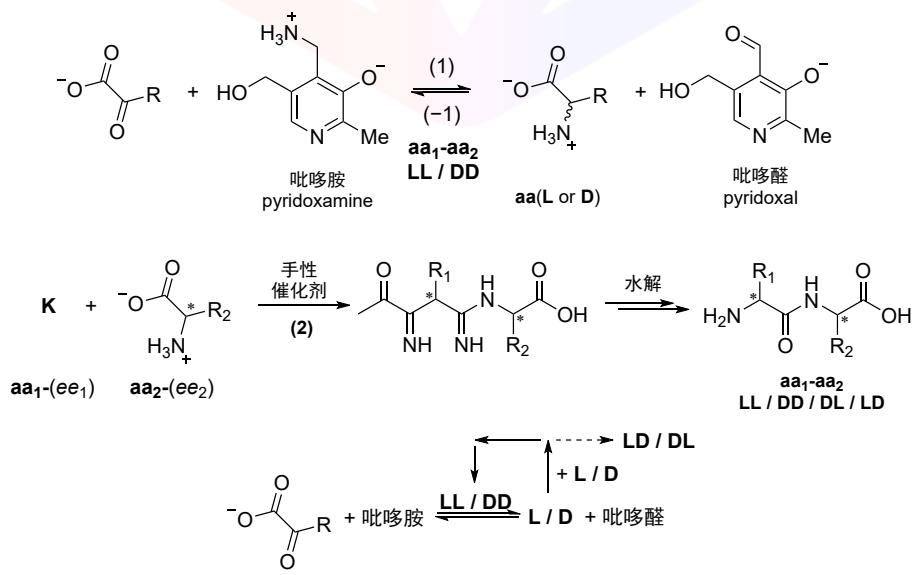


10-9 画出化合物K的结构。

上述反应 1 中，二肽催化剂的核心作用是促进氢原子转移 (HAT) 过程。例如，Yu 等人提出了 L–脯氨酰-L–缬氨酸（LL 型）催化丙酮酸合成丙氨酸的反应机理，如下图所示：

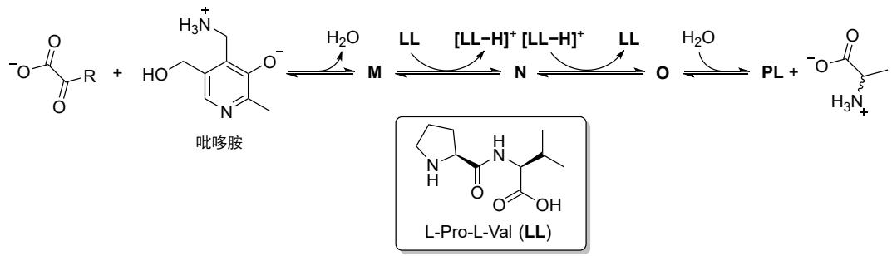


10-10 标出LL 型分子中参与氢原子转移过程的官能团。

10-11 画出化合物M–O的结构。

Yu 等人还发现，在由丙氨酸生成丙酮酸的逆反应 (−1) 中，D–丙氨酸的反应速率快于L–丙氨酸，从而使前生命体系富集L–型对映体。

10-12 在相应的过渡态中，哪些分子间作用力的有无，导致了 D–丙氨酸反应速率快于 L–丙氨酸？选出正确选项。

(a) 氢键

(b) $\pi$–$\pi$ 堆积

(c)空间位阻排斥

(d)手性中心的取向

研究者在流动体系中，分别研究了手性构建与手性破坏过程。在两种体系中，相应反应物的流速均为$\varphi$ ，结果如下图所示：

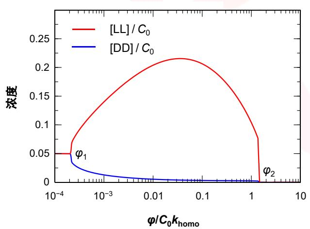


(a)酮酸（手性构建过程）


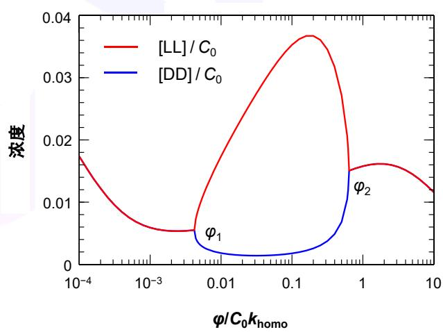


(b)氨基酸（手性破坏过程）


图 10-1 同手性二聚体浓度与流速的关系


10-13 推导手性不对称性达到最大值时的流速 $\varphi$ 值。

10-14 阐述下列流速范围内，[LL] 与 [DD] 的浓度变化行为：

(a) φ < φ1; 

(b) φ1 < φ < φ2; 

(c) φ > φ2
