::: {.callout-note appearance="simple" icon=false}
**Found an issue?** Post the problem number (**P2.17**) and the **step** on Discord.
[💬 Discuss on Discord →](https://discord.gg/CHANGE-ME){.discord-cta}
:::

Carbohydrates are an essential class of chemicals that fuel living organisms with energy. The common saccharide glucose (Glc) exists in either a linear or cyclic form. It can undergo some common chemical transformations:

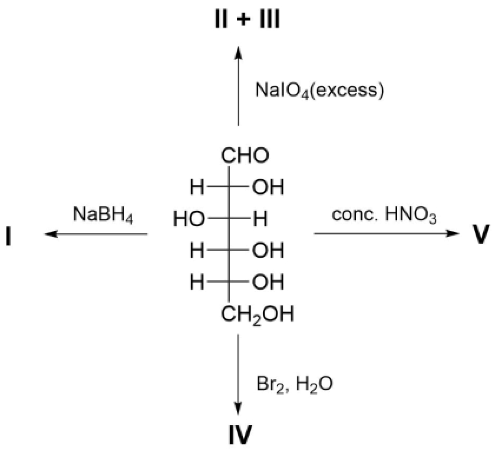

1. **Identify** products **I**–**V**.

> **Solution (Q17.1 — classical transformations of D-glucose).**
>
> The substrate in the figure is the open-chain form of D-glucose.
>
> | Product | Reagent(s) | Structure / name |
> |---|---|---|
> | **I** | $\mathrm{NaBH_4}$ | D-glucitol (sorbitol), $\mathrm{HOCH_2-(CHOH)_4-CH_2OH}$ |
> | **II** | excess $\mathrm{NaIO_4}$ | formic acid, $\mathrm{HCO_2H}$, formed from C1-C5 |
> | **III** | excess $\mathrm{NaIO_4}$ | formaldehyde, $\mathrm{HCHO}$, formed from C6 |
> | **IV** | $\mathrm{Br_2/H_2O}$ | D-gluconic acid, $\mathrm{HOOC-(CHOH)_4-CH_2OH}$ |
> | **V** | conc. $\mathrm{HNO_3}$ | D-glucaric acid (saccharic acid), $\mathrm{HOOC-(CHOH)_4-COOH}$ |
>
> Thus periodate cleavage gives $5\,\mathrm{HCO_2H}+1\,\mathrm{HCHO}$; the labels **II** and **III** can be interchanged if the two small products are drawn in the opposite order.
>
> 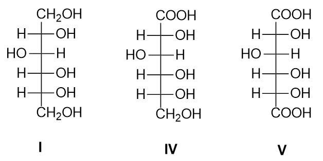
>
> **Structure check.** The adjusted drawings for **I**, **IV**, and **V** match D-glucitol, D-gluconic acid, and D-glucaric acid, respectively. Product **I** retains the D-glucose stereochemical pattern; with the original glucose numbering in a Fischer projection, the C2-C5 OH pattern is right-left-right-right.

In its cyclic form, glucose contains five hydroxy groups. Regioselective transformation of each position represents a challenge for chemists. Some synthetic transformations of $\alpha$-glucopyranose are shown below:

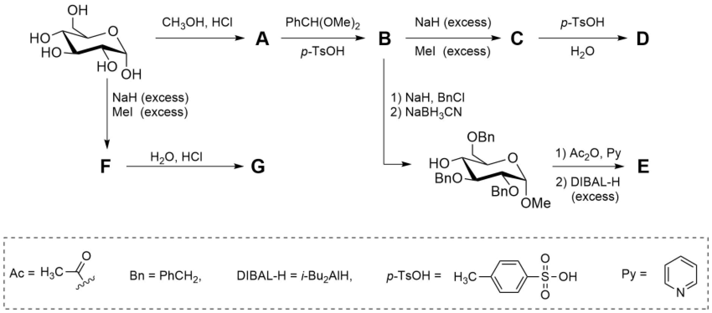

It is known that **A**, **G**, and **D** contain the same functional groups; **G** and **D** differ in formulae by $\mathrm{CH}_{2}$ ; **B** and **C** contain three six-membered rings in their structures; there are two different $\mathrm{CH}_{3}$ - groups in **E**.

2. **Draw** the structures of **A**–**G**.

> **Solution (Q17.2 — structures A-G).**
>
> | Compound | Structure |
> |---|---|
> | **A** | methyl $\alpha$-D-glucopyranoside |
> | **B** | methyl 4,6-$O$-benzylidene-$\alpha$-D-glucopyranoside |
> | **C** | methyl 2,3-di-$O$-methyl-4,6-$O$-benzylidene-$\alpha$-D-glucopyranoside |
> | **D** | methyl 2,3-di-$O$-methyl-$\alpha$-D-glucopyranoside, with free 4-OH and 6-OH |
> | **E** | methyl 2,3,6-tri-$O$-benzyl-4-$O$-ethyl-$\alpha$-D-glucopyranoside |
> | **F** | methyl 2,3,4,6-tetra-$O$-methyl-$\alpha$-D-glucopyranoside, as drawn in the corrected structure image |
> | **G** | 2,3,4,6-tetra-$O$-methyl-D-glucopyranose |
>
> 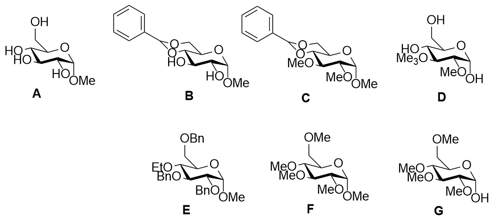
>
> **Checks.**
>
> - **Corrected image check.** In the updated drawing, **B**, **C**, **D**, and **F** all retain the anomeric $\mathrm{OMe}$ group. The added Me labels in **B** and **C** belong to the C1-O-Me methyl glycoside, not to an extra C-methyl substituent. Only **G** is drawn with a wavy anomeric OH because acid hydrolysis of **F** regenerates the reducing hemiacetal.
> - **Ring count.** **B** and **C** each contain the pyranose ring, the benzylidene acetal ring, and the phenyl ring, i.e. three six-membered rings.
> - **Hydrolysis of C.** Hydrolysis of **C** removes only the 4,6-benzylidene acetal, giving **D**; the methyl glycoside at C1 survives these conditions.
> - **G-D formula clue.** The formula clue is separate from the functional-group clue: **G** and **D** differ by $\mathrm{CH_2}$, which is a molecular-formula difference, not a functional group. Exhaustive methylation of glucose gives **F**, and acid hydrolysis cleaves only the anomeric methyl glycoside to give **G**. Thus **G** has two additional non-anomeric methyl ethers relative to **D** but lacks the anomeric methyl ether, giving net **G - D = $\mathrm{CH_2}$**.
> - **Two reductions, two different jobs.** In Q17.2, $\mathrm{NaBH_3CN}$ and excess DIBAL-H should not be treated as interchangeable hydride reagents. $\mathrm{NaBH_3CN}$ edits the benzylidene protecting group, while excess DIBAL-H edits the acetate substituent made from the free 4-OH.
> - **$\mathrm{NaBH_3CN}$ step in the lower branch.** After O2/O3 benzylation, the 4,6-$O$-benzylidene acetal is reductively opened under the acid-assisted $\mathrm{NaBH_3CN}$ conditions implied by the scheme. The C6 oxygen becomes the 6-$O$-benzyl ether, while O4 is released as 4-OH. Thus the intermediate is methyl 2,3,6-tri-$O$-benzyl-$\alpha$-D-glucopyranoside with 4-OH free, matching the corrected image.
> - **Ac2O/Py then excess DIBAL-H.** Acetylation converts the only free alcohol into 4-$O$Ac. Excess DIBAL-H is then used as a formal reduction of the acetate ester, $\mathrm{ROCOCH_3 \to ROCH_2CH_3}$, so the acetyl group becomes the 4-$O$-ethyl substituent in **E**. The two different methyl groups in **E** are therefore the anomeric $\mathrm{OMe}$ and the terminal $\mathrm{CH_3}$ of $\mathrm{OEt}$.

::: {.callout-note}
**A/D/G functional-group clue.** The statement that **A**, **D**, and **G** contain the same functional groups should be read in the broad protected-sugar sense: all three are oxygen-only carbohydrate derivatives containing hydroxy-type and ether-type functionality, and none contains an ester, carbonyl, benzylidene acetal, boronate, or other additional protecting-group functionality. Strictly, **A** and **D** are methyl glycosides with an anomeric acetal, whereas **G** is a reducing sugar hemiacetal after hydrolysis of **F**.
:::

However, these transformations cannot differentiate neighbouring 2,3- and 3,4-diols, since in both cases the hydroxy groups are in a trans-configuration and occupy equatorial positions. A brilliant solution to this challenge was found by using the common tetrahydropyranyl protecting group in chiral form:

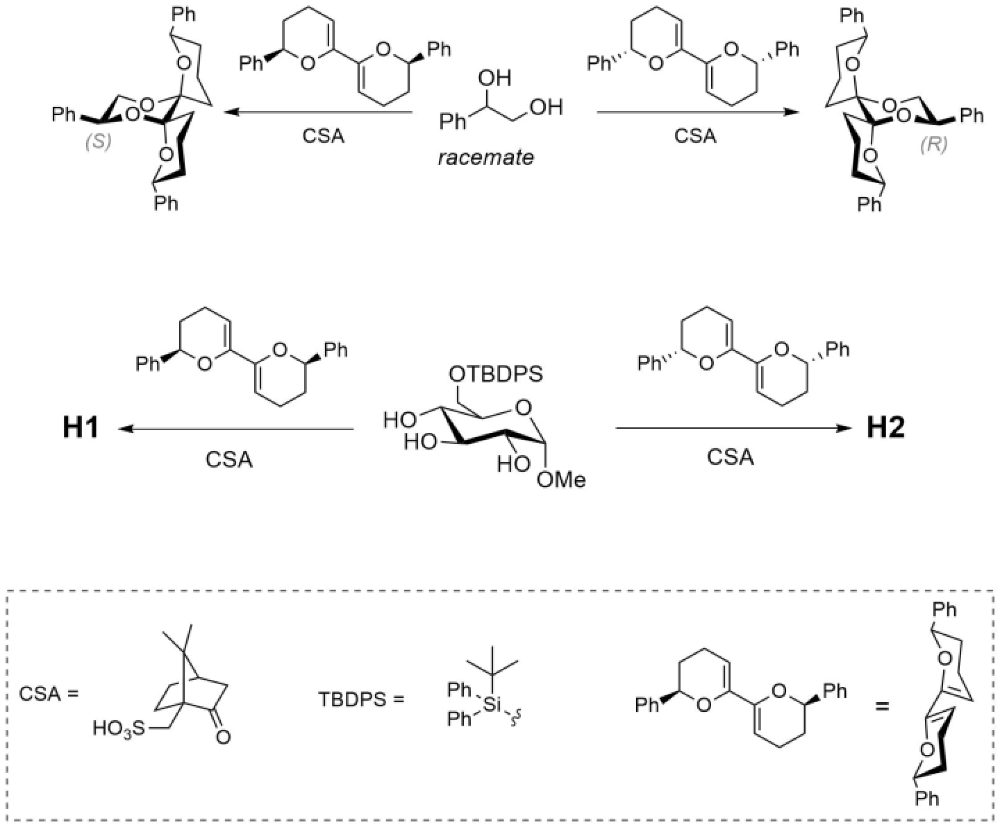

3. Based on the given example and considering that sterically bulky groups tend to occupy equatorial positions in chair conformations, **draw** the structures of **H1** and **H2**. For drawing **H1** you need to redraw the glucopyranose ring so that the 2,3-hydroxy groups are on the right side of the drawing. **Use** a chair conformation of the protecting group.

> **Solution (Q17.3 — chiral THP differentiation of the two trans-diols).**
>
> The two enantiomeric bis-dihydropyran reagents protect different adjacent trans-diols of methyl 6-$O$-TBDPS-$\alpha$-D-glucopyranoside. In both products the THP chairs must be drawn so that the phenyl substituents are equatorial; the sugar O-substituents occupy the orientations shown by the matching product in the model reaction.
>
> | Product | Structure to draw |
> |---|---|
> | **H1** | the **2,3-di-$O$-THP** protected glucoside: methyl 6-$O$-TBDPS-2,3-di-$O$-[the chiral THP reagent drawn on the left]-$\alpha$-D-glucopyranoside, with 4-OH free |
> | **H2** | the **3,4-di-$O$-THP** protected glucoside: methyl 6-$O$-TBDPS-3,4-di-$O$-[the enantiomeric THP reagent drawn on the right]-$\alpha$-D-glucopyranoside, with 2-OH free |
>
> 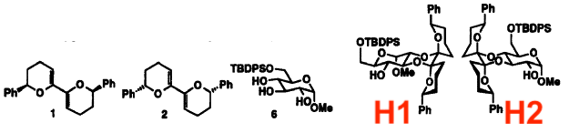
>
> **Structure check.** The added structures are consistent with the written assignments: **H1** uses the left-hand chiral bis-dihydropyran reagent and protects the O2/O3 trans-diol, leaving O4-H free; **H2** uses the enantiomeric reagent and protects the O3/O4 trans-diol, leaving O2-H free. In both products the C1-$\mathrm{OMe}$ and C6-$\mathrm{OTBDPS}$ substituents are retained, and the phenyl groups on the THP chairs are drawn in the sterically preferred equatorial-like orientations.
>
> For **H1**, the glucopyranose chair is redrawn so that O2 and O3 are the pair presented to the chiral protecting group. For **H2**, the original orientation already presents the O3/O4 pair. The selectivity follows from the same matched-chair rule as in the example: the accepted product keeps the bulky phenyl groups equatorial, while the alternative regioisomer would force an unfavorable axial bulky substituent in one THP chair.

A very interesting example of a glucopyranose transformation led to adamantane-type cyclic compound **K** stepwise blocking three hydroxyl groups with only one protecting group:

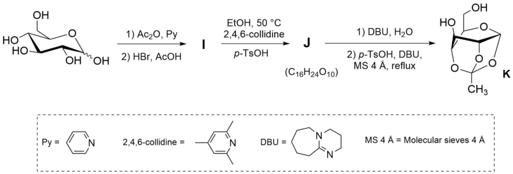

4. **Draw** the structures of **I** and **J**.

> **Solution (Q17.4 — acetobromoglucose and the orthoacetate).**
>
> | Intermediate | Structure |
> |---|---|
> | **I** | 2,3,4,6-tetra-$O$-acetyl-$\alpha$-D-glucopyranosyl bromide (acetobromoglucose) |
> | **J** | 3,4,6-tri-$O$-acetyl-1,2-$O$-(1-ethoxyethylidene)-$\alpha$-D-glucopyranose, i.e. the ethyl 1,2-orthoacetate |
>
> 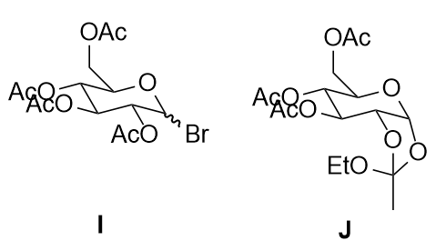
>
> **Structure check.** The provided drawings for **I** and **J** match the assigned connectivity. For **I**, the drawing uses a wavy anomeric C-Br bond; if a single stereoisomer is required, draw the glycosyl bromide as the $\alpha$ anomer, as stated in the table.
>
> Formation of **I** is the standard acetobromination of glucose. The anomeric OH is not intrinsically protected from acetylation: under acetylating conditions it can first form the peracetate, including an anomeric acetate. In the HBr/AcOH medium, however, the anomeric acetate (or protonated anomeric OH) is the most labile leaving group; it is converted through an oxocarbenium/acetoxonium-type intermediate and trapped by bromide. The ordinary 2,3,4,6-$O$-acetates remain as protecting groups. Neighboring participation by the 2-$O$-acetyl group then favors the $\alpha$-glycosyl bromide, so the isolated product is 2,3,4,6-tetra-$O$-acetyl-$\alpha$-D-glucopyranosyl bromide rather than the pentaacetate.
>
> The next key step is neighboring-group participation by the 2-$O$-acetyl group of **I**. Ethanol traps the acyloxonium intermediate to give the 1,2-orthoacetate **J**, whose formula is $\mathrm{C_{16}H_{24}O_{10}}$. DBU/water removes the three ordinary acetyl groups, and heating with acid/base in the presence of molecular sieves converts the 1,2-orthoacetate into the adamantane-like 1,2,3-$O$-orthoacetate **K**, in which O1, O2, and O3 are all bound to the same $\mathrm{C(CH_3)}$ orthoester carbon.

Another class of reagents that can form cyclic acetal-type structures is boronic acids. Their chemistry was successfully used to synthesise the trisaccharide “**Gal-Gal-Glc**” derivative:

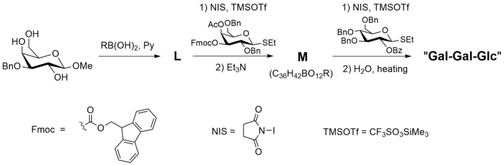

5. **Draw** the structures of **L**, **M**, and trisaccharide “**Gal-Gal-Glc**”. Do not specify the configuration of the newly formed anomeric centres.

> **Solution (Q17.5 — boronate-directed synthesis of Gal-Gal-Glc).**
>
> The starting acceptor is the methyl 3-O-benzyl-D-glucopyranoside shown in the scheme. Arylboronic acid masks its 4,6-diol as a cyclic boronate, leaving only O2 available for the first glycosylation.
>
> **Structures to draw.**
>
> **L**
>
> Methyl 3-O-benzyl-4,6-O-(RB)-D-glucopyranoside. O2 remains free.
>
> **M**
>
> Gal-(1->2)-Glc disaccharide.
>
> - Gal unit: 6-OAc, 2,3-di-OBn, 4-OH.
> - Glc unit: methyl 3-O-benzyl-4,6-O-(RB)-D-glucopyranoside.
>
> **Gal-Gal-Glc**
>
> Gal-(1->4)-Gal-(1->2)-Glc trisaccharide.
>
> - Nonreducing Gal unit: 2-OBz, 3,4,6-tri-OBn.
> - Middle Gal unit: 6-OAc, 2,3-di-OBn.
> - Glc unit: methyl 3-O-benzyl-D-glucopyranoside with free 4-OH and 6-OH after boronate hydrolysis.
>
> 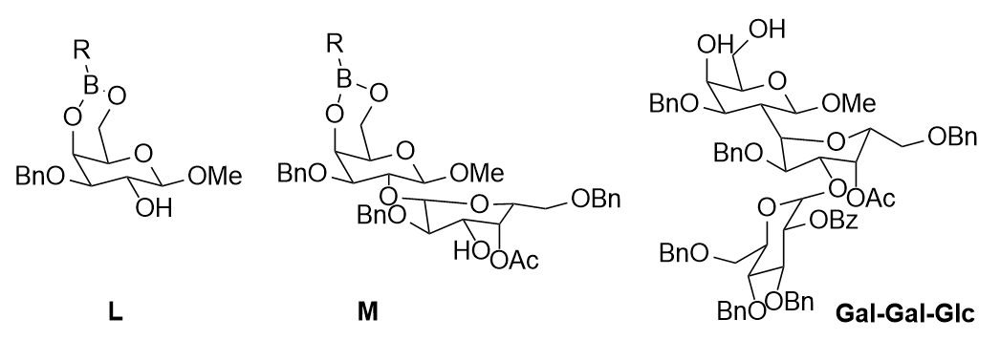
>
> In **M**, Et3N removes the Fmoc group from O4 of the first galactose residue, exposing the acceptor OH for the second NIS/TMSOTf glycosylation. The formula check for **M** is consistent: two sugar units plus one methyl glycoside, three benzyl groups, one acetyl group, and one cyclic boronate give C36H42BO12R.
>
> **Structure check.**
>
> - The adjusted drawings for **L**, **M**, and **Gal-Gal-Glc** match the written assignments.
> - In the final **Gal-Gal-Glc** drawing, the Glc 4,6-boronate has been hydrolysed to free 4-OH and 6-OH, consistent with the stated H2O/heating workup and with the assignment above.
> - The two newly formed anomeric configurations in the Gal-(1->4)-Gal and Gal-(1->2)-Glc linkages are intentionally left unspecified, as requested.

---

## 中文版 / Chinese translation
## 第17题 糖化学

糖类是生命体供能所需的重要化合物。常见的葡萄糖 (Glc) 能以链状或环状形式存在。葡萄糖能发生一些常见的化学转化：

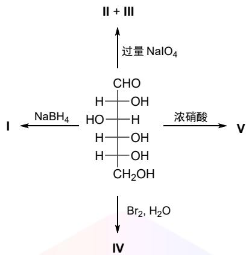

# 17-1 给出产物 I–V。

环状葡萄糖分子含有五个羟基，其区域选择性转化反应颇具挑战。以下是 $\alpha$-吡喃葡萄糖的一些合成转化示例：

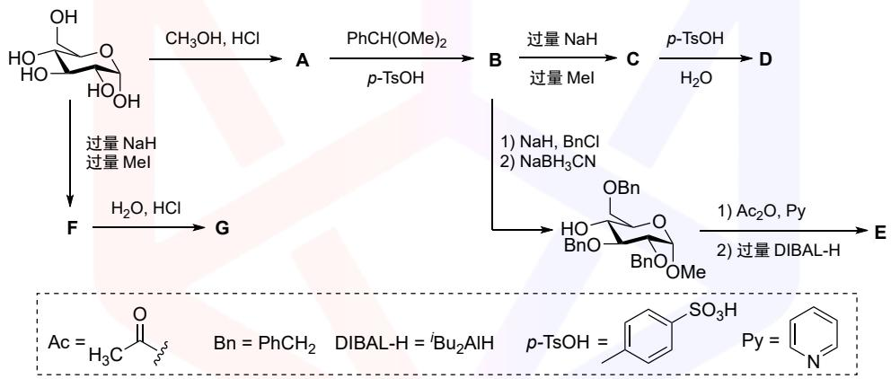

已知：A、G和 D 含有相同的官能团；G与 D 的分子式相差一个 $\mathrm{CH}_{2}$ ；B 和C 含有三个六元环；E 含有两个不同的甲基。

# 17-2 画出 A–G 的结构式。

然而，这些转化无法区分 2,3 和 3,4 这两对相邻羟基，因为它们均为平伏键上的反式构型。针对此挑战，研究人员开发出一个巧妙的策略，使用常见的四氢吡喃手性保护基：

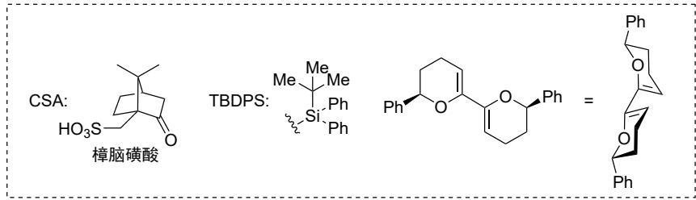

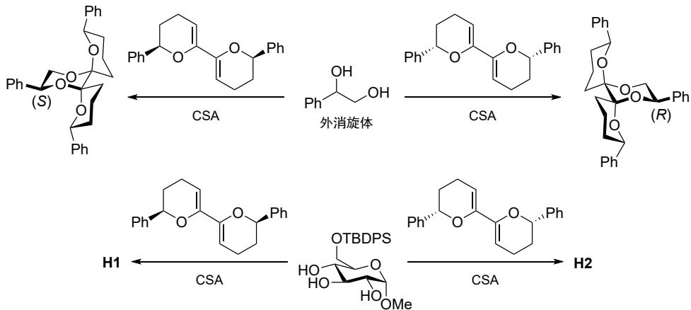

17-3 请画出此策略中 H1 和 H2 的结构式，注意椅式构象中大位阻基团倾向处于平伏键。画 H1 时，需重新绘制吡喃葡萄糖环，使其 2,3-羟基位于结构式的右侧。保护基需绘制为椅式构象。

下面是一个吡喃葡萄糖转化的有趣例子，仅用一种保护基、分步封闭三个羟基，最终得到类似金刚烷的笼状化合物K：

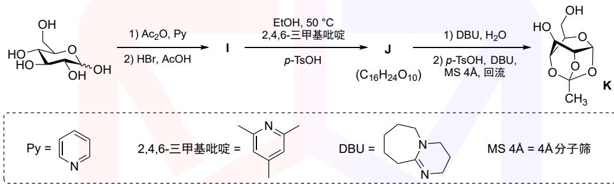

17-4 画出I和J的结构式。

有机硼酸也能形成类似缩醛的环状结构。研究人员由此成功合成了三糖Gal-Gal-Glc 的衍生物：

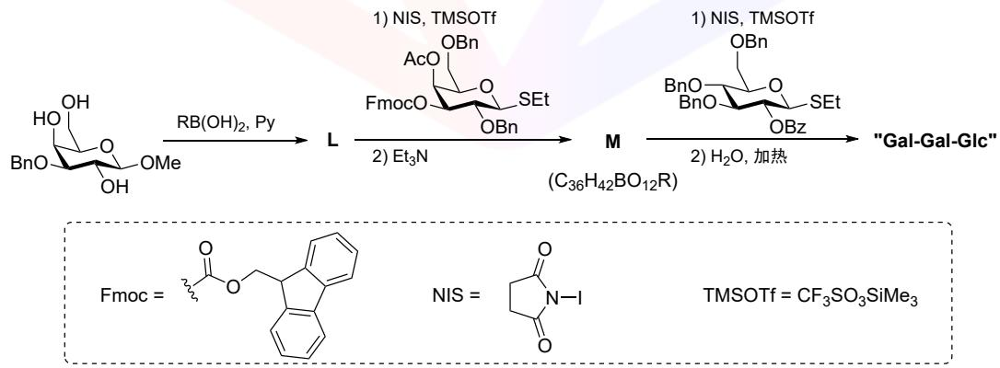

17-5 画出L、M及三糖Gal-Gal-Glc 的结构式。新生成的异头碳无需标明构型。

---

## 教学点评 / 解题分析

本题是 FoAD 第 6 项（碳水化合物化学）的**正面命中题**——糖化学领域的"语言题"，几乎不涉及隐蔽推断，主要考察学生对**经典糖反应库**与**保护基编排逻辑**的系统性掌握。整题难度集中在 Q17.2（连续保护基操作的次序推断）与 Q17.3（手性 THP 试剂区分两组反式邻二醇），其他几小问对学过 FoAD #6 的学生都是标准范式。

**题眼。** 全题没有"深藏"的题眼，但有两条**钥匙线索**：

- **Q17.2 的"缩醛/缩酮形成涉及伯醇"提示**——这是命题人给的最关键钥匙。葡萄糖吡喃糖只有 **C6 是伯醇位**，因此凡是"涉及伯醇"的保护基都必须包含 C6。**4,6-O-亚苄基缩醛**（1,3-二氧杂六元环）是同时锁定 C4 与 C6 的经典保护基，因此 B 必然是 methyl 4,6-O-benzylidene-α-D-glucopyranoside；这一锁定让后续 B → C → D → E → F → G 的整条链豁然开朗。
- **Q17.3 的"大基团趋于直立赤道位"提示**——手性 THP 试剂的 phenyl 取代基必须取赤道位，由此**唯一决定**了哪一对 OH 与哪一个 THP enantiomer 反应；这是一道**几何 + 立体化学**的混合推理题，而非反应类型题。

**推断链。**

- **Q17.1（糖反应库）**——典型的"试剂 → 产物"配对：$\mathrm{NaBH_4} \to$ C1 还原（D-葡糖醇 sorbitol）；$\mathrm{NaIO_4}$ 过量 $\to$ 邻二醇 C–C 切断给出 5 mol HCO₂H + 1 mol HCHO；$\mathrm{Br_2/H_2O} \to$ 仅 C1 醛 → 羧酸（D-葡糖酸）；浓 $\mathrm{HNO_3} \to$ C1 + C6 双端氧化（D-葡糖二酸 glucaric）。糖化学课堂入门级语言。
- **Q17.2（保护基编排）**——围绕 4,6-O-亚苄基缩醛展开的"洋葱模型"：A (methyl α-glucoside) → B (4,6-亚苄基，异头 OMe 保留) → C (2,3-二甲基化) → D (稀酸脱亚苄基保异头甲基) → E (下分支：2,3-苄基化 + $\mathrm{NaBH_3CN/H^+}$ 还原性开环给 6-OBn/4-OH + 4-OAc + excess DIBAL-H 还原为 4-OEt)；另一支路中 F 是穷尽甲基化得到的 α-甲基苷，G 是酸水解后形成的还原性半缩醛。这里的两个还原剂分工完全不同：$\mathrm{NaBH_3CN/H^+}$ 是"开亚苄基"，excess DIBAL-H 是"把 4-OAc 还原成 4-OEt"。**G 比 D 多一个 CH₂** 的提示是验证手段，正好匹配 F → G 仅切异头 OMe。
- **Q17.3（手性 THP 区分反式邻二醇）**——全题最精巧的一问。葡萄糖吡喃糖的 2,3-OH 与 3,4-OH 都是反式赤道-赤道，普通保护基无法选择性反应。命题方用一对**手性双氢吡喃**——两个 THP 椅式互为镜像，与不同位的邻二醇匹配时产生**手性匹配/失配**。在每个产物中 phenyl 必须取赤道位的几何约束唯一决定了哪个 THP 与哪对 OH 反应。H1 = 2,3-di-O-THP；H2 = 3,4-di-O-THP（分别用 enantiomeric THP 试剂）。
- **Q17.4–Q17.5（三糖合成 Gal-Gal-Glc）**——经典的甘露糖/半乳糖与葡萄糖的糖苷化；命题方避免了 α/β 立体化学的纠缠，只要求骨架连接。

**板块。**

| 板块 | 小问 | 核心化学 |
|---|---|---|
| 糖反应库 | Q17.1 | NaBH₄ / NaIO₄ / Br₂·H₂O / HNO₃ 四件套 |
| 保护基编排 | Q17.2 | 4,6-亚苄基 + 选择性脱保护 + 还原性开环 + 4-OAc $\to$ 4-OEt |
| 手性区分反式邻二醇 | Q17.3 | 手性 THP + 椅式取向 + 几何匹配 |
| 糖苷化与三糖装配 | Q17.4–Q17.5 | Gal-Gal-Glc 骨架 |

**经验总结。**

1. **糖反应库要肌肉记忆**——NaBH₄ → C1 还原；NaIO₄ → 邻二醇切断；Br₂·H₂O → C1 → 羧酸；HNO₃ → C1+C6 双端氧化。这四个反应是糖化学的"基础四件套"。
2. **保护基编排的"伯醇优先" 原则**——4,6-O-亚苄基在己糖中是黄金保护基：同时锁住 C4 + C6，留出 C2/C3 给后续操作。看到"伯醇优先" 提示就要条件反射想到 4,6-亚苄基。
3. **缩醛稳定性梯度**——异头甲基苷 > 4,6-亚苄基缩醛 > 1,2-异亚丙叉缩酮。稀酸下亚苄基先脱、甲基苷保留——这是选择性脱保护的核心。
4. **两个还原不是一回事**——$\mathrm{NaBH_3CN/H^+}$ 负责打开 4,6-O-亚苄基，本题条件下得到 6-OBn/4-OH；后面的 excess DIBAL-H 不是再开亚苄基，而是把 4-OAc 形式上还原为 4-OEt，即 $\mathrm{ROCOCH_3 \to ROCH_2CH_3}$。因此解题时要先问"还原的是保护基骨架，还是还原的是新装上的酰基"。
5. **手性区分等价 OH** 是 IChO 出题人喜欢用的高级技巧——核心是"局部立体约束"决定哪一对 OH 与哪个 enantiomer 匹配。这与不对称催化的"手性环境"哲学一脉相承。
6. **Fischer / Haworth / 椅式三种投影要无缝切换**——题目混用了三种画法（Q1 用 Fischer，Q2 用 Haworth/椅式，Q3 强调椅式），任何一种生疏都会打乱整题节奏。

**难度评级：★★★☆☆**——对受过 FoAD #6 系统训练的学生属于送分题；对仅有通识有机基础的学生顶到 ★★★★☆，主要被 Q17.3 的手性 THP 与 Q17.2 下分支的"还原性开环亚苄基 → 4-OAc → DIBAL-H → 4-OEt"卡住。整题与 P2.19（碳水化合物作为手性源）形成"基础（保护基）→ 应用（全合成）"的姊妹题对。
