::: {.callout-note appearance="simple" icon=false}
**Found an issue?** Post the problem number (**P2.19**) and the **step** on Discord.
[💬 Discuss on Discord →](https://discord.gg/CHANGE-ME){.discord-cta}
:::

Asymmetric synthesis has attracted significant attention in recent years thanks to advances in asymmetric catalysis. However, using chiral auxiliary groups in the substrate structure remains an efficient approach for chiral total synthesis, especially when chiral substrates are readily available. Different monosaccharides are handy starting materials in natural product synthesis. For example, in 1985, the first synthesis of compound **X** from L-sorbose derivative **A** was published.

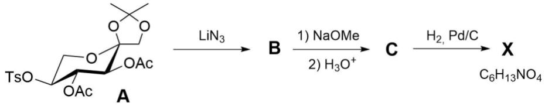

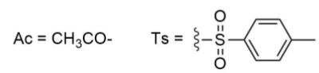

1. **Draw** the structures of compounds **B**, **C**, and the most stable diastereomer of **X,** including stereochemistry. Note: **X** contains a five-membered heterocycle, and the formation of **X** proceeds through an imine intermediate.

> **Solution (Q1 — L-sorbose derivative to DMDP).**
>
> **B** is obtained by direct $\mathrm{S_N2}$ substitution at the tosylate-bearing C5 stereocentre of **A**:
>
> $$\boxed{\mathbf{B}=\text{the C5-azide analogue of A: replace } \mathrm{OTs}\text{ by }\mathrm{N_3}\ \text{with inversion at C5},\text{ leaving both OAc groups and the acetonide unchanged.}}$$
>
> The $\mathrm{NaOMe}$ step removes the acetyl groups, and acidic workup hydrolyses the acetonide. Therefore **C** is the deprotected C5-azidosugar drawn in the article as a cyclic hemiacetal, not an amino compound or imine:
>
> $$\boxed{\mathbf{C}=5\text{-azido-}5\text{-deoxy-L-sorbose}\;(\text{drawn as the article's pyranose/hemiacetal form}).}$$
>
> Hydrogenation reduces $\mathrm{N_3}$ to $\mathrm{NH_2}$; the amine condenses intramolecularly with the C2 ketone to form a cyclic imine, and further hydrogenation gives the most stable pyrrolidine iminosugar:
>
> 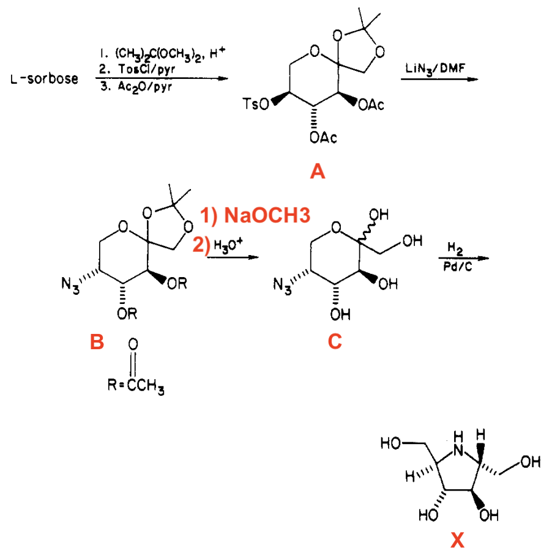
>
> Thus **X** is DMDP, $(2R,3R,4R,5R)$-2,5-bis(hydroxymethyl)-3,4-dihydroxypyrrolidine. The structure sequence is consistent with Card and Hitz, *J. Org. Chem.* 1985, 50, 891-893, DOI: [10.1021/jo00206a037](https://doi.org/10.1021/jo00206a037).

Thromboxane B2 (TxB2) is a stable, inactive breakdown product of Thromboxane A2 (TxA2), a potent molecule that causes blood platelets to clump (aggregate) and blood vessels to constrict. It was synthesised from D-glucose. The following scheme shows the synthesis of key intermediate **I**.

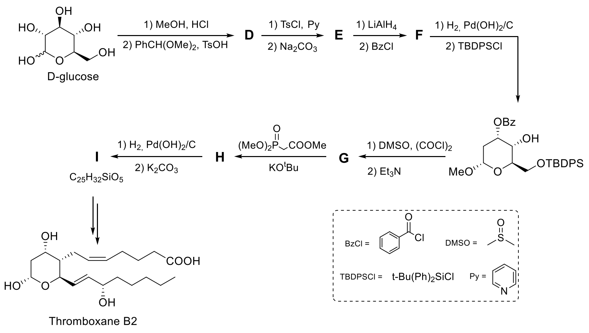

2. **Draw** the structures of **D**–**I** with stereochemistry. Note: Acetal/ketal formation involves a primary alcohol when it is available.

> **Solution (Q2 — corrected D-I assignments from the printed scheme).**
>
> **D** is the product of methanolysis followed by benzylidene acetal formation:
>
> | Compound | Correct structure to draw |
> |---|---|
> | **D** | 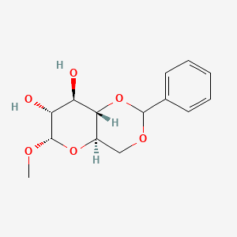 methyl 4,6-O-benzylidene-$\alpha$-D-glucopyranoside; C2-OH and C3-OH remain free. |
> | **E** | methyl 2,3-anhydro-4,6-O-benzylidene-$\alpha$-D-mannopyranoside/allopyranoside epoxide, formed by tosylation followed by intramolecular displacement by the neighbouring OH. |
> | **F** | LiAlH4 opens the 2,3-anhydro sugar to the **2-deoxy** pyranoside; BzCl protects the newly retained secondary OH as OBz while the 4,6-benzylidene remains. |
> | **G** | After hydrogenolysis of the benzylidene and selective TBDPS protection of the primary C6-OH, Swern oxidation converts the remaining secondary OH into the corresponding ketone/ulose. |
> | **H** | Horner-Wadsworth-Emmons olefination of **G** gives the exocyclic $\alpha,\beta$-unsaturated ester at the ketone carbon. |
> | **I** | Hydrogenation followed by base treatment gives the protected TxB2 key intermediate with formula $\mathrm{C_{25}H_{32}SiO_5}$; draw the pyranoside stereochemistry exactly as inherited from the scheme, with the C6-OTBDPS group retained. |
>
> The key correction is that the "primary alcohol participates in acetal formation" clue refers to formation of the **4,6-O-benzylidene** acetal in **D**, not to a 1,2:5,6-di-O-isopropylidene furanose. The D structure image is from PubChem name lookup; 
>
> 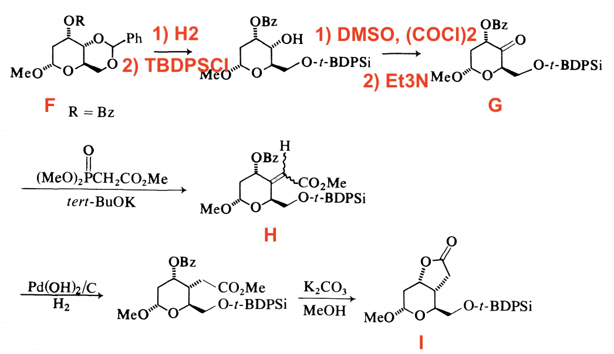

3. **Determine** in what order the following combinations of reagents $\left( Z_{1} \mathrm{-} Z_{4} \right)$ must be used to obtain Thromboxane $\mathbf{B}_{2}$ from **I**: 

$Z_{1} - 1 )$ PCC $\mathrm {( P y H^{+} {\cdot} C r O_{3} C l^{-}}$ ), 2) $\mathrm {P h_{3} P^{+} C H^{-} C ( O ) ( C H_{2} )_{4} C H_{3}} ;$

$Z_2$ – 1) BzCl, 2) $\mathrm {B u_{4} N^{+} F^{-}}$ ;

$Z_3$ – 1) $\ce{NaBH4}$, 2) ${\mathrm{K}}_{2} {\mathrm{CO}}_{3}$ , 3) HCl;

$Z_4$ – 1) $\ce{(i-Bu)2AlH}$, 2) $\ce{Ph3P+CH^−(CH2)3COOH}$, 3) $\ce{CH2N2}$.

> **Solution (Q3 — ordering of Z1-Z4 for I -> TxB2).**
>
> **Order: Z4 -> Z2 -> Z1 -> Z3.**
>
> 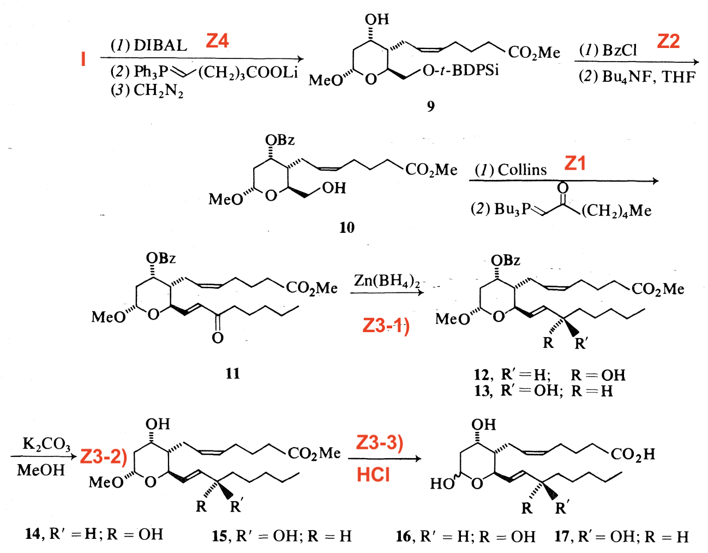
>
> **Why this order is forced by the structure of I.**
>
> Intermediate **I** is already the protected thromboxane ring system, but it is missing both side chains in their final oxidation states. It still contains the lactone/lactol-side carbonyl precursor needed for the **alpha chain**, a free secondary alcohol on the ring, and a primary alcohol masked as the **OTBDPS** ether.
>
> **1. Z4 must be first.** DIBAL reduces the lactone/lactol carbonyl of **I** to the aldehyde/lactol oxidation level required for Wittig homologation. The ylide $\mathrm{Ph_3P{=}CH(CH_2)_3CO_2Li}$ then installs the alpha chain with the alkene and terminal carboxylate skeleton. $\mathrm{CH_2N_2}$ converts that carboxylic acid/carboxylate into the methyl ester, giving intermediate **9** in the provided structure plate. This step cannot wait until after oxidative side-chain elaboration, because it uses the lactone/lactol carbonyl functionality present in **I**.
>
> **2. Z2 comes next.** The newly formed **9** still has a free ring alcohol and a primary **OTBDPS** group. $\mathrm{BzCl}$ protects the ring alcohol as **OBz**, and $\mathrm{Bu_4NF}$ removes the TBDPS group to expose the primary alcohol, giving **10**. This sequencing is chemoselective: the ring alcohol must be protected before the primary alcohol is unmasked for oxidation in the next step.
>
> **3. Z1 then installs the omega chain.** PCC/Collins-type oxidation converts the primary alcohol of **10** into the aldehyde. The stabilised ylide $\mathrm{Ph_3P{=}CHC(O)(CH_2)_4CH_3}$ then forms the enone side chain, giving **11**. This reagent set has to follow Z2, because the aldehyde needed for the Wittig reaction is generated only after desilylation of the primary alcohol.
>
> **4. Z3 is the final deprotection/reduction sequence.** $\mathrm{NaBH_4}$ (the literature plate uses $\mathrm{Zn(BH_4)_2}$ for the same hydride-reduction role) reduces the side-chain ketone of **11** to the C15 alcohol, giving the C15 epimeric alcohols **12/13**. $\mathrm{K_2CO_3/MeOH}$ removes the benzoate to give **14/15**, and acid then hydrolyses the methyl glycoside and methyl ester to the free lactol/carboxylic acid products **16/17**, corresponding to TxB2 stereoisomeric products. The natural TxB2 assignment uses the isomer with the correct C15 alcohol configuration.
>
> This matches the Hanessian-Lavallee D-glucose route to thromboxane B2: the sequence first constructs the alpha chain from **I**, then unmasks the primary alcohol, oxidises it for omega-chain Wittig extension, and only at the end reduces/deprotects to the free TxB2 framework.

Using compound **D**, it is possible to synthesise other chiral molecules. $( + )$ -Actinobolin, isolated from the culture fluid of Streptomyces, has a broad antibacterial spectrum and moderate antitumor activity. In the synthesis of $( + )$ -Actinobolin, overall, five new stereocentres were formed using the chiral auxiliary.

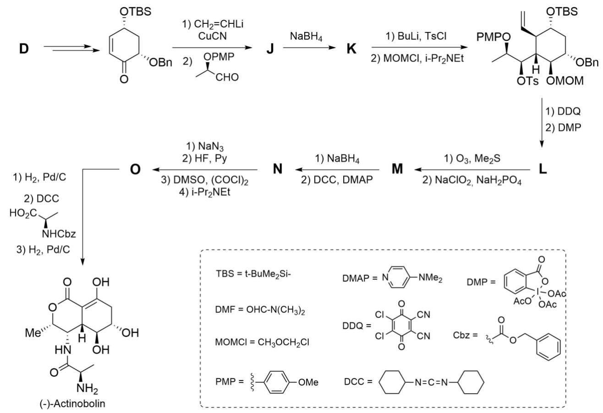

4. **Draw** the structures of **J**–**O**, including stereochemistry.

> **Solution (Q4 — corrected J-O logic).**
>
> The unlabeled substrate entering this sequence is the protected cyclohexenone drawn in the problem, not the glucose acetal **D** itself. The labels **J-O** are therefore assigned by the transformations in that cyclohexenone route:
>
> | Compound | Correct structure to draw |
> |---|---|
> | **J** | The conjugate-addition/aldol adduct shown in the added structure plate: vinyl cuprate adds to the enone, then the chiral aldehyde bearing an MPM/PMB-protected alcohol traps the enolate. **J** retains the ring ketone, has the newly installed terminal vinyl group, and bears the $\mathrm{CH(OH)CH(CH_3)OMPM}$ side chain with the stereochemistry drawn in the plate. |
> | **K** | $\mathrm{NaBH_4}$ reduces the **ring ketone** of **J** to the secondary ring alcohol. Thus **K** contains two free alcohols: the pre-existing aldol side-chain alcohol and the newly formed ring alcohol. In the following step, BuLi/TsCl converts the side-chain alcohol into **OTs**, while MOMCl protects the newly formed ring alcohol as **OMOM**. |
> | **L** | After the OTs/OMOM intermediate, DDQ cleaves the MPM ether and Dess-Martin periodinane oxidises that liberated secondary alcohol to the methyl ketone drawn in **L**. The terminal alkene, OTBS, OBn, OTs, and OMOM groups remain in place. |
> | **M** | Ozonolysis of the terminal alkene followed by Pinnick oxidation converts that vinyl group into the carboxylic acid; the methyl ketone, OTs, OMOM, OTBS, and OBn groups are retained. |
> | **N** | $\mathrm{NaBH_4}$ reduces the methyl ketone of **M** to the hydroxy acid, and DCC/DMAP then promotes intramolecular esterification to the protected lactone **N**. The tosylate is still present at this stage and is not replaced until the next step. |
> | **O** | $\mathrm{NaN_3}$ displaces the tosylate with inversion to install the azide; HF/pyridine removes the TBS group; Swern oxidation followed by silica gel gives the enolised lactone/alcohol oxidation pattern drawn as **O**. The azide and benzyl ether are retained until the final hydrogenation/coupling sequence with Cbz-D-alanine. |
>
> 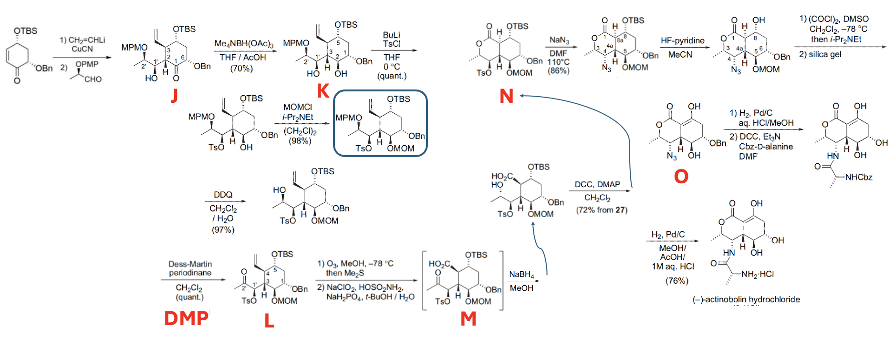
>
> **Structure note:** The added structure image is consistent with the problem scheme and should be used as the J-O structure plate. It also shows the drawn route leading to the $(-)$-actinobolin series; if the surrounding OCR text says $(+)$-actinobolin, treat that as a sign/text mismatch and keep the stereochemistry shown in the scheme unless the target enantiomer is explicitly changed.
>
> **Abbreviation / source note:** $\mathrm{MPM}$ is **not** the same as $\mathrm{PMP}$ in standard protecting-group shorthand. $\mathrm{MPM}$ = $\mathrm{PMB}$ = p-methoxybenzyl = p-methoxyphenylmethyl, whereas $\mathrm{PMP}$ normally means p-methoxyphenyl. The source article for this actinobolin route gives the relevant aldehyde as **P = MPM**, and the later DDQ cleavage in **K -> L** is also diagnostic for an MPM/PMB ether. Therefore the $\mathrm{PMP}$/$\mathrm{OPMP}$ label in the question scheme should be treated as a typographical/OCR error and corrected in the solution to $\mathrm{MPM}$/$\mathrm{OMPM}$, without altering the original question image. Reference: S. Imuta, H. Tanimoto, M. K. Momose, N. Chida, "Total synthesis of actinobolin from D-glucose by way of the stereoselective three-component coupling reaction," *Tetrahedron* **2006**, 62, 6926-6944, DOI: [10.1016/j.tet.2006.04.079](https://doi.org/10.1016/j.tet.2006.04.079).

Swainsonine, an indolizidine alkaloid, was synthesised using benzyl-$\alpha$-D-mannopyranoside. It is a potent inhibitor of Golgi apparatus alpha-mannosidase II, an immunomodulator, and a potential chemotherapeutic agent. The synthesis of (–)-Swainsonine is given below.

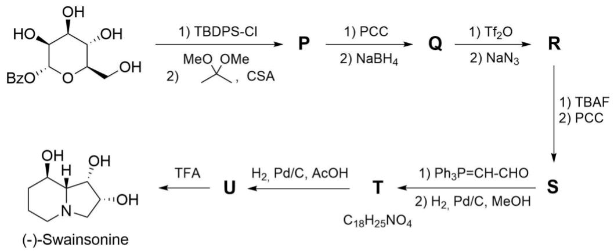

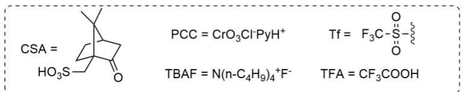

Hint: **P** and **Q** are epimers.

5. **Determine** the configurations of all stereocentres in $( - )$ -Swainsonine and the starting material.

> **Solution (Q5 — absolute configurations).**
>
> | Compound | Configuration image / stereochemical name |
> |---|---|
> | Starting benzyl $\alpha$-D-mannopyranoside | 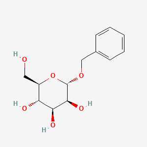 PubChem CID [10956572](https://pubchem.ncbi.nlm.nih.gov/compound/10956572): $(2R,3S,4S,5S,6S)$-2-(hydroxymethyl)-6-(phenylmethoxy)oxane-3,4,5-triol. |
> | $(-)$-Swainsonine | 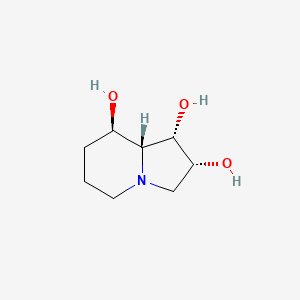 PubChem CID [51683](https://pubchem.ncbi.nlm.nih.gov/compound/51683): $(1S,2R,8R,8aR)$-1,2,3,5,6,7,8,8a-octahydroindolizine-1,2,8-triol. |
>
> Therefore the target stereocentres of $(-)$-swainsonine are:
>
> $$\boxed{1S,\;2R,\;8R,\;8aR.}$$

6. **Draw** the structures of **P**–**U**, including stereochemistry.

> **Solution (Q6 — corrected P-U assignments).**
>
> The following literature route image matches the problem's swainsonine scheme and is useful for drawing P-U:
>
> 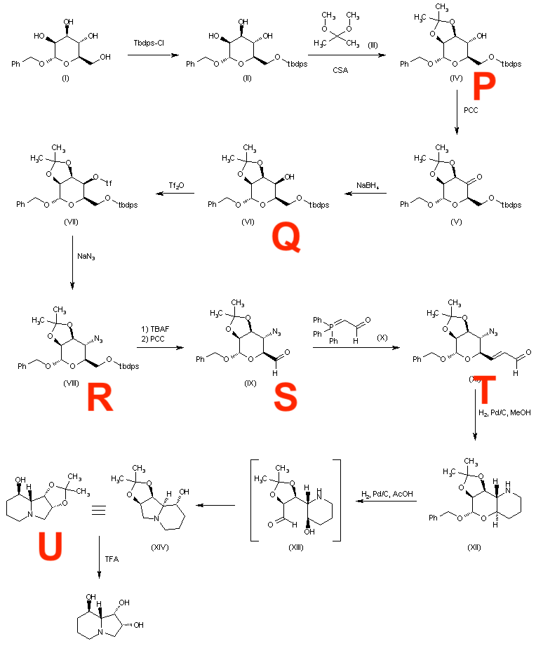
>
> **Source note:** The route image is from DrugFuture's reproduction of Fleet et al., *Tetrahedron Letters* 1984, 25, 1853, "Enantiospecific synthesis of swainsonine ... from D-mannose".

7. **Indicate** which stereocentres are preserved and which centres are newly formed.

> **Solution (Q7 — preserved, inverted, and newly set stereocentres).**
>
> - The two acetonide-bearing stereocentres corresponding to the mannose C2/C3 region are carried through the route and appear as the 1,2-diol stereochemistry of $(-)$-swainsonine.
> - The C4 centre is **not simply preserved**: P -> Q inverts it by oxidation/reduction, and Q -> R inverts it again by triflate displacement with azide. Net, this centre is controlled by two stereospecific operations and ends with the configuration required for the C8-OH of swainsonine.
> - The primary C6 carbon is not initially stereogenic; after oxidation, Wittig homologation, and reductive cyclisation it becomes part of the piperidine ring but does not introduce an uncontrolled stereochemical ambiguity.
> - The anomeric C1 centre is labile during hydrogenolysis to a lactol/open-chain aminoaldehyde and is re-set during the final intramolecular reductive amination that gives the indolizidine ring junction. This is the principal **newly fixed** stereocentre in the late-stage bicyclisation.
>
> In short: most of the stereochemical information is transferred from D-mannose, C4 is deliberately inverted twice, and the ring-junction stereocentre is newly formed under substrate control during the final reductive amination.

---

## 中文版 / Chinese translation
## 第19题 糖类手性源

近年来，随着不对称催化的发展，不对称合成备受关注。然而在手性全合成中，直接使用含手性辅助基的底物仍不失为有效策略，尤其是对于容易获取的手性底物。比如，各种单糖便可作为天然产物合成中便捷的手性源。1985 年，首次报道了以L–山梨糖衍生物A为原料合成化合物X的路线。

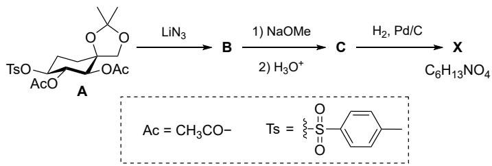

19-1 画出化合物B、C、X的最稳定非对映异构体的结构式，需标明立体化学。

注： $\pmb {\mathrm{x}}$ 中含有一个五元杂环，经过亚胺中间体生成。

血栓素 A2可强烈促进血小板聚集并引起血管收缩。血栓素 B2(TxB2) 是血栓素A2 (TxA2) 分解而得的稳定产物，无生物活性。血栓素B2 可由 D–葡萄糖人工合成，其关键中间体I的合成路线如下所示：

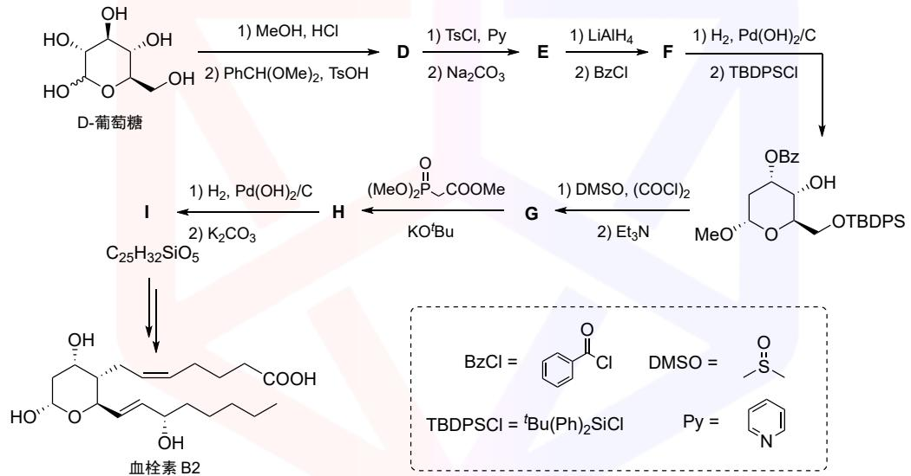

19-2 画出D–I的结构式，需标明立体化学。

注：缩醛/缩酮形成时，若存在伯醇，则优先与伯醇反应。

19-3 指出应按什么顺序使用下列试剂组合Z1–Z4，将中间体I转化为血栓素B2：

· Z1：(1) PCC $\left( \mathrm{Py} \mathrm{H}^{+} {\cdot} \mathrm{Cr} \mathrm{O}_{3} \mathrm{Cl}^{-} \right.$ ); (2) Ph3P+CH−C(O)(CH2)4CH3 

· Z2：(1) BzCl; (2) $\mathrm {B u_{4} N^{+} F^{-}}$ 

· Z3：(1) NaBH4; (2) $\mathrm{K}_{2} \mathrm{CO}_{3} ;$ (3) HCl 

· Z4：(1) ${}^{i} \mathrm{Bu}_{2} \mathrm{AlH}$ ; (2) Ph3P+CH−(CH2)3COOH; (3) CH2N2 

化合物 D还可以用于合成其他手性分子。链霉菌培养液中分离得到的 $( + ) \cdot$ –放线菌素 (Actinobolin) 具有广谱抗菌活性和中等抗肿瘤活性。 $( + ) \cdot$ –放线菌素的合成中，借助手性辅助基团构建了五个新的手性中心。

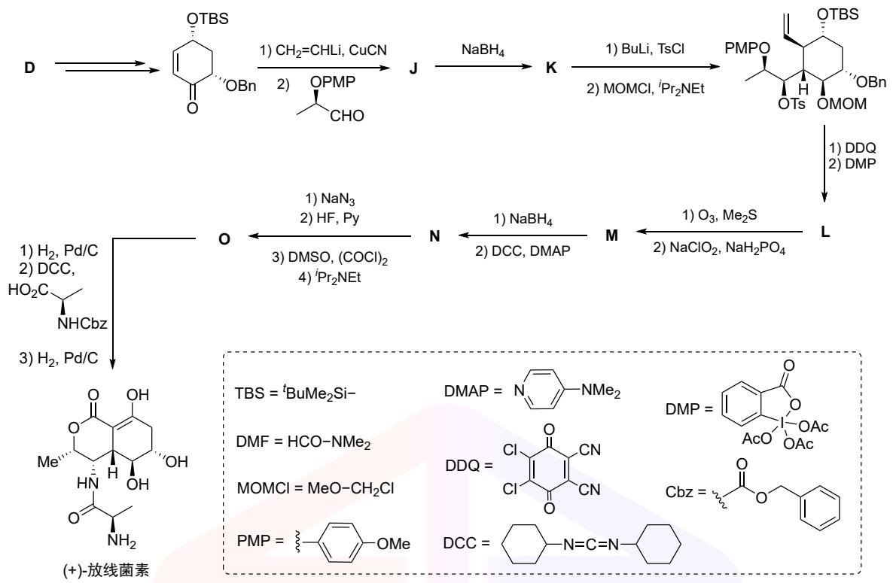

19-4 画出J到O的结构式，需标明立体化学。

(−)–苦马豆碱 (Swainsonine) 是八氢吲嗪类生物碱，可作为高尔基体 $\alpha \cdot$ -甘露糖苷酶II 的强效抑制剂，具有免疫调节作用，也是潜在的化疗药物。(−)–苦马豆碱可由苄基- $\mathbf{\nabla} \cdot \mathbf{a} .$ -D–吡喃甘露糖苷合成，路线如下所示：

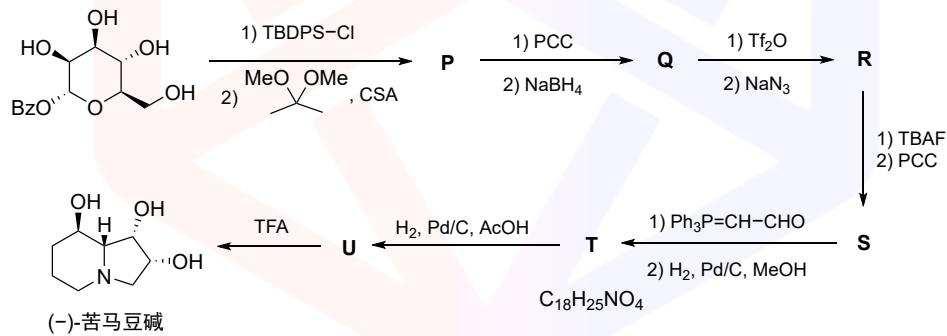

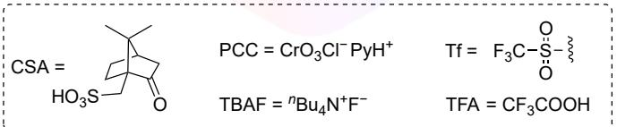

提示： $\mathsf{P}$ 和 $\mathbf{Q}$ 为差向异构体。

19-5 指出 (−)–苦马豆碱及起始原料中所有立体中心的构型。

19-6 画出 P 到 U 的结构式，需标明立体化学。

19-7 指出哪些立体中心得以保持，哪些是新形成的。

---

## 教学点评 / 解题分析

本题是 FoAD 第 6 项**碳水化合物化学**的"实战题"——题目直接命名为"Carbohydrates as chiral pools"，覆盖**三条独立的天然产物合成路线**：(i) L-sorbose → DMDP（吡咯烷亚胺糖，Q1）；(ii) D-glucose → Thromboxane B₂（前列腺素类，Q2–Q4）；(iii) D-mannose → (−)-Swainsonine（吲哚里西丁生物碱，Q5–Q7）。每条路线都是文献级的全合成，要求学生**追踪手性中心的传递**与**保护基的编排**。难度集中在 Q19.4 的 J–O 长链中间体推断；其余对学过 FoAD #6 的学生属于标准范式。

**题眼。** 全题的钥匙是**"手性池" 哲学**——不需要不对称催化，直接借用天然糖固有的 D/L 构型，**每一步都不破坏手性中心**。具体题眼分散在三条路线的关键节点：

- **Q19.1 的"X 含五元杂环 + 经过亚胺中间体"提示**——立刻锁定**吡咯烷亚胺糖** (iminosugar) 家族。L-sorbose 的 C5-OTs 经 SN2 反相 → C5-azide → 氢化为 C5-胺 → 与 C2 酮分子内缩合形成五元亚胺 → 再次氢化 → DMDP。
- **Q19.2 的"缩醛形成涉及伯醇"**——与 P2.17 完全相同的钥匙提示。D-葡萄糖的 C6 是伯醇位，因此 D = methyl 4,6-O-benzylidene-α-D-glucopyranoside；从这一锁定开始 E（2,3-环氧）、F（2-脱氧）、G（酮）、H（HWE 烯化）、I（饱和酯）整条链都能顺序解开。
- **Q19.5 的"Swainsonine + Fleet 路线"**——用 D-mannose（而非 D-glucose）的原因是 mannose 的 C2/C3 立体化学正好匹配 swainsonine 双环吲哚里西丁母核的构型；这是"看目标 → 反推糖源"的经典手性匹配。

**推断链。**

- **DMDP 合成（Q19.1）**：A = 1,2:5,6-双异丙叉 L-sorbose-3-OAc-2-OTs → B (C5-azide, SN2 反相) → C (NaOMe 脱乙酰 + 酸水解异丙叉, 自由 5-azido-5-deoxy-L-sorbose 吡喃形) → H₂/Pd 还原 azide → 自发分子内亚胺 → 再次氢化 → **X = DMDP** = (2R,3R,4R,5R)-2,5-bis(hydroxymethyl)-3,4-dihydroxypyrrolidine。
- **Thromboxane B₂ 合成（Q19.2–Q19.4）**：D-葡萄糖 → D (4,6-亚苄基甲苷) → E (2,3-环氧通过分子内 SN2 关环) → F (LiAlH₄ 开 2,3-环氧给 2-脱氧吡喃糖 + BzCl 保 C3-OH) → G (氢解亚苄基 + TBDPS 保 6-OH + Swern 氧化 4-OH 为酮) → H (HWE 烯化生成 α,β-不饱和酯) → I (氢化 + 碱处理给 Thromboxane B₂ 关键中间体，分子式 $\mathrm{C_{25}H_{32}SiO_5}$)。**Q19.4 的 Z 顺序 = Z4 → Z2 → Z1 → Z3**：Z4 用 DIBAL + Wittig 安装 α 链 + $\mathrm{CH_2N_2}$ 酯化；Z2 用 BzCl 保 ring-OH + Bu₄NF 脱 TBDPS；Z1 用 PCC 氧化伯醇为醛 + Wittig 安装 ω 链；Z3 用 NaBH₄ 还原酮 + $\mathrm{K_2CO_3}$ 水解 + HCl 最终脱保护。每一步的"位点匹配 + 试剂选择"完全互锁——任何一步顺序换乱都会断链。
- **Swainsonine 合成（Q19.5–Q19.7）**：(−)-Swainsonine 的 (1S,2R,8R,8aR) 立体构型指明起始物必须是 D-mannose（C2、C3 构型直接匹配）。**Q19.6 的 P–U 涵盖**：Mitsunobu C4 反相 → 四脚环 → azide 取代 → Pt/H₂ 氢化关环为二级胺 → 还原 → swainsonine。**Q19.7 测试"立体中心的保留 vs 反相 vs 新生"**：D-mannose 自带的 C2、C3、C5 立体中心**保留**（never broken）；C4 立体中心通过 Mitsunobu **反相**；C7 是双环关环时**新生**的立体中心。

**板块。**

| 板块 | 小问 | 核心化学 |
|---|---|---|
| L-sorbose → DMDP | Q19.1 | C-azide → 胺 → 自动闭环亚胺 → 再次氢化 |
| D-glucose → Thromboxane B₂ | Q19.2–Q19.3 | 4,6-亚苄基 + 2,3-环氧 + HWE + 多步保护基 |
| Z 顺序推断 | Q19.4 | 试剂兼容性 + 保护基匹配 |
| D-mannose → Swainsonine (Fleet) | Q19.5–Q19.7 | C4 反相 + 双环关环 + Pt/H₂ |
| 立体中心追踪 | Q19.7 | 保留 vs 反相 vs 新生 |

**经验总结。**

1. **手性池 (chiral pool) 哲学** 的精髓是"立体中心一次设、永不破坏"——所有 C–O / C–N 键的切断都要**避开手性中心**，让该手性中心穿透整条合成链直达天然产物。
2. **保护基的"伯醇优先" 原则**与 P2.17 完全相同——4,6-O-亚苄基是葡萄糖系合成的中央保护基。
3. **2,3-环氧吡喃糖** 是 D-葡萄糖 → D-甘露糖 (C2 反相) 或 → 2-脱氧糖的通用中间体。本题 E (2,3-anhydro) 即此中间体；LiAlH₄ 开环给 2-脱氧糖是教科书反应。
4. **Z 顺序的"试剂兼容性"**——任何一步都不能因为"先释放某 OH"或"先氧化某酮"而破坏后续步骤。**先做不可逆安装、再做去保护**是不变铁律。
5. **D-mannose vs D-glucose 选择哲学**——两种糖的 C2、C3 立体化学相反，对应不同的合成目标。mannose-derived 多有 Swainsonine 的 (S,R) 模式；glucose-derived 多为 thromboxane 的 (R,S) 模式。学生需要能"看目标手性 → 反推糖源"。
6. **Fleet (1985) 与 Card-Hitz (1985)** 是糖→生物碱的双经典——前者 D-mannose → Swainsonine，后者 L-sorbose → DMDP。两者都用"先安装 azide、再氢化关环"的策略。
7. **立体中心的三种命运**：(i) **保留**——糖固有手性穿透到底；(ii) **反相**——通过 Mitsunobu / Pirkle / SN2 翻转；(iii) **新生**——通过环化 / HWE / 不对称还原引入。Q19.7 直接考这一点。

**难度评级：★★★★☆**——典型的"手性池全栈题"。对受过 FoAD #6 系统训练 + 看过 Fleet/Hanessian 全合成文献的学生属于 ★★★☆☆；对仅有通识有机背景的学生顶到 ★★★★★（每一步都是"先做什么再做什么"的细节排序题，节奏一打乱就全盘崩溃）。Q19.4 是真正难点——8 步 Z₁–Z₄ 排序，错一步全错。整题与 P2.17 形成"基础（保护基）→ 应用（全合成）"对比，是 IChO 主考卷风格中的"高级碳水题"。
