::: {.callout-note appearance="simple" icon=false}
**Found an issue?** Post the problem number (**P2.20**) and the **step** on Discord.
[💬 Discuss on Discord →](https://discord.gg/CHANGE-ME){.discord-cta}
:::

Scientists often look for analogies in culture to explain their discoveries. One example of such a comparison was the arcade video game Pacman, popular in the 1980s and 1990s, where the main task of the yellow ball (Pacman) is to eat all the dots on the map.

The same task must be performed by the molecules **Pacman 1** and **Pacman 2**, which must “eat” small molecules such as $\mathrm{CO}_{2}$, $\mathrm{N}_2$, or $\mathrm{O}_{2}$, catalysing their transformations. Pacman molecules are two catalytically active structural fragments connected by a linker at a certain angle. Inspiration for such molecules comes from

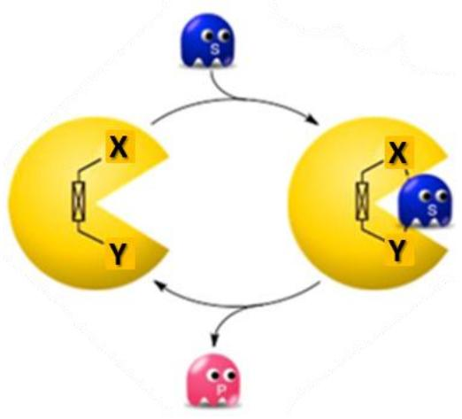

the active site of natural cytochrome P450, which contains a porphyrin macrocycle. Porphyrin is a macrocycle with an $18\,\pi$ -electron Hückel aromatic system, which can coordinate metal ions in the middle. The synthesis of **Pacman 1** is shown below:

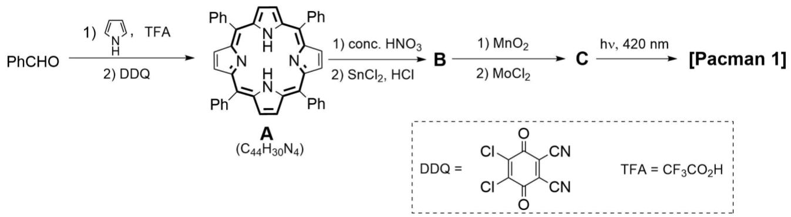

Note: C–H bonds of porphyrin rings are not involved in chemical transformations in this problem.

1. **Draw** the structures of compounds **B** and **C**, if it is known that neither of these compounds, nor **Pacman 1**–**2** contain oxygen. The nitrogen content (by mass) in compounds **B** and **C** is $11.12\%$ and $9.70\%$ , respectively.

> **Solution (Q1 — Structures of B and C in the Pacman-1 synthesis).**
>
> A is tetraphenylporphyrin, $\mathrm{C_{44}H_{30}N_4}$. Nitration of one phenyl substituent followed by $\mathrm{SnCl_2/HCl}$ reduction gives the oxygen-free aniline derivative:
>
> **B = monoaminotetraphenylporphyrin**, best drawn as 5-(4-aminophenyl)-10,15,20-triphenylporphyrin:
> $$\mathrm{B:\ C_{44}H_{31}N_5},\qquad w_\mathrm{N}=\frac{5\cdot14}{44\cdot12+31+5\cdot14}=11.13\%\approx 11.12\%.$$
>
> 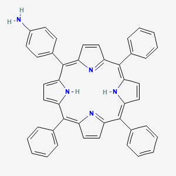
>
> Oxidation with $\mathrm{MnO_2}$ couples two aniline units to an azo bridge, and $\mathrm{MoCl_2}$ inserts Mo into both porphyrin cores:
>
> **C = trans-azo-bridged bis(molybdenum tetraphenylporphyrin)**:
> $$\mathrm{(MoTPP{-}C_6H_4{-}N{=}N{-}C_6H_4{-}TPPMo)},$$
> more explicitly, two molybdenum porphyrins connected through a para,para'-azobenzene linker. Its formula is
> $$\mathrm{C:\ C_{88}H_{54}Mo_2N_{10}},\qquad w_\mathrm{N}=\frac{10\cdot14}{88\cdot12+54+2\cdot96+10\cdot14}=9.71\%\approx 9.70\%.$$
>
> Irradiation at 420 nm converts the trans azo-bridged bisporphyrin to the bent/cis "Pacman 1" conformation.
>
> **Source note:** The B image is from PubChem CID [135423398](https://pubchem.ncbi.nlm.nih.gov/compound/135423398). C/Pacman 1 are scheme-derived bisporphyrin/Mo structures; no reliable standalone database image matching the exact Mo azo bisporphyrin was found.

Unfortunately, it was impossible to isolate **Pacman 1**. As a result, another approach to the stable **Pacman 2** with two different porphyrin rings was suggested. In the mass spectrum of this compound, the molecular ion peak was at m/z 1535.04.

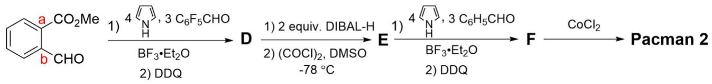

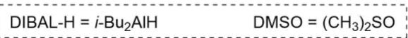

2. **Draw** the structures of compounds **D**–**F**, and **Pacman 1**–**2**. All molecules can be drawn flat. **Pacman 2** contains $7.678\%$ of the metal by weight.

> **Solution (Q2 — D, E, F and the two Pacmans; identification of the metal).**
>
> **Identification of the metal.** From the mass-spectrum peak $m/z=1535.04$ for Pacman 2 and $w_\mathrm{M}=7.678\%$, the mass of the two metal atoms is
> $$2M_\mathrm{metal}=0.07678\times 1535.04=117.86\ \mathrm{g\,mol^{-1}}\Longrightarrow M_\mathrm{metal}=58.93\ \mathrm{g\,mol^{-1}}\equiv \mathbf{Co}.$$
> Thus each porphyrin ring of Pacman 2 carries one Co(II).
>
> **D.** The first Lindsey condensation uses methyl 2-formylbenzoate plus 3 equiv. pentafluorobenzaldehyde and 4 equiv. pyrrole:
> $$\boxed{\text{D = 5-(2-methoxycarbonylphenyl)-10,15,20-tris(pentafluorophenyl)porphyrin.}}$$
>
> **E.** DIBAL-H reduces the ester side chain, and Swern oxidation converts the alcohol to the aldehyde:
> $$\boxed{\text{E = 5-(2-formylphenyl)-10,15,20-tris(pentafluorophenyl)porphyrin.}}$$
>
> **F.** The aldehyde group in E then acts as the fourth aldehyde component in a second porphyrin-forming condensation with 4 equiv. pyrrole and 3 equiv. benzaldehyde:
> $$\boxed{\text{F = free-base heterobisporphyrin linked through an ortho-phenylene hinge.}}$$
> One porphyrin half bears three $\mathrm{C_6F_5}$ groups; the other bears three phenyl groups. The two macrocycles share the ortho-phenylene linker at one meso position each.
>
> 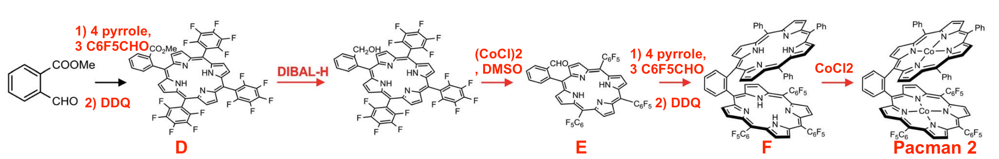
>
> **Pacman 1.** From Q1: the 420 nm photoisomerised/cis azo-bridged dimolybdenum bisporphyrin.
>
> **Pacman 2.** Metallation of F with $\mathrm{CoCl_2}$ inserts one Co into each porphyrin:
> $$\boxed{\text{Pacman 2 = bis-Co heterobisporphyrin: one tris(pentafluorophenyl) jaw and one triphenyl jaw.}}$$
>
> A useful mass check is that the free-base precursor has the skeleton $\mathrm{C_{82}H_{39}F_{15}N_8}$; replacing the four inner N-H hydrogens by two Co atoms gives approximately $\mathrm{C_{82}H_{35}Co_2F_{15}N_8}$, $M\approx1535$, consistent with the given molecular ion.
>

3. **Calculate** the distance between the two metals in **Pacman 2**, if the distance from carbon atoms a and b to the corresponding metals is the same and equals 4.7 Å. **Assume** that porphyrin and benzene rings are coplanar, and bond lengths and angles on benzene rings are ideal. Note: The carbon–carbon bond distance in the benzene ring is 1.39 Å.

> **Solution (Q3 — Co···Co distance in Pacman 2).**
>
> In the idealised drawing, the two porphyrin planes and the two metal centres are arranged by the ortho-phenylene linker as an equilateral-triangle construction. The distance between the two adjacent aryl carbons a and b is one benzene C–C bond, $1.39\ \mathrm{\AA}$, and the remaining metal-to-carbon segment given in the problem is $4.7\ \mathrm{\AA}$.
>
> Therefore
> $$\boxed{d(\mathrm{Co\cdots Co})=4.7+1.39=6.09\ \mathrm{\AA}.}$$

4. **Draw** a 3D schematic structure of **Pacman 2** binding an oxygen molecule. Note: You can simplify the macrocycle as a quadrilateral, only drawing out the linker and metals.

> **Solution (Q4 — O₂ binding mode in the Pacman cleft).**
>
> Draw the two Co porphyrins as two square/diamond "jaws" held at an angle by the ortho-phenylene linker. The $\mathrm{O_2}$ molecule sits in the cleft between the metals and bridges the two Co centres, usually drawn as a $\mu$-1,2 dioxygen/peroxo bridge:
>
> ```
>       porphyrin jaw                porphyrin jaw
>           [Co] ---- O--O ---- [Co]
>              \                /
>               \              /
>                ortho-phenylene
>                    hinge
> ```
>
> In a 3D sketch, make the porphyrin planes non-coplanar so the molecule visibly looks like open jaws. Place one Co in each macrocycle and draw one O atom bound to each Co; the O-O bond lies across the cleft. The exact Co-O/O-O distances are not required for this schematic.
>
> Something similar to this (Source: https://pubs.acs.org/doi/10.1021/acscatal.5c05181):
>
> 

Another version of a binuclear complex was synthesised as follows to yield **Pacman 3**:

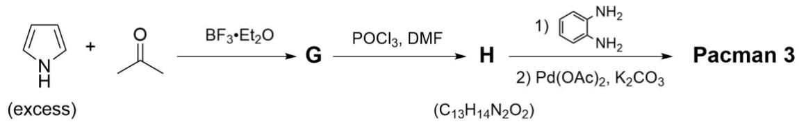

5. **Draw** the structures of compounds **G**–**H** and **Pacman 3**.

> **Solution (Q5 — alternative "post-functionalisation" route to Pacman 3).**
>
> **🟡 Structures for compound I and Pacman 3 to be added.** The text below describes the connectivity and the post-functionalisation logic (G → H → I → Pacman 3 via Vilsmeier–Haack formylation + Schiff-base condensation), but cleaner chair/skeletal **drawings** of I and the final Pacman 3 are still pending and will be added in a later revision.
>
> With pyrrole in excess, acetone forms a dipyrromethane rather than a porphyrin.
>
> **G = 2,2-bis(pyrrol-2-yl)propane**, often called **5,5-dimethyldipyrromethane** or the acetone-derived dipyrromethane. The central $\mathrm{C(CH_3)_2}$ carbon is attached to the alpha/2-position of each pyrrole ring:
> $$\boxed{\mathrm{G:\ (pyrrol{-}2{-}yl)_2C(CH_3)_2,\quad C_{11}H_{14}N_2}.}$$
>
> 
>
> $\mathrm{POCl_3/DMF}$ is the Vilsmeier-Haack formylation system: it generates the chloroiminium/Vilsmeier electrophile from DMF, and this electrophile attacks the electron-rich pyrrole $\alpha$-positions of G. Hydrolysis of the iminium adducts then introduces one $-\mathrm{CHO}$ group on each pyrrole ring:
>
> **H = 5,5'-(propane-2,2-diyl)bis(1H-pyrrole-2-carbaldehyde)**, equivalently **5,5-dimethyl-1,9-diformyldipyrromethane**. In the literature scheme this is compound **1a** $(R=\mathrm{Me})$:
> $$\boxed{\mathrm{H:\ C_{13}H_{14}N_2O_2},}$$
> matching the formula printed in the scheme.
>
> **Pacman 3.** The correct sequence follows the reported $R=\mathrm{Me}$ route:
>
> 1. Two molecules of H and two molecules of o-phenylenediamine first undergo acid-promoted $[2+2]$ Schiff-base condensation. The four aldehyde groups of H become four imine links, giving the protonated tetraimine macrocyclic salt **2a** in the literature figure.
> 2. Base then gives the neutral free-base macrocycle $\mathrm{H_4[L^1]}$. In the problem, $\mathrm{K_2CO_3}$ plays the same base role that $\mathrm{NEt_3}$ plays in the literature scheme.
> 3. $\mathrm{Pd(OAc)_2}$ inserts two $\mathrm{Pd^{II}}$ centres to form $\mathrm{Pd_2[L^1]}$ (**complex 4** in the literature), which is the Pacman 3 structure.
>
> For the drawing, show a $[2+2]$ macrocycle made from two H units and two o-phenylene units. Each o-phenylenediamine unit is connected through two $\mathrm{C=N}$ imine bonds, and the two Pd centres are held in the cleft. Each Pd is best drawn in an approximately square-planar $\mathrm{N_4}$ pocket, coordinated by two deprotonated pyrrole nitrogens and two imine nitrogens.
>
> Annotated literature scheme for the $R=\mathrm{Me}$ route:
>
> 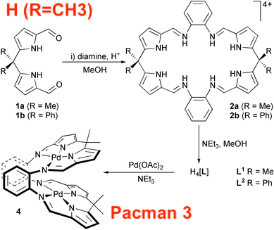
>
> **Source note:** G and H were rendered from PubChem PUG-REST using the scheme-derived SMILES because exact named database records were not found. The Pacman 3 assignment and complex image follow Givaja, Blake, Wilson, Schröder, and Love, *Chem. Commun.* 2003, 2508-2509, DOI: [10.1039/B308443D](https://doi.org/10.1039/B308443D), where H is compound 1a, the macrocyclic salt is 2a, the free macrocycle is $\mathrm{H_4[L^1]}$, and the dipalladium Pacman product is complex 4.

In the catalytic centre of cytochrome c oxidase, heme (a porphyrin-based iron-containing compound which forms the non-protein part of haemoglobin) and Cu atoms are placed in close proximity to ease the reduction of oxygen to water. Scientists attempted to mimic this pocket by synthesising a salt called **Hangman,** bearing two different metal ions:

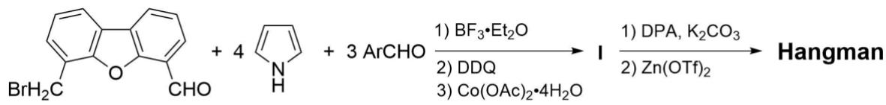

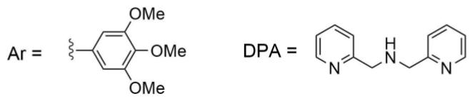

6. **Draw** the structures of **I** and **Hangman**.

> **Solution (Q6 — the Hangman heterobimetallic Co/Zn salt).**
>
> In this scheme, the first aldehyde is a dibenzofuran derivative bearing a benzylic bromide. It becomes the unique meso substituent of the porphyrin; the other three meso substituents come from $\mathrm{ArCHO}$, where Ar is the 3,4,5-trimethoxyphenyl group printed below the scheme.
>
> **I = Co hangman precursor.** Draw a cobalt porphyrin with:
>
> - Co in the porphyrin core, inserted by $\mathrm{Co(OAc)_2\cdot4H_2O}$;
> - three 3,4,5-trimethoxyphenyl meso substituents;
> - one dibenzofuran meso substituent bearing a pendant $\mathrm{-CH_2Br}$ group.
>
> 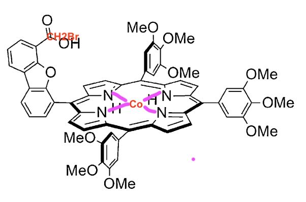
>
> **Hangman.** The secondary amine DPA in the problem drawing is $\mathrm{bis(2\!-\!pyridylmethyl)amine}$, also called di(2-picolyl)amine. It substitutes the benzylic bromide to give a neutral $\mathrm{-CH_2N(CH_2Py)_2}$ pendant ligand. Then $\mathrm{Zn(OTf)_2}$ binds to the tridentate DPA pocket, giving a **salt**, not merely a neutral covalent product:
> $$\boxed{\text{Hangman}=[\text{Co-porphyrin--dibenzofuran--CH}_2\text{-DPA-Zn}]^{2+}\cdot2\mathrm{OTf^-}.}$$
>
> Thus the two different metal ions are **Co** in the porphyrin and **Zn** in the DPA pocket, held close to one another above the porphyrin face. The Co-porphyrin fragment is neutral overall, while coordination of $\mathrm{Zn^{2+}}$ by the neutral DPA pendant gives the cationic Zn-DPA site; the triflate ions are the counterions of the salt.
>
> This assignment should not be replaced by diphenylamine $(\mathrm{Ph_2NH})$: diphenylamine has no pyridyl nitrogen donors and therefore cannot give the Zn-binding pocket implied by the drawn ligand and by $\mathrm{Zn(OTf)_2}$.
>
> 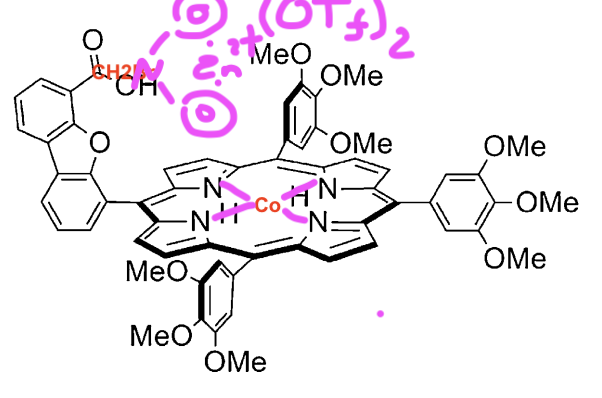
>
> **Source note:** Cite Graham, Zheng, and Nocera, *ChemSusChem* **2014**, 7, 2449-2452, DOI: [10.1002/cssc.201402242](https://doi.org/10.1002/cssc.201402242), for the synthesis and structure of the **I-like cobalt hangman precursor/scaffold**. That paper reports a closely related dibenzofuran hangman aldehyde, its Lindsey condensation with pyrrole and 3,4,5-trimethoxybenzaldehyde, post-synthetic pendant modification, and cobalt hangman porphyrins. However, it does **not** report the final Hangman salt in this problem: a heterobimetallic Co/Zn species with Zn bound in a DPA pocket and triflate counterions. That final salt assignment is therefore deduced from the problem statement and the printed reagent sequence, especially DPA followed by $\mathrm{Zn(OTf)_2}$.

Another type of binuclear porphyrin complexes can be called **Cageman**. One of the examples of a **Cageman** synthesis is shown below. In the mass spectrum of the compound **K**, a series of signals at m/z 2667.0, 1261.0, 792.3, 558.0, and 417.4 were detected.

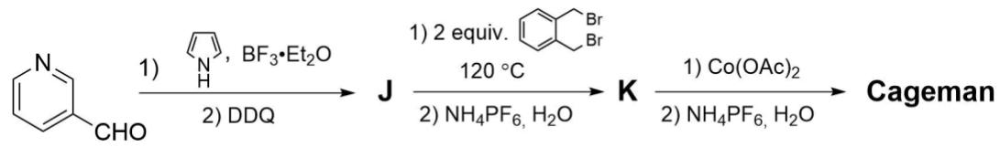

7. **Calculate** the molecular weight of **Cageman** (use integer values of atomic mass).

> **Solution (Q7 — MW of Cageman from the ESI-MS envelope of K).**
>
> **J.** Pyridine-3-carbaldehyde plus pyrrole gives tetrakis(3-pyridyl)porphyrin:
> $$M(\mathbf{J})=\mathrm{C_{40}H_{26}N_8}=40\cdot12+26+8\cdot14=618.$$
>
> 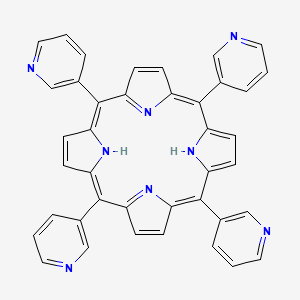
>
> Each J has four pyridyl nitrogens. o-Xylylene dibromide has two benzylic bromides, so the quaternisation can form cages in 1+2, 2+4, 3+6, ... ratios. For the 2+4 cage:
>
> - two porphyrins: $2\times618$;
> - four o-xylylene bridges: $4\times104$;
> - eight $\mathrm{PF_6^-}$ counterions after anion exchange: $8\times145$.
>
> Hence the full salt K has
> $$M(\mathbf{K})=2(618)+4(104)+8(145)=2812.$$
>
> The observed ESI peaks arise by loss of $\mathrm{PF_6^-}$ anions, giving multiply charged cations:
>
> | peak $m/z$ | assignment | calculated |
> |---|---|---|
> | 2667.0 | $[\mathrm{cage}\cdot7\mathrm{PF_6}]^+$ | $2812-145=2667$ |
> | 1261.0 | $[\mathrm{cage}\cdot6\mathrm{PF_6}]^{2+}$ | $(2812-2\cdot145)/2=1261$ |
> | 792.3 | $[\mathrm{cage}\cdot5\mathrm{PF_6}]^{3+}$ | $(2812-3\cdot145)/3=792.3$ |
> | 558.0 | $[\mathrm{cage}\cdot4\mathrm{PF_6}]^{4+}$ | $(2812-4\cdot145)/4=558.0$ |
> | 417.4 | $[\mathrm{cage}\cdot3\mathrm{PF_6}]^{5+}$ | $(2812-5\cdot145)/5=417.4$ |
>
> The MS series therefore identifies K as the **2+4 cage**.
>
> The final step inserts two Co atoms into the two free-base porphyrin cores. Each Co insertion replaces two inner N-H hydrogens, so the mass change is $2(59)-4(1)=114$:
>
> $$M_\mathrm{Cageman}=2812+2(59)-4=\boxed{2926\ \mathrm{g\,mol^{-1}}}.$$
>
> 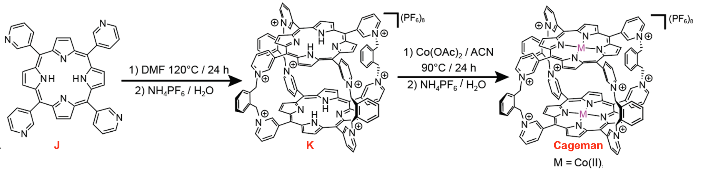
>
> **Source note:** The J image is from PubChem name lookup for 5,10,15,20-tetra(3-pyridyl)porphyrin. The cage K/Cageman structures are scheme-derived quaternised porphyrin cages; the mass calculation above is the structurally reliable way to distinguish K from the Co-inserted final product.

---

## 中文版 / Chinese translation
## 第20题 吃豆人、上吊人、笼中人

译者注：标题中的吃豆人 (Pacman) 与上吊人 (Hangman) 均为该领域中已广泛接受的形象化命名。前者借自街机游戏《吃豆人》，后者则源于经典英文猜词游戏。而笼中人 (Cageman) 应为命题组沿用这一方式，根据分子特征给出的玩梗式命名。

科学家们常常从文化中寻找类比来解释他们的发现。这种类比的一个例子便是上世纪八九十年代流行的街机游戏《吃豆人》(Pacman)，游戏中黄色小球（吃豆人）的主要任务是吃光地图上所有的豆子。

吃豆人 1、吃豆人 2 分子也需要完成同样的任务：“吃掉” $\mathrm{CO}_{2}$ 、$\mathrm{N}_{2}$ 、 $\mathrm{O}_{2}$ 等小分子，并催化其转化。吃豆人分子中有一个连接基团，以特定的张角连接两个催化活性结构片段。其设计灵感来源于天然细胞色素P450 的活性中心，该中心含有一个卟啉大环。卟啉是具有 $18 \pi$ 电子Hückel 芳香体系的大环，中心可配位金属离子。吃豆人 1 的合成路线如下所示：

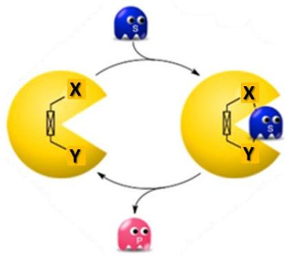


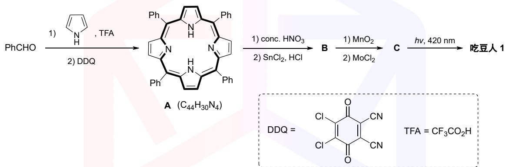


注：本问题中，卟啉环的C–H键不参与化学反应。


20-1 画出化合物B和C的结构式。已知B、C以及吃豆人1–2均不含氧原子。B和C中氮元素的质量分数分别为 $11.12\%$ 和 $9.70\%$ 。

遗憾的是，吃豆人 1 无法分离。因此，研究人员提出了另一种合成策略，得到了具有两个不同卟啉环的稳定结构吃豆人2。该化合物质谱的分子离子峰位于 $m / z = 1535.04$ 。

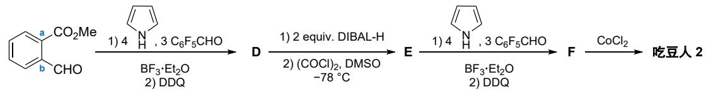


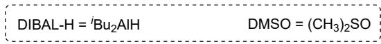


20-2 画出化合物D–F及吃豆人1–2的结构式。所有分子均可绘制为平面结构。吃豆人2中金属元素的质量分数为 $7.678\%$ 。

20-3 已知上图中碳原子a 和b 到各自对应金属的距离均为4.7 Å，苯环中C–C 键长为1.39 Å。计算吃豆人2中两个金属原子的间距。假设卟啉环和苯环共平面，且苯环上的键长和键角均为理想值。

20-4 画出吃豆人2结合氧分子的3D 结构示意图。

注：可将大环简化为四边形，仅画出连接基团和金属原子。

研究人员通过以下方法合成了另一种双核配合物，命名为 吃豆人 3：

$$
\begin{array}{r l} & \text{过 量} \xrightarrow {\mathrm{N}} + \xrightarrow {\mathrm{O}} \xrightarrow {\mathrm{BF}_{3} \cdot \mathrm{Et}_{2} \mathrm{O}} \mathrm{G} \xrightarrow {\mathrm{POCl}_{3} , \mathrm{DMF}} \mathrm{H} \xrightarrow {\text{1)} \xrightarrow {\mathrm{CH}_{2}} \mathrm{NH}_{2}} \text{吃 豆 人 3} \\ & \quad \quad \quad \quad \quad \quad \quad \quad \quad \quad \quad \quad \quad \quad \quad \quad \quad \quad \left(\mathrm{C}_{13} \mathrm{H}_{14} \mathrm{N}_{2} \mathrm{O}_{2}\right) \end{array}
$$

20-5 画出化合物G–H及吃豆人3的结构式。

在细胞色素 c 氧化酶的催化中心处，血红素（一种基于卟啉的含铁化合物，是血红蛋白的非蛋白部分）和 Cu 原子距离十分接近，以促进氧分子还原为水。上吊人可以模拟这一活性口袋，该盐含有两种不同的金属离子：

$$
\begin{array}{c} \text{B r H}_{2} \mathrm{C} \xrightarrow {\text{O}} \text{C H O} + 4 \xrightarrow [ \mathrm{N} ]{\text{H}} + 3 \text{A r C H O} \xrightarrow [ \mathrm{H} ]{\text{N}} \text{O t h e t a}_{2} \mathrm{O} \\ \text{A r} = \xrightarrow [ \mathrm{N} ]{\text{O t h e t a}} \text{O m e} \\ \text{D P A} = \xrightarrow [ \mathrm{N} ]{\text{H}} \end{array}
$$

20-6 画出化合物I及上吊人的结构式。

笼中人 是另一类双核卟啉配合物，合成方式如下。化合物 K 的质谱包含一系列信号， $m / z$ 分别为2667.0、1261.0、792.3、558.0 和 417.4。

$$
\mathrm{CHO} \xrightarrow {\text{1)} \underset {\mathrm{H}} {\text{B F}_{3} \cdot \mathrm{Et}_{2} \mathrm{O}}} \mathrm{J} \xrightarrow {\text{1) 2 e q u i v .} \underset {\mathrm{Br}} {\text{B r}}} \mathrm{K} \xrightarrow {\text {1) C o (O A c)_{2}}} \text{笼 中 人}
$$

20-7 计算笼中人的分子量（原子量近似为整数计算）
