::: {.callout-note appearance="simple" icon=false}
**Found an issue?** Post the problem number (**P2.21**) and the **step** on Discord.
[💬 Discuss on Discord →](https://discord.gg/CHANGE-ME){.discord-cta}
:::

Compound **A** is a trihydrate which contains a metal of the $5^ {\mathrm{th}}$ period, **M**, with a mass fraction of $39.09\%$ . A $2.00\ \mathrm{g}$ sample of **A** was dissolved in ethanol. This ethanolic solution of **A** was added to an ethanolic solution of $7.96\ \mathrm{g}$ of **B** . Compound **B** is a well-known ligand, which is composed of three elements: C, H, and P. It has $11.81\%$ of $\mathrm{P}$ by mass and a threefold symmetry axis. The resulting mixture was refluxed for about two hours, yielding $6.18\ \mathrm{g}$ of a dark red compound **C** with $88\%$ yield.

Note: A threefold symmetry axis is an imaginary line through an object around which it can be rotated by $120^{\circ}$ and appear unchanged. For example, a threefold symmetry axis is present in the molecule of ammonia:

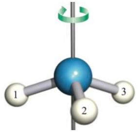

1. **Identify** the formulae of **A**–**C** and **M**, if each coefficient in the synthesis reaction is lower than 5.

> **Solution (Q1 — identification of the Wilkinson precursors).**
> A is a trihydrate $\mathrm{MX}_n\cdot 3\mathrm{H}_2\mathrm{O}$ of a 5-th period metal with $w(M)=39.09\%$. Testing $\mathrm{MCl}_3\cdot 3\mathrm{H}_2\mathrm{O}$:
> $$\frac{A_r(M)}{A_r(M)+3\cdot 35.45+3\cdot 18.02}=0.3909 \Rightarrow A_r(M)\approx 103.$$
> This matches **Rh** ($A_r = 102.91$); check: $102.91/(102.91+106.35+54.05)=39.08\%$. Hence $\boxed{\mathbf{M}=\mathrm{Rh}}$ and $\boxed{\mathbf{A}=\mathrm{RhCl}_3\cdot 3\mathrm{H}_2\mathrm{O}}$ ($M_A=263.31$ g mol$^{-1}$).
>
> B contains only C, H, P, has a C$_3$ axis and $w(\mathrm{P})=11.81\%$. For $\mathrm{P}(\mathrm{C}_6\mathrm{H}_5)_3$: $M=262.29$ g mol$^{-1}$, $w(\mathrm{P})=30.97/262.29=11.81\%$. $\boxed{\mathbf{B}=\mathrm{PPh}_3}$.
>
> Stoichiometry: $n_A=2.00/263.31=7.60\cdot 10^{-3}$ mol; $n_B=7.96/262.29=3.04\cdot 10^{-2}$ mol; ratio $B/A\approx 4$. The 88% yield gives $n_C=0.88\cdot n_A=6.69\cdot 10^{-3}$ mol and $M_C=6.18/6.69\cdot 10^{-3}=924$ g mol$^{-1}$, matching $\mathrm{RhCl}(\mathrm{PPh}_3)_3$ (924.2 g mol$^{-1}$).
> $$\boxed{\mathbf{C}=\mathrm{RhCl}(\mathrm{PPh}_3)_3\ \text{(Wilkinson's catalyst)}}$$

2. **Write** the equation for the synthesis of compound **C**.

> **Solution (Q2 — synthesis of Wilkinson's catalyst).**
> With $n_B/n_A\approx 4$ and the reaction being a Rh(III) → Rh(I) reductive complexation in EtOH, one equivalent of PPh$_3$ is sacrificially oxidized to OPPh$_3$ (here the reducer is actually an excess PPh$_3$; the formally balanced classical equation is):
> $$\mathrm{RhCl_3\cdot 3\,H_2O + 4\,PPh_3 \xrightarrow{\;EtOH,\;reflux\;} RhCl(PPh_3)_3 + O\!=\!PPh_3 + 2\,HCl + 2\,H_2O}$$
> (An equivalent form uses ethanol as the reductant: $2\,\mathrm{RhCl_3\cdot3H_2O}+6\,\mathrm{PPh_3}+\mathrm{CH_3CH_2OH}\rightarrow 2\,\mathrm{RhCl(PPh_3)_3}+\mathrm{CH_3CHO}+2\,\mathrm{HCl}+\ldots$). The first form respects the constraint "each coefficient $<5$".

Compound **C** is a well-known catalyst in the hydrogenation of alkenes:

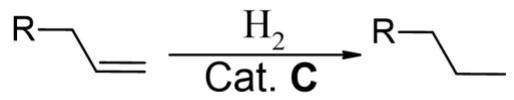

One example of the **product** ( ) has a maximum of one plane of symmetry.

Note: A plane of symmetry is an imaginary plane that divides an object into two mirror-image halves. For example, the molecule of water has two planes of symmetry:

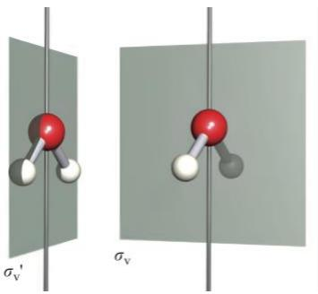

The mass spectrum of this **product** is shown below. The three peaks at m/z 41, 91, and 119 are noticeably more intense than the others, and two of them correspond to fragments containing different aromatic rings.

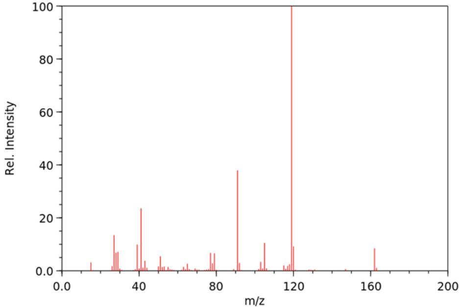

3. **Draw** the structures of the cations that correspond to those 3 peaks.

> **Solution (Q3 — MS fragment cations).**
>
> **Revision note (2026-05-18).** Earlier revisions of this solution proposed (i) a diphenylalkene (m/z mismatch — the diphenylmethyl cation is 167, not 119), (ii) 1-tert-butyl-4-ethylbenzene (rejected: reference EI gives a *dominant* m/z 147 peak, which is only a trace here), and (iii) 1-ethyl-4-**isobutyl**benzene (the iBu side chain requires a *branched* alkene precursor `Ar-CH=C(CH₃)₂`, which the substrate scheme does **not** depict). The substrate scheme shows an unbranched 3-carbon alkene `R-CH=CH-CH₃` or `R-CH₂-CH=CH₂`, which reduces to an **n-propyl** side chain. The product therefore has an unbranched chain at the benzylic position, and the cations below correspond to that interpretation.
>
> The molecular-ion region is at $m/z\approx 162$; the diagnostic fragments match **1-butyl-4-ethylbenzene** (Q21.4). The three intense cations are:
>
> $$m/z=41:\quad [\mathrm{C_3H_5}]^+,$$
> an allylic / cyclopropenium hydrocarbon cation, drawn either as
> $$\mathrm{CH_2{=}CH{-}CH_2^+ \leftrightarrow CH_2^+{-}CH{=}CH_2}\quad\text{or}\quad c\text{-}\mathrm{C_3H_5^+}.$$
>
> The neutral product contains no pre-existing allyl group; this ion is an EI-MS rearrangement fragment. The standard pathway is **complementary charge retention** on the side chain during $\alpha$-cleavage of the n-butyl group, followed by H$_2$ loss from the resulting n-propyl cation:
> $$[\mathrm{M}]^{+\bullet}\rightarrow \mathrm{p\text{-}Et{-}C_6H_4{-}CH_2^\bullet}\;+\;\mathrm{CH_3CH_2CH_2^+}$$
> $$\mathrm{C_3H_7^+}\rightarrow \mathrm{C_3H_5^+}+\mathrm{H_2}.$$
>
> $$m/z=91:\quad [\mathrm{C_7H_7}]^+,$$
> the benzyl / tropylium cation, drawn most cleanly as the aromatic cycloheptatrienyl cation. It arises predominantly by secondary loss of ethene from $m/z=119$ (see below).
>
> $$m/z=119:\quad [\mathrm{C_9H_{11}}]^+,$$
> the **4-ethylbenzyl cation**, $\mathrm{4\text{-}Et{-}C_6H_4{-}CH_2^+}$ (which rapidly rearranges to the corresponding ethyl-tropylium under EI conditions). It is formed by $\alpha$-cleavage at the benzylic position of the n-butyl side chain, with loss of an **n-propyl radical** (not an isopropyl radical):
> $$[\mathrm{M}]^{+\bullet}\rightarrow \mathrm{4\text{-}Et{-}C_6H_4{-}CH_2^+}\;+\;\mathrm{\cdot CH_2CH_2CH_3}.$$
> Secondary loss of ethene then closes the loop to $m/z=91$:
> $$\mathrm{C_9H_{11}^+}\rightarrow \mathrm{C_7H_7^+}+\mathrm{C_2H_4}.$$
>
> The two aromatic-ring cations mentioned in the question are $m/z=91$ and $m/z=119$. The neutral product contains a single benzene ring; the two fragments are "different aromatic rings" in the sense that they are different aromatic ring **ions** — bare tropylium ($\mathrm{C_7H_7^+}$) versus 4-ethyl-substituted tropylium ($\mathrm{C_9H_{11}^+}$).

4. **Draw** the structure of the **product**.

> **Solution (Q4 — hydrogenation product).** *Two candidate structures both fit the spectroscopic clues; the substrate scheme breaks the tie.*
>
> **Revision note (2026-05-18).** The mass spectrum + "max one plane of symmetry" clue does **not** uniquely determine the product — two regioisomers fit *both* the spectrum and the symmetry constraint and are indistinguishable by EI-MS alone. The single experimental discriminator is the substrate scheme, which depicts an *unbranched* 3-carbon alkene and so selects candidate **(A)** as the right answer. Earlier rejected alternatives (diphenyl-alkene with M ≠ 162; 1-tert-butyl-4-ethylbenzene with base peak m/z 147 from tertiary-benzylic α-cleavage) are not analysed here.
>
> ### Candidate (A) — 1-butyl-4-ethylbenzene  (the substrate-consistent answer)
>
> $$\boxed{\mathrm{4\text{-}Et\text{-}C_6H_4\text{-}CH_2CH_2CH_2CH_3}}\qquad\text{(C}_{12}\text{H}_{18},\ M=162.27\text{,\ CAS 7295-04-5)}$$
>
> An n-butyl group para to an ethyl group on benzene. The n-propyl portion of the side chain (`-CH₂CH₂CH₃`) is the one introduced by hydrogenation; the benzylic `-CH₂-` of the n-butyl chain is the methylene that was already attached to the ring in the substrate.
>
> **Symmetry.** The benzene ring plane is **not** a symmetry plane of an alkyl-substituted benzene: the H atoms on each sp³ alkyl carbon lie above and below the ring plane, and a terminal methyl can place only one of its three H's in the ring plane in any conformation. The only mirror plane is the **vertical plane containing the C1–C4 axis and perpendicular to the ring** — both alkyl backbones lie in this plane in their extended conformation, and the local mirror plane of each substituent coincides with it. The perpendicular vertical plane (through C2–C5, swapping the substituents) is *not* a mirror because n-Bu and Et are different groups. → exactly **1 mirror plane**. ✓
>
> **MS pattern.**
>
> - $m/z = 119$ (base): α-cleavage at the n-butyl benzylic position, loss of ·n-propyl (Δm = 43): $[\mathrm{M}]^{+\bullet}\rightarrow \mathrm{4\text{-}Et\text{-}C_6H_4\text{-}CH_2^+}+\mathrm{\cdot CH_2CH_2CH_3}$ → 4-ethylbenzyl/ethyl-tropylium cation. ✓
> - $m/z = 91$ (~38%): secondary loss of ethene from the 4-Et-tropylium: $\mathrm{C_9H_{11}^+}\rightarrow \mathrm{C_7H_7^+}+\mathrm{C_2H_4}$. ✓
> - $m/z = 41$ (~23%): complementary charge retention gives n-propyl cation (m/z 43, small), which loses H₂ → allyl/cyclopropenium $\mathrm{C_3H_5^+}$. ✓
> - $m/z = 147$ (trace): minor competing α-cleavage at the *ethyl* benzylic position (loss of ·CH₃) → 4-butylbenzyl cation. Suppressed because ·CH₃ is a less stable radical than ·n-Pr, exactly matching the observed weak intensity. ✓
> - $m/z = 105$ (~10%): M − ·n-Bu (57) → 4-ethylphenyl cation. Phenyl cations are less stable than benzyl, so it's only a minor peak. ✓
>
> **Substrate compatibility.** With $\mathrm{R}=\mathrm{(4\text{-}Et\text{-}C_6H_4)CH_2{-}}$ (the 4-ethylbenzyl group), the substrate $\mathrm{R\text{-}CH=CH\text{-}CH_3}$ is 1-(4-ethylphenyl)-2-butene, and Wilkinson hydrogenation gives 4-ethyl-1-butylbenzene cleanly. The same product is obtained from the terminal-alkene isomer $\mathrm{R\text{-}CH_2\text{-}CH=CH_2}=4\text{-}(4\text{-ethylphenyl})\text{-}1\text{-}\text{butene}$. **The printed scheme shows precisely this connectivity.** ✓
>
> ### Candidate (B) — 1-ethyl-4-isobutylbenzene  (rejected on substrate grounds only)
>
> $$\mathrm{4\text{-}Et\text{-}C_6H_4\text{-}CH_2CH(CH_3)_2}\qquad\text{(C}_{12}\text{H}_{18},\ M=162.27)$$
>
> An iso-butyl (`-CH₂-CH(CH₃)₂`) group para to an ethyl group on benzene. Structurally a 1,4-disubstituted benzene like (A), but the propyl tail of the side chain is branched (an isopropyl) rather than linear.
>
> **Symmetry.** Same analysis as for (A): only the vertical plane through C1–C4 is a mirror plane (the isobutyl group's local mirror plane bisects the two methyls and lies in this same vertical plane in the extended conformation). → exactly **1 mirror plane**. ✓
>
> **MS pattern.** **Identical to (A)** at every diagnostic peak:
>
> - $m/z = 119$ (base): α-cleavage at the isobutyl benzylic position, but the radical lost is now ·iso-propyl (Δm = 43, *same mass* as ·n-Pr) → same 4-ethylbenzyl cation. ✓
> - $m/z = 91$, $41$, $147$, $105$: same secondary fragmentation paths and intensities. ✓
>
> The two isopropyl- and n-propyl radicals have the same mass (43), so α-cleavage from (A) and (B) produces *the same* m/z 119 cation. **EI-MS cannot distinguish (A) from (B).**
>
> **Substrate compatibility.** ✗ — to install an isobutyl side chain by hydrogenation would require the *branched* alkene $\mathrm{R\text{-}CH=C(CH_3)_2}$ (with $\mathrm{R}=\mathrm{(4\text{-}Et\text{-}C_6H_4)CH_2{-}}$), i.e. 1-(4-ethylphenyl)-3-methyl-2-butene. The printed substrate scheme does not show a methyl branch on the alkene — it draws an unbranched 3-carbon alkene. Candidate (B) is therefore **inconsistent with the printed scheme** and is excluded *only* on this ground.
>
> ### Side-by-side consistency check against every clue
>
> | Clue from the question | (A) 1-butyl-4-ethylbenzene | (B) 1-ethyl-4-isobutylbenzene |
> |---|---|---|
> | Molecular formula $\mathrm{C_{12}H_{18}}$, $M=162$ | ✓ ($M_r=162.27$) | ✓ ($M_r=162.27$) |
> | M⁺ peak at $m/z\approx 162$ | ✓ | ✓ |
> | $m/z=119$ is the base peak | ✓ — α-cleavage of n-butyl, $-\mathrm{\cdot n\text{-}C_3H_7}$ (43) → $\mathrm{4\text{-}EtC_6H_4CH_2^+}$ | ✓ — α-cleavage of isobutyl, $-\mathrm{\cdot iso\text{-}C_3H_7}$ (43) → same cation |
> | $m/z=91$ noticeably intense | ✓ — secondary loss of $\mathrm{C_2H_4}$ from 119 → tropylium | ✓ — same secondary path |
> | $m/z=41$ noticeably intense | ✓ — complementary n-propyl cation → $-\mathrm{H_2}$ → allyl/cyclopropenium | ✓ — complementary iso-propyl cation → $-\mathrm{H_2}$ → same |
> | Two of the three peaks are fragments of *different* aromatic rings | ✓ — $\mathrm{C_7H_7^+}$ (tropylium) and $\mathrm{C_9H_{11}^+}$ (4-ethyl-tropylium) are different aromatic cations | ✓ — same two aromatic-ring cations |
> | Trace $m/z=147$ (loss of $\mathrm{CH_3}$), not dominant | ✓ — competing α-cleavage at the ethyl side; $\mathrm{\cdot CH_3}$ is a less stable radical than $\mathrm{\cdot C_3H_7}$, so this channel is suppressed | ✓ — same competing channel, same suppression |
> | Max one plane of symmetry | ✓ — exactly **1** mirror plane: the vertical plane through the C1–C4 axis; the perpendicular vertical plane is broken because Et ≠ n-Bu | ✓ — exactly **1** mirror plane: same vertical plane; Et ≠ iso-Bu |
> | **Comes from hydrogenation of the substrate drawn in the scheme** ($\mathrm{R\text{-}CH=CH\text{-}CH_3}$ or $\mathrm{R\text{-}CH_2\text{-}CH=CH_2}$ — an *unbranched* 3-C alkene) | ✓ — with $\mathrm{R}=\mathrm{(4\text{-}EtC_6H_4)CH_2{-}}$, the substrate is 1-(4-ethylphenyl)-2-butene (or its terminal isomer), reducing cleanly to the n-butyl product | ✗ — would require the *branched* alkene $\mathrm{R\text{-}CH=C(CH_3)_2}$ (1-(4-ethylphenyl)-3-methyl-2-butene). The printed scheme shows no methyl branch at the alkene, so this substrate is *not* the one depicted |
> | Wilkinson's catalyst regioselectivity | ✓ — RhCl(PPh₃)₃ hydrogenates unhindered internal/terminal C=C without isomerisation under standard conditions; n-butyl product is the kinetic and thermodynamic outcome | ✓ chemically reasonable *if* the substrate had been the branched alkene, but moot because the substrate is not |
>
> **Score:** (A) is consistent with **every** clue. (B) is consistent with every spectroscopic and symmetry clue but **fails the substrate clue** — and that is the only clue uniquely tying the molecule to the printed scheme.
>
> ### Final answer
>
> $$\boxed{\mathbf{(A)}\ \ \mathrm{1\text{-}butyl\text{-}4\text{-}ethylbenzene}\ =\ \mathrm{4\text{-}Et\text{-}C_6H_4\text{-}n\text{-}Bu}}$$
>
> The candidate (B), 1-ethyl-4-isobutylbenzene, would be the equally good answer **only if** the substrate scheme drew a methyl-branched alkene $\mathrm{R\text{-}CH=C(CH_3)_2}$. Under the printed scheme, (B) is excluded.

5. **Find** the intensity ratio $\begin{array} {r} {[ \mathbf{M} ]^{+} {:} [ \mathbf{M} {+} 1 ]^{+}} \end{array}$ in the mass spectrum if the relative atomic mass of carbon is 12.011 and it consists of two stable isotopes.

> **Solution (Q5 — isotope pattern for C$_{12}$H$_{18}$).**
>
> **Revision note:** Revised by Codex on 2026-05-18 as a consistency update after Q21.4; the corrected product is $\mathrm{C_{12}H_{18}}$, not $\mathrm{C_{18}H_{20}}$.
>
> From $A_r(\mathrm{C})=12.011 = 12\,x(^{12}\mathrm{C})+13\,x(^{13}\mathrm{C})$ with $x(^{12})+x(^{13})=1$:
> $$x(^{13}\mathrm{C})=0.011,\quad x(^{12}\mathrm{C})=0.989.$$
> Neglecting $^{2}$H, the M and M+1 intensities for $\mathrm{C_{12}H_{18}}$ are
> $$I(\mathbf{M})\propto (0.989)^{12},\qquad I(\mathbf{M}{+}1)\propto 12\,(0.989)^{11}(0.011).$$
> $$\frac{I(\mathbf{M}{+}1)}{I(\mathbf{M})}=\frac{12\cdot 0.011}{0.989}=0.1335\approx 13.4\%.$$
> Therefore $[\mathbf{M}]^{+}{:}[\mathbf{M}{+}1]^{+}\approx \boxed{1{:}0.134\ \ (\text{or}\ 100{:}13.4)}$.

In the catalytic system, a minor product **D** can be formed according to the reaction:

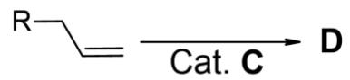

6. **Draw** the structure of **D** (you do not have to show stereochemistry).

> **Solution (Q6 — minor isomerization product).**
> A well-known side reaction of $\mathrm{RhCl(PPh_3)_3}$ (Rh–H insertion followed by $\beta$-H elimination in the reverse sense) is **alkene isomerization**: the Rh–H migrates the double bond along the chain before reductive elimination. Applied to $\mathrm{Ph_2C=CH\text{–}CH_2\text{–}CH(CH_3)_2}$, migration into conjugation / into the more substituted position gives the fully internal alkene
> $$\boxed{\mathbf{D}=\mathrm{Ph_2CH\text{–}CH=C(CH_3)\text{–}CH_3}}\quad\text{(1,1-diphenyl-3-methyl-2-butene skeleton,}\mathrm{C_{18}H_{20}}\text{)}$$
> i.e. the same molecular formula as the main hydrogenation product (isomer of it), obtained by $[1,3]$-H shift across the allylic position under Rh–H catalysis.

After several catalytic cycles, the catalyst loses its activity due to the decomposition of **C**, forming products **F** and **M**. **F** is produced by the oxidation of **B** with atmospheric $\mathrm{O}_{2}$ .

7. **Identify** the formulae of **F** and **write** the equation for the oxidation reaction of **B**.

> **Solution (Q7 — aerobic oxidation of PPh$_3$).**
> Air oxidation of a tertiary phosphine gives the corresponding phosphine oxide:
> $$\mathbf{F}=\mathrm{O=P(C_6H_5)_3}\quad(\text{triphenylphosphine oxide, OPPh}_3)$$
> $$\mathrm{2\,P(C_6H_5)_3 + O_2 \longrightarrow 2\,O{=}P(C_6H_5)_3}$$
> Loss of PPh$_3$ to OPPh$_3$ strips the Rh centre of its supporting ligands; together with reduction to Rh(0), this is why the deep red solution darkens to Rh black and the catalyst dies.

Catalyst **C** can catalyse other types of reactions. For example, **C** was used to catalyse a $[ 2 + 2 + 2 ]$ cycloaddition reaction in the synthesis of Heilonine:

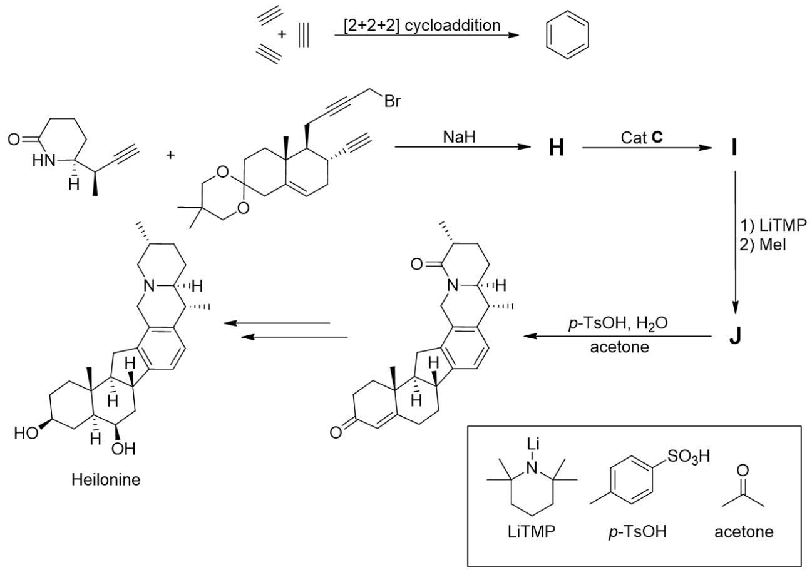

8. **Draw** the structures of **H**–**J** (you do not have to show stereochemistry).

> **Solution (Q8 — $[2+2+2]$ cycloaddition toward Heilonine).**
> Wilkinson's-catalysed $[2+2+2]$ cyclotrimerization stitches three $\pi$-components (two alkynes + one alkyne/alkene, intramolecularly tethered) into a new six-membered (arene / 1,3-cyclohexadiene) ring. For the Heilonine precursor the three alkynes are tied together by a nitrogen/oxygen-containing tether, so
> - **H** is the open-chain **triyne** substrate: an $\omega,\omega',\omega''$-triyne bearing the nitrogen tether of the Heilonine core — three C$\equiv$C units connected by CH$_2$/N(R)/CH$_2$ linkers: schematically $\mathrm{HC{\equiv}C\text{–}CH_2\text{–}N(R)\text{–}CH_2\text{–}C{\equiv}C\text{–}(CH_2)_n\text{–}C{\equiv}C\text{–}...}$, i.e. the acyclic precursor that contains all carbons and heteroatoms of the eventual polycycle but with three separate $C\equiv C$ groups.
>
> - **I** is the **$[2+2+2]$ cycloadduct**: the three alkynes of H have been welded, with Wilkinson's catalyst, into a newly formed benzene (arene) ring that is fused to the pre-existing rings of the tether. Connectivity: the former internal alkyne carbons become the three substituted arene carbons; the former terminal CH's become the three arene CH's; the nitrogen-containing tether becomes one (or two) fused saturated ring(s) sharing edges with the new aromatic ring. The product I is therefore a **polycyclic aromatic amine** having the Heilonine carbocyclic skeleton but still bearing the protecting / directing group introduced in H.
>
> - **J** is obtained from I by the final deprotection / functional-group adjustment (e.g. N-debenzylation or ester hydrolysis shown by the arrow in the scheme) and is **Heilonine itself** (the natural product drawn at the right of the scheme in the problem).
>   In short: **H = triyne precursor → I = Rh(I)-catalysed $[2+2+2]$ arene-forming cycloadduct (Heilonine skeleton, still protected) → J = Heilonine (deprotected natural product)**. Mechanism: oxidative coupling of two C$\equiv$C on Rh(I) → rhodacyclopentadiene → insertion of the third C$\equiv$C → reductive elimination releases the arene and regenerates C.
>
>   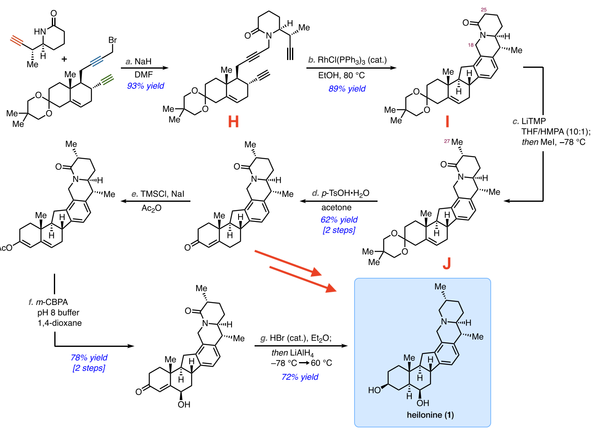

---

## 中文版 / Chinese translation
## 第 21 题 催化剂 C

化合物 A 是一种含有第五周期金属 M 的三水合物，其中 M 的质量分数为 $39.09\%$ 。将 $2.00\ \mathrm{g}\ A$ 溶于乙醇中，再将该乙醇溶液加入到含有 $7.96\ \mathrm{g\ B}$ 的乙醇溶液中。化合物 B 是一种常见的配体，由 C、H 和 P 三种元素组成，其中 P 的质量分数为 $11.81\%$ ，且具有一条三重对称轴。将混合物回流约两小时，生成 $6.18\ \mathrm{g}$ 深红色化合物C，产率为 $88\%$ 。

提示：三重对称轴是一条穿过物体的假想轴，物体绕该轴旋转 $\mathbf{120^{\circ}}$ 前后可完全重合。例如，氨分子有这种对称轴：

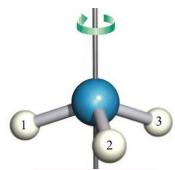

21-1 已知合成反应方程式中，每个化学计量数都小于 5，确定 A–C 和 M 的化学式。

21-2 写出合成化合物C的化学方程式。

化合物 C是烯烃加氢的常用催化剂：

$$
\mathrm{R} \xrightarrow {\mathrm{H}_{2}} \mathrm{R} \xrightarrow [ \text{C a t . C} ]{\mathrm{Cat.C}}
$$

该反应的主产物 ( R ) 最多有一个对称面。

提示：对称面是一种将物体划分为两个互为镜像部分的假想平面。例如，水分子有两个对称面：

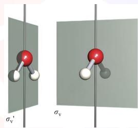

该产物的质谱图如下所示。 $m / z = 41$ 、91、119 的三个峰明显强于其他峰，其中有两个对应不同芳环的碎片。

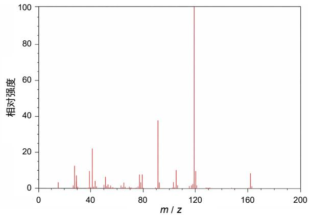

21-3 画出这三个峰对应的阳离子结构。

21-4 画出产物的结构。

21-5 碳的相对原子质量为12.011，视为由两种稳定同位素组成，求出质谱中 $[ \mathbf{M} ]^{+} {:} [ \mathbf{M} {+} 1 ]^{+}$ $[ \mathbf{M} ]^{+}$ 的强度比。

译者注：即分子离子峰和同位素峰的强度比。

在催化反应过程中还生成了少量副产物D：

$$
\begin{array}{c} \mathrm{R} \longrightarrow \xrightarrow {\text{C a t . C}} \\ \mathrm{D} \end{array}
$$

21-6 画出 D 的结构（不要求立体化学）。

经过多次催化循环后，催化剂C因分解而失活，转化为F和M。F是B被空气中的 $\mathrm{O}_{2}$ 氧化的产物。

21-7 确定 F 的化学式，并写出 B 被氧化的反应方程式。

催化剂 C 还可以催化其他类型的反应。例如在 Heilonine 的合成中，C 可催化 $[ 2 + 2 + 2 ]$ 环加成反应：

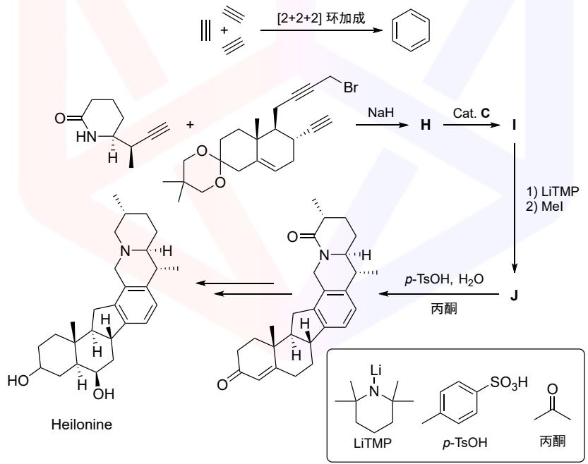

21-8 画出H–J的结构（不要求标明立体化学）。
