::: {.callout-important appearance="simple"}
**Status: TBC** — at least one mechanistic step (notably the Q3 OS/CN/VE assignment for HAT to a metal-oxo, and the Pd-cycle bookkeeping in Q7) is contested. If you spot the bug, please flag it on Discord with the question number and the specific step.

[💬 Discuss on Discord →](https://discord.gg/CHANGE-ME){.discord-cta}
:::

Note: Natural abundances of some isotopes are given at the end of the problem.

Transition metal-catalyzed reactions can be versatile and unique. As such, nickel complex **4** can catalyze the transformation of compounds **1** and **2** into product **3** as described below.

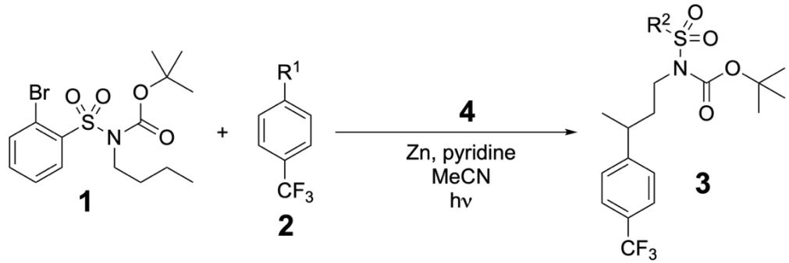

## Q1 — Structures of 2 and 3 from EI-MS

1. The mass spectra (MS) of **2** and **3** are shown (electron impact ionization method). **Determine** the structures of **2** and **3**.

MS of 2

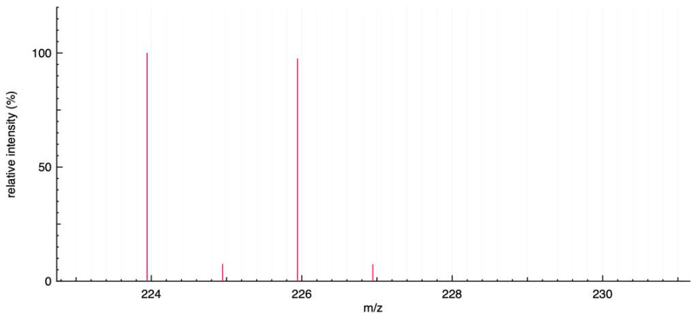

MS of 3

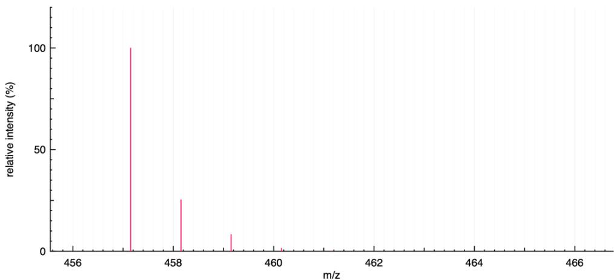

> **Solution (Q1 — Structures of 2 and 3 from EI-MS).**
>
> **Compound 2.** The MS of **2** shows M⁺· at *m/z* 224/226 with a ≈ 1 : 1 doublet — the fingerprint of a single Br atom (⁷⁹Br : ⁸¹Br ≈ 50.69 : 49.31). The scheme fixes the skeleton as R¹–C₆H₄–CF₃. M(C₆H₄CF₃) = 6·12 + 4·1 + 12 + 3·19 = 145, so R¹ = 224 − 145 = **79 = Br**. Hence
>
> $$\boxed{\mathbf{2}\;=\;4\text{-bromo-}\alpha,\alpha,\alpha\text{-trifluorotoluene}\;=\;4\text{-Br–C}_6\text{H}_4\text{–CF}_3\;\;(\mathrm{M}^{+\!\cdot}=224/226)}$$
>
> **Compound 3.** The base peak in the MS of **3** is at *m/z* 457 **without** a Br doublet, so the two reactant bromines have both been lost in the transformation. The drawn skeleton shows R²–SO₂–N(Boc)–CH₂CH₂CH(CH₃)–C₆H₄–CF₃. Decomposing the mass:
>
> - CF₃–C₆H₄–C₄H₈– (aryl + C₄H₈ linker) = 69 + 76 + 56 = 201
> - –N(Boc) = –N–CO₂C(CH₃)₃ = 14 + 44 + 57 = 115
> - remainder = 457 − 201 − 115 = **141 = SO₂–C₆H₅** (64 + 77), i.e. R² = **Ph**
>
> The Br on the sulfonyl ring of **1** has been replaced by H (R² = Ph) and the coupling has installed the 4-(CF₃)C₆H₄ group onto the butyl side chain. From the structure drawn for **3**, the Ar′ attaches at Cγ of the *n*-butyl chain (the carbon bearing the methyl in the product drawing):
>
> $$\boxed{\mathbf{3}\;=\;N\text{-Boc-}N\text{-(phenylsulfonyl)-3-[4-(trifluoromethyl)phenyl]butan-1-amine}}$$
>
> i.e. PhSO₂–N(Boc)–CH₂–CH₂–CH(4-CF₃-C₆H₄)–CH₃, M = 457. (The hint's name "4-(…)butan-2-amine" labels the same connectivity viewed from the other end of the C₄ chain.)
>
> **Mechanistic cross-check.** A radical generated at the ortho-position of the sulfonyl ring of **1** (after loss of Br·) performs an intramolecular **1,7-HAT** through the 8-membered TS Cortho→Cipso→S→N→Cα→Cβ→Cγ→H, abstracting the γ-C–H of the butyl chain. This (i) restores ortho-Ar–H (R² = Ph) and (ii) generates a secondary alkyl radical at Cγ, which is captured by the Ni centre and cross-coupled with the aryl group of **2** (Ar′ = 4-(CF₃)C₆H₄). Both changes are visible in the MS of **3**: no Br pattern, and ΔM consistent with "–Br, –H, +Ar′H –H" exactly.
>
> 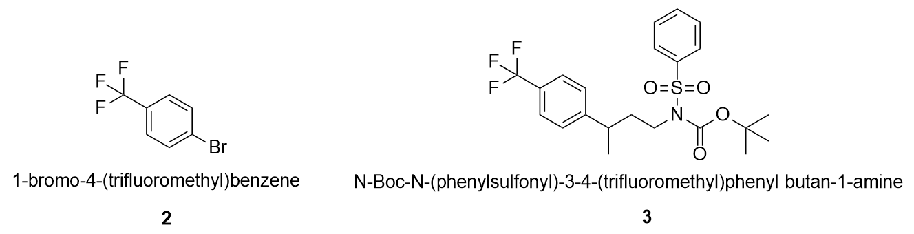

Complex **4** can be obtained via the following reaction. OS is the oxidation state of a metal in a complex; CN is the coordination number, and VE is the total number of valence electrons.

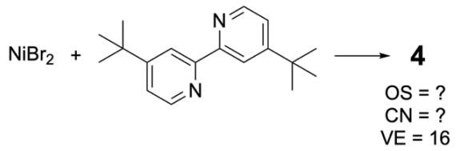

## Q2 — Complex 4: OS, CN, VE of Ni

2. **Draw** the structure of **4** and **report** the OS and CN of the metal in it.

> **Solution (Q2 — Complex 4, OS/CN/VE of Ni).**
>
> NiBr₂ (square planar d⁸) simply chelates the bidentate N,N-ligand (4,4′-di-*tert*-butyl-2,2′-bipyridine, dtbbpy) to give the neutral, 16 e⁻ pre-catalyst:
>
> $$\boxed{\mathbf{4}\;=\;[\mathrm{NiBr_2(dtbbpy)}]\;\;\text{(square planar)}}$$
>
> Two Br⁻ (X-type, 1 e⁻ each, covalent method) + one L–L dtbbpy (4 e⁻) + Ni atom (10 e⁻):
>
> | Parameter | Value | Counting |
> |---|---|---|
> | **OS** | **+2** | inherited from NiBr₂; d⁸ |
> | **CN** | **4** | 2 N + 2 Br (square planar) |
> | **VE** | **16** | 10 (Ni) + 4 (dtbbpy) + 2 × 1 (Br·) = 16 ✓ |
>
> This matches the "VE = 16" shown in the scheme.

HAT is Hydrogen Atom Transfer, while XAT is Halogen Atom Transfer. If atom transfer is intramolecular, it is called 1,n-AT. An example of 1,5-HAT is presented on the scheme below along with some Bond Dissociation Energies (BDE) useful for this task.

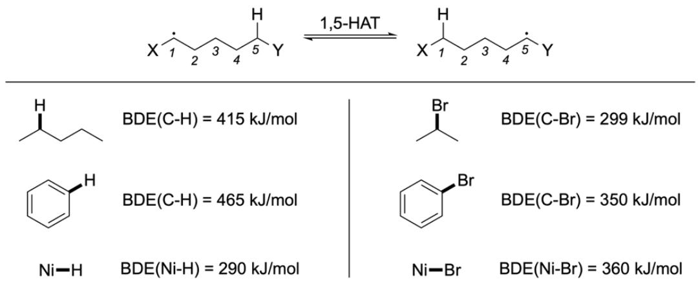

Metal complexes can participate in HAT and XAT processes. Two examples are given below:

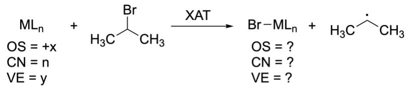

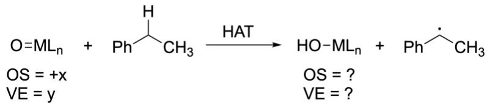

## Q3 — OS/CN/VE of HAT and XAT products

3. **Find** the missing parameters (OS, CN, and VE) for the complexes produced in HAT and XAT processes.

> **Solution (Q3 — OS/CN/VE of the HAT and XAT products).**
>
> Both atom-transfer steps are formally one-electron oxidative additions of a radical (X· or H·) onto the metal. In covalent electron counting, the metal captures an X-type ligand (1 e⁻ donor) and gains +1 in OS, +1 in CN, and +1 in VE.
>
> **XAT product Br–MLₙ** (from MLₙ + iPrBr → Br–MLₙ + iPr·):
>
> | Parameter | Value |
> |---|---|
> | OS | **+(x+1)** |
> | CN | **n + 1** |
> | VE | **y + 1** |
>
> One new M–Br σ-bond: the Br· brings 1 e⁻ to the metal valence shell and the metal contributes 1 e⁻; net +1 to VE (covalent count) and +1 to the formal oxidation state.
>
> **HAT product HO–MLₙ** (from O=MLₙ + PhCH(H)CH₃ → HO–MLₙ + PhC·HCH₃): the metal-oxo (M=O, double bond, X₂-type oxo) becomes a metal-hydroxo (M–OH, single bond, X-type hydroxo). The added H binds to the oxo O, not to the metal, so the metal's valence count and CN are unchanged, but the metal is **reduced by one** (formally M(O²⁻) → M(OH⁻)):
>
> | Parameter | Value |
> |---|---|
> | OS | **+(x − 1)** |
> | CN | **n** (unchanged, O remains a single donor atom) |
> | VE | **y − 1** (M=O donated 4 e⁻; M–OH donates 2 e⁻ as X-type + 1 e⁻ gained from H·; net −1 e⁻ on the metal using covalent counting, equivalently: the metal gains one electron = reduced) |
>
> Equivalently in the ionic picture: O²⁻ + H⁺ + e⁻ → OH⁻ + (metal keeps the e⁻) ⇒ OS drops by 1. This is the subtle point: in HAT to an oxo ligand, the H adds to O and the metal is *reduced*; in XAT to the metal centre, the X binds directly to M and the metal is *oxidised*.

The catalytic cycle for the transformation of **1** and **2** to product **3** is described below:

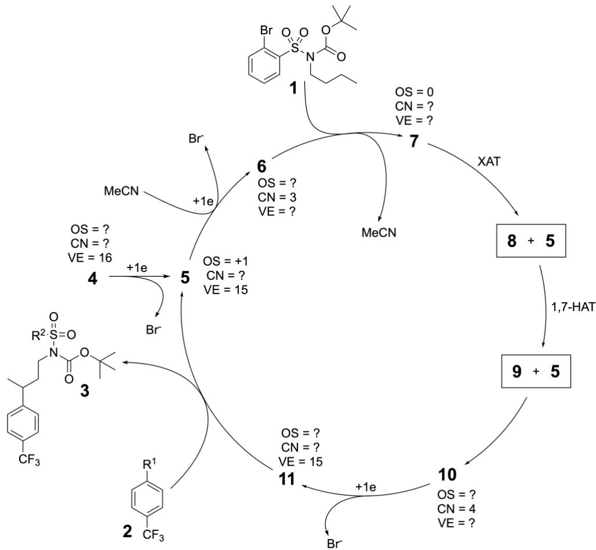

## Q4 — Ni cycle: structures 5–11 and Ni bookkeeping

4. **Find** the structures of **5**–**11** in the cycle. For Ni-containing structures **5**–**7** and **10**–**11**, **find** the missing parameters (OS, CN, and VE).

> **Solution (Q4 — Structures 5–11 and Ni parameters).**
>
> The cycle is a two-electron-reduced metallaphotoredox cross-coupling in which the Ni centre itself does the XAT on **1** (generating an *aryl* radical from the ortho-Ar–Br), the aryl radical does a **1,7-HAT** to translocate the radical onto Cγ of the butyl chain, and the resulting alkyl radical is captured by the same Ni catalyst to cross-couple with **2**. Let L = dtbbpy throughout (L–L, 4 e⁻, CN contribution = 2).
>
> **Ni-containing species.**
>
> | # | Structure | OS | CN | VE | Count (covalent) |
> |---|---|---:|---:|---:|---|
> | **4** | [LNiBr₂]  — precatalyst, square planar | +2 | 4 | 16 | 10 + 4 + 2·1 = 16 |
> | **5** | [LNi(Br)]  — after 1 e⁻ reduction / Br⁻ loss | **+1** | **3** | **15** | 10 + 4 + 1 = 15 ✓ |
> | **6** | [LNi(MeCN)] — after 2nd 1 e⁻ reduction / Br⁻ loss, MeCN binds | **0** | **3** | **16** | 10 + 4 + 2 = 16 |
> | **7** | [LNi⁰·(η¹/η²-ArBr of **1**)] — substrate-loaded complex (MeCN displaced) | **0** | **4** | **16** | 10 + 4 + 2 = 16 |
> | **10** | [LNi(Br)(R)]  — after Ni(I) **5** captures the alkyl radical **9** | **+2** | **4** | **16** | 10 + 4 + 1 + 1 = 16 |
> | **11** | [LNi(R)]  — after 1 e⁻ reduction / Br⁻ loss from **10** | **+1** | **3** | **15** | 10 + 4 + 1 = 15 ✓ |
>
> (From **11**, oxidative addition of **2** (Ar′–Br) gives a transient [LNi(R)(Ar′)(Br)] (Ni(III), CN 5, VE 17); C–C reductive elimination releases **3** and regenerates **5** = [LNi(Br)].)
>
> **Organic radicals (not Ni-containing).**
>
> - **8** = the aryl radical at the ortho position of the sulfonyl ring, i.e. the 2-substituted benzenesulfonamide of **1** with a carbon-centred radical replacing Br:
>   *(2-·)C₆H₄–SO₂–N(Boc)–(CH₂)₃CH₃*
> - **9** = the secondary alkyl radical at Cγ of the butyl chain after 1,7-HAT (ortho-Ar now bears H):
>   *C₆H₅–SO₂–N(Boc)–CH₂–CH₂–·CH–CH₃*
>
> **Flow.** **4** →(+e⁻, −Br⁻)→ **5** →(+e⁻, −Br⁻, +MeCN)→ **6** →(+**1**, −MeCN)→ **7** →(XAT)→ **8** + **5** →(1,7-HAT)→ **9** + **5** →(radical capture)→ **10** →(+e⁻, −Br⁻)→ **11** →(+**2**, oxidative addition + C–C RE)→ **3** + **5**. Each turnover consumes two outer-sphere electrons supplied by the terminal reductant (see Q5) and expels two Br⁻ (one from **1**, one from **2**).
>
> 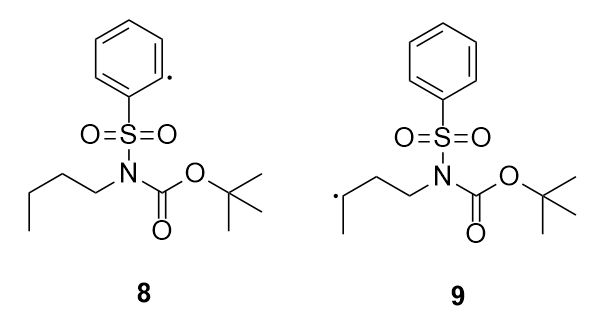

## Q5 — Identity of the electron donor

5. **Analyse** the given reaction conditions for the synthesis of compound **3** and **determine** the electron donor in the above catalytic cycle.

> **Solution (Q5 — Identity of the electron donor).**
>
> Reaction conditions: catalyst **4**, **Zn**, pyridine, MeCN, hν. Each catalytic turnover requires *two* outer-sphere electrons (4→5 and 5→6, and again 10→11) and expels two Br⁻. Pyridine is only a mild base/ligand, MeCN is the solvent, and hν merely excites the Ni centre for LMCT/homolysis; none of these can be a stoichiometric 2 e⁻ reductant. The only species thermodynamically capable of supplying 2 e⁻ per equivalent is metallic zinc:
>
> $$\boxed{\text{Electron donor = Zn}^{0}\;\;(\text{Zn} \longrightarrow \text{Zn}^{2+} + 2\,\mathrm{e}^{-};\;\text{overall: Zn + 2 Br}^{-}\to \text{ZnBr}_2)}$$
>
> Zn(0) → Zn(II) (E° = −0.76 V) is a clean, innocent two-electron reductant; the two Br⁻ set free by **1** and **2** precipitate as ZnBr₂ (driving force for the stoichiometry). Consistent with the scheme's "+1e" labels appearing twice per turnover.

A conceptually similar catalytic reaction is a desaturation of silylated alcohols such as **12**. In the example below a deuterium label was installed for mechanistic studies.

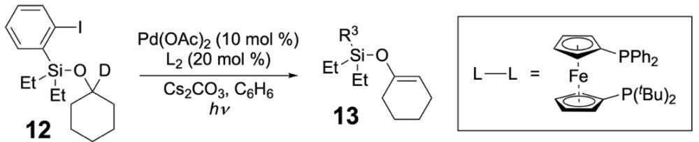

## Q6 — Structure of 13 from EI-MS

6. The mass spectrum of **13** is presented below (electron impact ionisation method). **Determine** its structure.

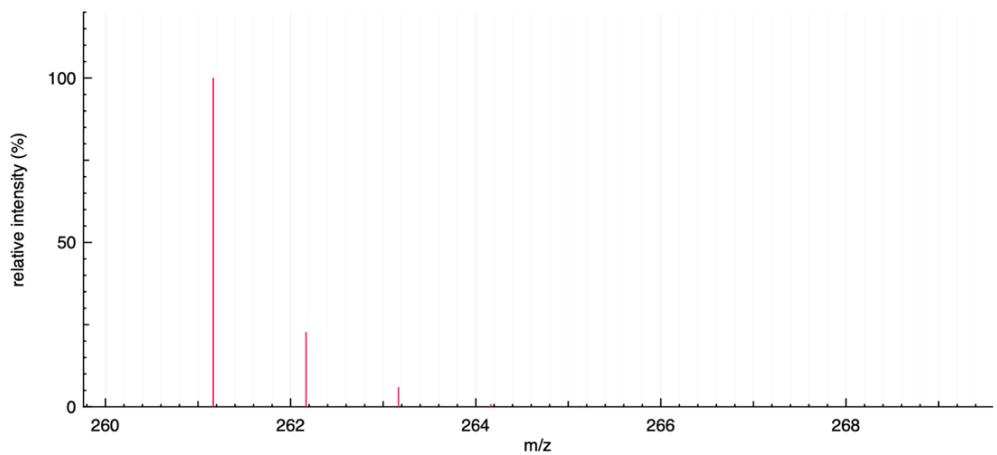

> **Solution (Q6 — Structure of 13 from EI-MS and mechanism).**
>
> **12** = 1-(2-iodophenyl)-1,1-diethyl-1-[(1-deuteriocyclohexyl)oxy]silane, i.e. (2-I-C₆H₄)(Et)₂Si–O–C(D)(ring). The sole label is a **D at the cyclohexyl C1** (the α-C to O), which in 12 has (O, D, 2 ring C) — no other H on C1.
>
> The Pd/hν reaction performs an intramolecular **1,5-HAT**: after C–I cleavage, the ortho-aryl radical traverses ortho-C → ipso-C → Si → O → C1 (five atoms, 6-membered TS), abstracting **the α-D**. This places D on the ortho-carbon of the aryl ring (now Ar–D, iodide replaced by D!) and leaves a C1-centred radical, which is then trapped by Pd and undergoes β-H elimination (ring-C2 → Pd) to install the C1=C2 double bond — a silyl enol ether.
>
> $$\boxed{\mathbf{13}\;=\;(2\text{-}\text{D}\text{-}\text{C}_6\text{H}_4)(\text{Et})_2\text{Si–O–(cyclohex-1-en-1-yl)}}$$
>
> i.e. R³ = **2-D-C₆H₄** (the ortho-I has been replaced by the D translocated from the cyclohexyl α-C; the cyclohexyl ring has lost one H (from C2) and become the 1-enol silyl ether).
>
> **Mass cross-check.** The fully protio analogue (Ph(Et)₂Si–O–cyclohex-1-en-1-yl) has M = 12·16 + 1·24 + 28 + 16 = 192 + 24 + 28 + 16 = **260**. Substituting one H by D adds 1 → **261**. Observed M⁺· = **261** (base peak), with M+1 ≈ 262 at ~23 % (consistent with 16 C's worth of ¹³C + ²⁹Si + ³⁰Si contributions). Perfect match and confirms **D is retained in 13** — but located on the aryl ortho position, not on the enol ether carbon. The γ-H elimination that forms C=C is from C2 (an ordinary H), which leaves as H (→ eventually HI).
>
> 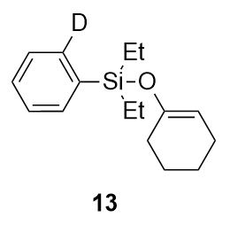

The catalytic cycle for the transformation of **12** into **13** is shown below:

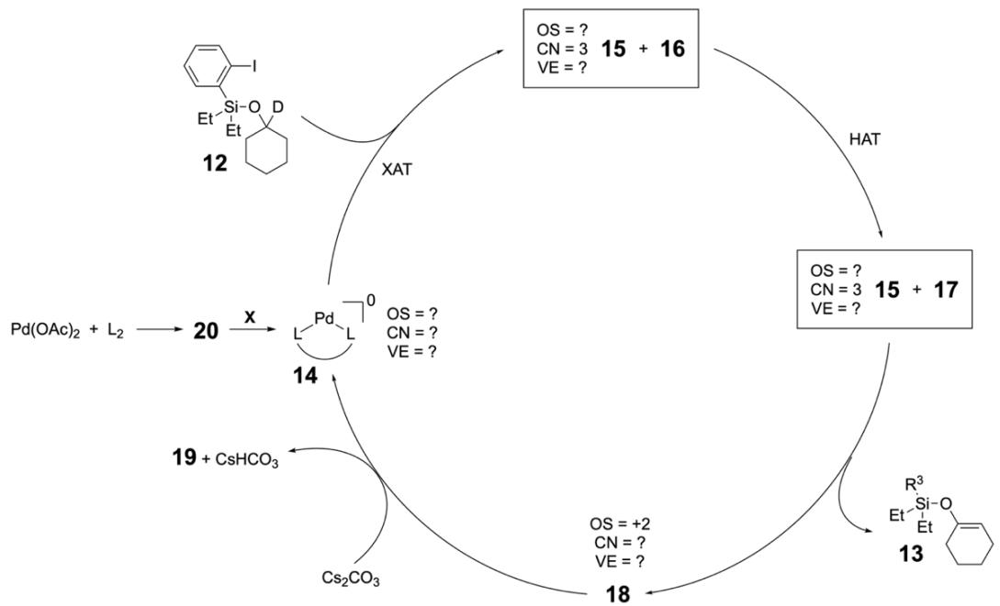

## Q7 — Pd desaturation intermediates 15–19

7. **Determine** the structures of **15**–**19**. For Pd-containing intermediates **14**, **15**, and **18**, **find** the missing parameters (OS, CN, VE).

> **Solution (Q7 — Pd desaturation intermediates 15–19.)**
>
> L = 1,1′-bis(phosphino)ferrocene with PPh₂ and P(tBu)₂ on the two Cp rings (a P,P-bidentate ferrocene — dppf-type), chelating Pd through the two phosphorus atoms (L–L contributes 4 e⁻, CN 2). The cycle runs exactly parallel to the Ni one in Q4 (XAT, then 1,5-HAT, then radical rebound and β-H elimination):
>
> | # | Structure | OS | CN | VE | Count |
> |---|---|---:|---:|---:|---|
> | **14** | [LPd⁰] | 0 | 2 | 14 | 10 + 4 |
> | **15** | [LPd(I)·I]  — after XAT of Ar–I (12) by 14 | **+1** | **3** | **15** | 10 + 4 + 1 ✓ (CN=3 matches scheme) |
> | **16** | **aryl radical** (ortho-carbon of 12 with I removed): (2-·)C₆H₄–Si(Et)₂–O–C(D)(ring) | — | — | — | organic radical |
> | **17** | **alkyl radical** after 1,5-HAT: (2-D-C₆H₄)–Si(Et)₂–O–·C(ring) — D has migrated to ortho-Ar, radical sits on C1 of the ring | — | — | — | organic radical |
> | **18** | [LPd(II)(H)(I)]  — forms by 15 + 17 combining (Pd–C σ-bond) and then β-H elimination off C2 of the ring, releasing **13** and leaving a Pd–H | **+2** | **4** | **16** | 10 + 4 + 1 + 1 ✓ |
> | **19** | **CsI** — Cs₂CO₃ deprotonates H–I coming from reductive elimination on **18**: H–I + Cs₂CO₃ → **CsI** + CsHCO₃ | — | — | — |
>
> (If the system had selected the deuterated β position instead, 19 would be CsD-I = CsI anyway; the specific D here ends up on Ar in **13**, not in 19.)
>
> **Step-by-step:** 14 + **12** →(XAT) **15** + **16**; **16** →(1,5-HAT) **17** (with Ar now carrying D); **15** + **17** →(radical rebound; Pd(I)·I + C· → Pd(II)(C)(I), then β-H elim) → **13** + **18**; **18** + Cs₂CO₃ →(reductive elimination of H–I, then neutralisation) **14** + **19** + CsHCO₃.
>
> 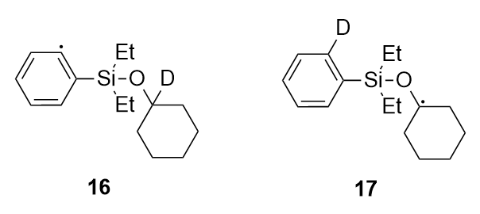

Active species **14** is not particularly stable, thus, it is practically easier to start the reaction with a bench-stable palladium complex ${\mathrm{Pd}} ( \mathrm{OAc} )_{2}$ . The first step towards **14** is reaction with the phosphine ligand.

## Q8 — Pre-catalyst 20 and reductive activation step X

8. **Draw** a possible structure for **20**. **Suggest** what type of process should occur in the second step marked as **X** on the scheme. **Analyse** the given reaction conditions for the synthesis of **13** and **suggest** what reagent can participate in the step **X**.

> **Solution (Q8 — Structure of 20 and identity of step X).**
>
> **20** = the simple ligation product of Pd(OAc)₂ with the bidentate dppf-like ligand L:
>
> $$\boxed{\mathbf{20}\;=\;[\mathrm{L_2\,Pd(OAc)_2}]\;\;(\text{square planar, OS}=+2,\,\mathrm{CN}=4,\,\mathrm{VE}=16)}$$
>
> **Step X** must convert this Pd(II) pre-catalyst into the Pd(0) complex **14**, i.e. it is a **two-electron reduction** of the metal centre. No Zn is used in this transformation (contrast with the Ni cycle in Q1-5). Among the species present (Pd(OAc)₂, L₂, Cs₂CO₃, **12**, benzene, hν), the two credible reductants are:
>
> 1. **The phosphine ligand L** — the classic Pd(OAc)₂ activation: one P donor is oxidised to a phosphine oxide, releasing AcOH, giving L(O=P…)Pd(0). This is well precedented (Amatore/Jutand) and is the dominant pathway whenever a P-ligand is present.
> 2. **The silyl ether substrate 12 itself** — via κ¹-O or κ¹-I coordination to Pd(II), followed by β-hydride elimination from the cyclohexyl α-C (the C–D here) to give a Pd(II)(H or D)(OAc), then reductive elimination of AcOH/AcOD to deliver Pd(0).
>
> Since the bulky, P(tBu)₂-bearing ligand L is easily oxidised at its P(tBu)₂ centre and is present at 20 mol%, the most likely reductant under the described conditions is **L itself** (P → P=O), with **12** as a secondary option. In either case, **step X is the two-electron reduction Pd(II) → Pd(0)** — a **reductive activation** of the pre-catalyst.

## Q9 — Pairwise BDE(C–H) comparison for 21–23

9. Based on the information in the task, **analyse** BDE(C–H) of highlighted bonds in compounds **21**–**23**. **Compare** the values in pairwise manner using symbols $< , > \mathrm{or} =$ :

$$
\mathrm{BDE} (\mathrm{C} - \mathrm{H})_{21} \quad \mathrm{BDE} (\mathrm{C} - \mathrm{H})_{22}
$$

$$
\mathrm{BDE} (\mathrm{C} - \mathrm{H})_{21} \quad \mathrm{BDE} (\mathrm{C} - \mathrm{H})_{23}
$$

$$
\mathrm{BDE} (\mathrm{C} - \mathrm{H})_{22} \quad \mathrm{BDE} (\mathrm{C} - \mathrm{H})_{23}
$$

> **Solution (Q9 — Pairwise BDE comparison for 21–23).**
>
> Reading the three marked C–H's from the drawings:
>
> - **21** — Me₃Si–C₆H₅ with an **ortho-aryl sp² C–H** bolded: this is an Ar(sp²)–H, BDE(Csp²–H) ≈ **112–113 kcal mol⁻¹**.
> - **22** — Me₃Si–O–CH(CH₃)₂ with the bolded H on the central CH: an **α-O-silyl tertiary sp³ C–H**, stabilised by both σ*C–H ← nO hyperconjugation and by the two methyl groups → BDE ≈ **91–93 kcal mol⁻¹**.
> - **23** — Me₃Si–O–CH(CH₃)–CH₂–CH₃ with the bolded H on the methylene (i.e. Cβ to the OSi, not α): an **unactivated secondary sp³ C–H** (no lone-pair donor in the α-position), BDE ≈ **98–99 kcal mol⁻¹**.
>
> Hierarchy: aryl sp² C–H > unactivated secondary C–H > α-O-silyl tertiary C–H. Therefore:
>
> $$\boxed{\mathrm{BDE(C{-}H)_{21}\;>\;BDE(C{-}H)_{22}}}$$
> $$\boxed{\mathrm{BDE(C{-}H)_{21}\;>\;BDE(C{-}H)_{23}}}$$
> $$\boxed{\mathrm{BDE(C{-}H)_{22}\;<\;BDE(C{-}H)_{23}}}$$
>
> **Mechanistic corollary.** The α-O-silyl C–H (type **22**) is the weakest and therefore the kinetically and thermodynamically preferred site for the aryl-radical 1,5-HAT in the 12→13 cycle — precisely the C1 position where the D label sits in **12**. This rationalises (i) the exquisite site-selectivity of the Pd-catalysed desaturation, (ii) the clean D-transfer onto the aryl ortho position (Q6), and (iii) the primary KIE normally observed in such ArO-silicon 1,5-HAT systems.

**Table of Natural Abundances**

| **Isotope** | **Natural Abundance / %** |
|---|---|
| ¹H | 99.9885 |
| ²H | 0.0115 |
| ¹²C | 98.93 |
| ¹³C | 1.07 |
| ¹⁴N | 99.632 |
| ¹⁵N | 0.368 |
| ¹⁶O | 99.757 |
| ¹⁷O | 0.038 |
| ¹⁹F | 100 |

| **Isotope** | **Natural Abundance / %** |
|---|---|
| ³²S | 94.93 |
| ³³S | 0.76 |
| ³⁴S | 4.29 |
| ³⁶S | 0.02 |
| ³⁵Cl | 75.78 |
| ³⁷Cl | 24.22 |
| ⁷⁹Br | 50.69 |
| ⁸¹Br | 49.31 |
| ¹²⁷I | 100 |

---

::: {.content-hidden when-format="html"}

## 中文版 / Chinese translation

# 第 23 题 氢原子转移和卤原子转移

注：同位素相对丰度数据见本题末尾。

过渡金属催化反应形式多样，机理也常有独特之处。如下所示，镍配合物 4 可以催化底物 1 和 2 转化为产物 3。

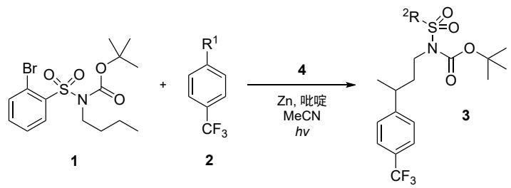

## 23-1 — 由质谱确定 2 和 3 的结构

23-1 下面给出了2和3的电子轰击电离质谱。确定 2和 3的结构。

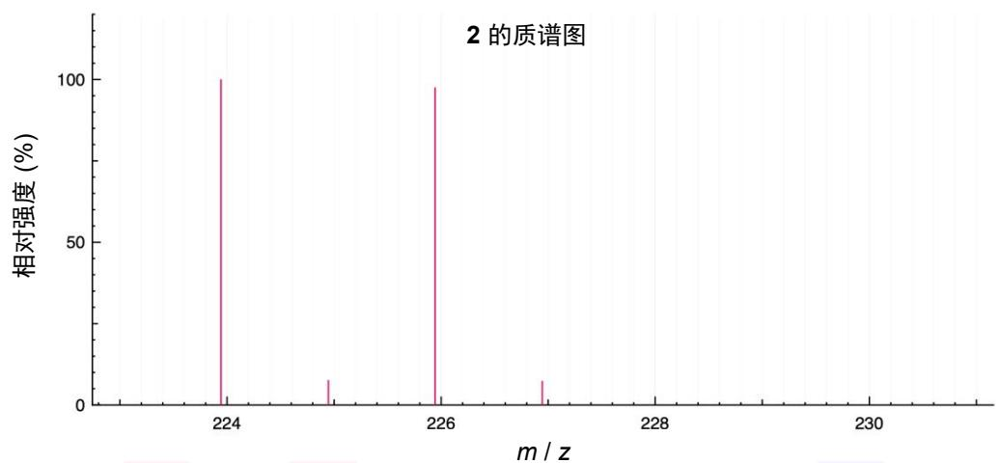

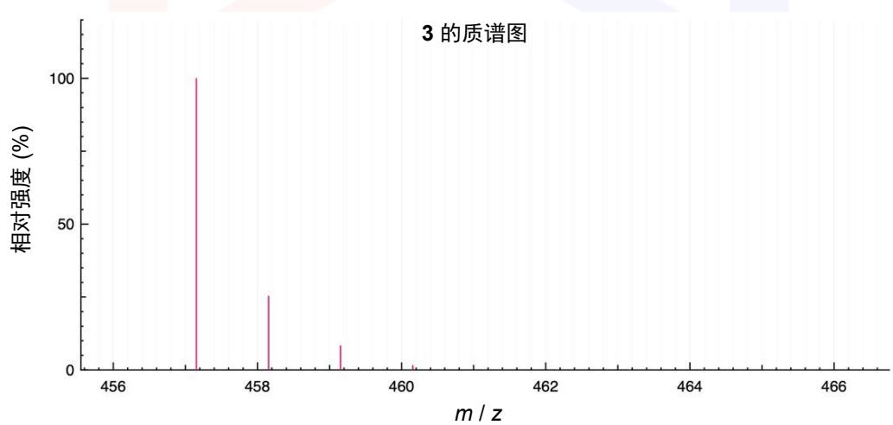

配合物 4 可以通过以下反应得到。OS 表示金属在配合物中的氧化态；CN 表示配位数，VE 表示价电子的总数。

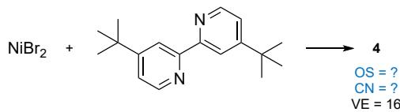

## 23-2 — 配合物 4 的结构及 Ni 的 OS、CN

23-2 画出 4 的结构，并指出其中金属的 OS 和 CN。

HAT 表示氢原子转移，XAT 表示卤素原子转移。如果该原子在分子内转移，则可表为 1,n-AT。下面是1,5-HAT 的示例，以及一些相关的键解离能 (BDE) 数据。

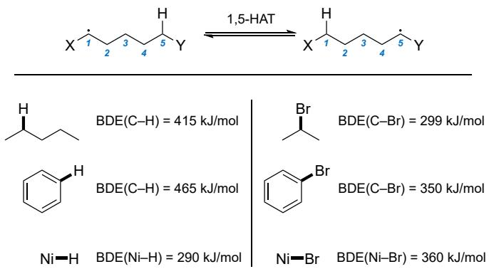

金属配合物可以参与HAT 和XAT 过程。下面给出两个例子：

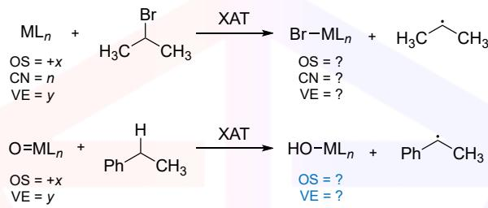

## 23-3 — HAT 与 XAT 产物配合物的 OS、CN、VE

23-3 指出 HAT 和 XAT 生成的配合物的 OS、CN、VE。

下图描述了1和2转化为产物3的催化循环：

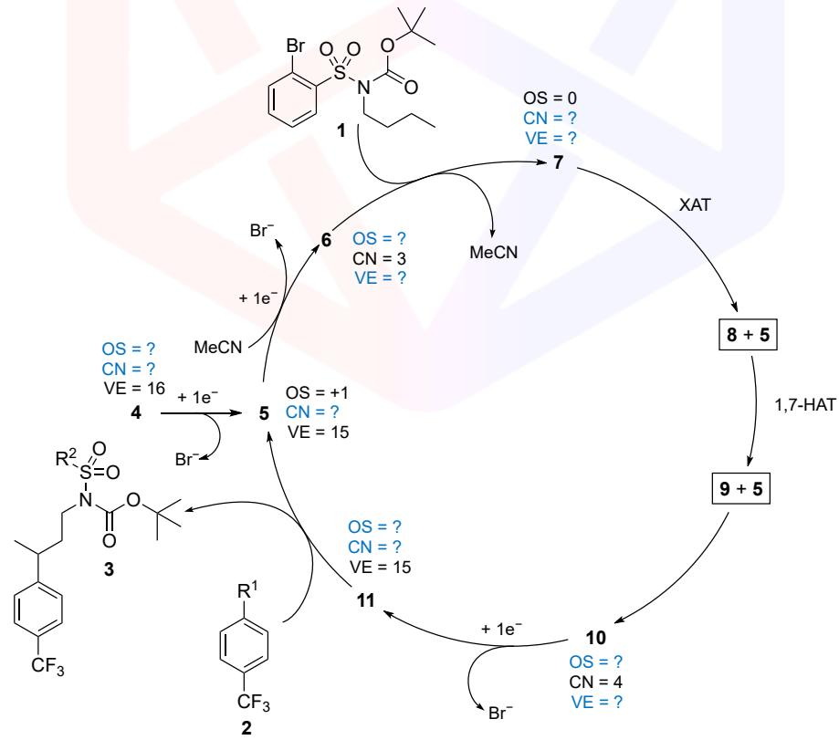

## 23-4 — Ni 催化循环：5–11 的结构与配合物参数

23-4 给出循环中 5–11 的结构。指出含 Ni 中间体 5、6、7、10、11 的 OS、CN 和 VE。

## 23-5 — 确定催化循环的电子供体

23-5 分析合成化合物3的反应条件，确定上述催化循环中的电子供体。

与此思路类似的另一类催化反应，是12这类硅醚的不饱和化反应。下面的例子中引入了氘原子标记，用于机理研究。

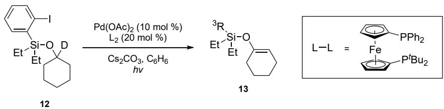

## 23-6 — 由质谱确定 13 的结构

23-6 下面给出了13的电子轰击电离质谱。确定其结构。

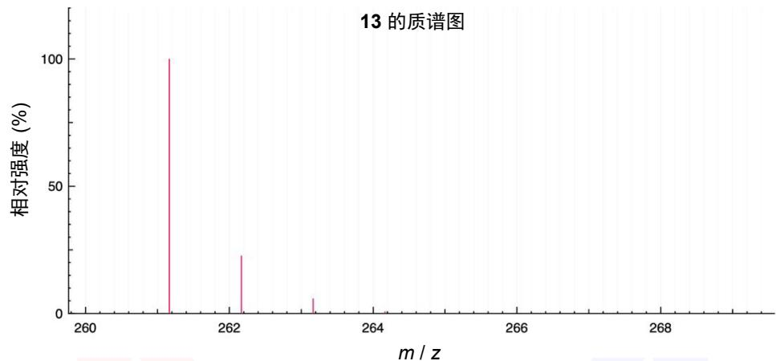

将 12转化为13的催化循环如下所示：

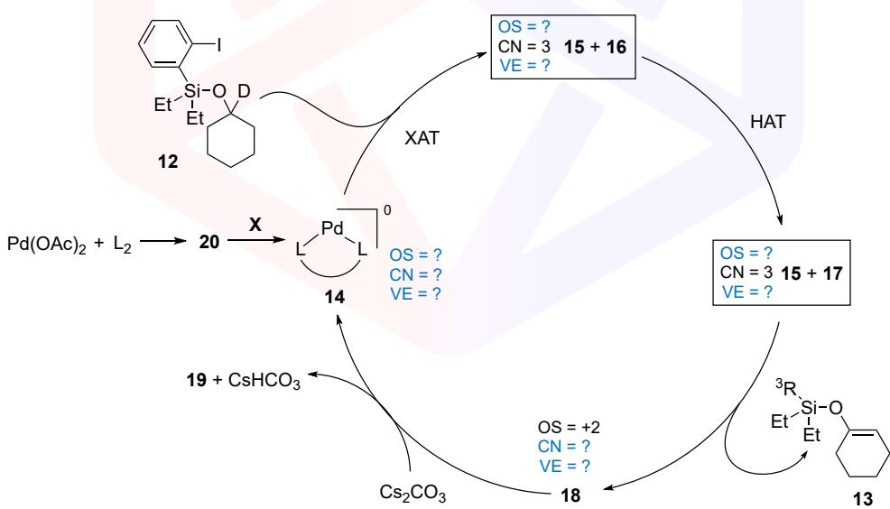

## 23-7 — Pd 脱氢循环中间体 15–19

23-7 确定 15–19 的结构。指出含 Pd 的中间体 14、15、18 的 OS、CN、VE。

活性物种 14 并不特别稳定，因此实验上常用更稳定的钯盐 $\mathrm{Pd} ( \mathrm{OAc} )_{2}$ 代替，它先与膦配体反应生成 20。

## 23-8 — 预催化剂 20 的结构与还原激活步骤 X

23-8 画出 20 的一个可能结构。猜测图中的第二步 X 应该是什么过程。分析生成 13 的反应条件，并推测哪种试剂可以参与步骤X。

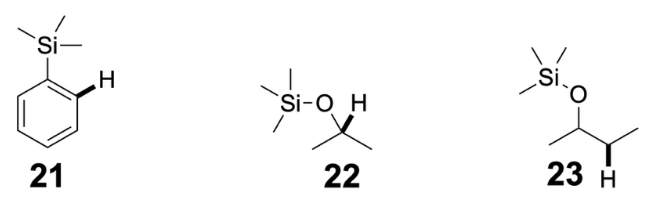

## 23-9 — 化合物 21–23 的 C–H 键 BDE 两两比较

23-9 根据表格中的信息，分析化合物21–23中加粗 C–H键的解离能 $\mathrm{BDE}_ {\mathrm{C-H}}$ ，填入 <、> 或 $=$ ：

$$
\mathrm{BDE}_ {\mathrm{C} - \mathrm{H}} (\mathbf{21}) \quad \mathrm{BDE}_ {\mathrm{C} - \mathrm{H}} (\mathbf{22})
$$

$$
\mathrm{BDE}_ {\mathrm{C-H}} (21) \quad \mathrm{BDE}_ {\mathrm{C-H}} (23)
$$

$$
\mathrm{BDE}_ {\mathrm{C-H}} (\mathbf{22}) \quad \mathrm{BDE}_ {\mathrm{C-H}} (\mathbf{23})
$$

# 相对丰度表

| 同位素 | 相对丰度 | 同位素 | 相对丰度 |
|---|---|---|---|
| $^{1}\mathrm{H}$ | 99.9885% | $^{32}\mathrm{S}$ | 94.93% |
| $^{2}\mathrm{H}$ | 0.0115% | $^{33}\mathrm{S}$ | 0.76% |
| $^{12}\mathrm{C}$ | 98.93% | $^{34}\mathrm{S}$ | 4.29% |
| $^{13}\mathrm{C}$ | 1.07% | $^{36}\mathrm{S}$ | 0.02% |
| $^{14}\mathrm{N}$ | 99.632% | $^{35}\mathrm{Cl}$ | 75.78% |
| $^{15}\mathrm{N}$ | 0.368% | $^{37}\mathrm{Cl}$ | 24.22% |
| $^{16}\mathrm{O}$ | 99.757% | $^{79}\mathrm{Br}$ | 50.69% |
| $^{17}\mathrm{O}$ | 0.038% | $^{81}\mathrm{Br}$ | 49.31% |
| $^{19}\mathrm{F}$ | 100% | $^{127}\mathrm{I}$ | 100% |

---

## 教学点评 / 解题分析

本题与题 4（Nanozymes）一样，属于典型的**现代交叉型 / IChO 主考卷风格**——它把 2018–2023 年金属-光氧化还原（metallaphotoredox）与远程 C–H 活化领域的两条主流路线（Ni-cat. 1,*n*-HAT 与 Pd-cat. 硅醚导向脱氢）一并打包，分九个小问轮番考察 **MS 解谱 / 配合物 bookkeeping (OS/CN/VE) / 自由基机理 / 电子衡算 / 同位素示踪 / BDE 排序** 六大板块。每板块单独看都不算难，但九小问跨六板块的考点密度与切换频率极高——真正考的是选手能否**在 4 小时内稳健穿越六个板块、不在某一处死磕**的节奏感。

**第一板块：MS 锁定 2 与 3（Q1）。** 此板块把"差减显元 + 骨架代入"的经典套路演到尽头：

- **2** 的 M⁺·=224/226 1:1 双峰是 **Br 同位素指纹**（⁷⁹Br : ⁸¹Br ≈ 50.69 : 49.31）。骨架 R¹–C₆H₄–CF₃ 的非 R¹ 段质量 6·12+4+12+3·19 = **145**，故 R¹ = 224 − 145 = **79 = Br**——一减一代即得 **2 = 4-Br-C₆H₄-CF₃**；
- **3** 的 M⁺·=457 *无* Br 双峰，意味着两个底物的 Br 都在反应中"消失"——这是机理的第一层暗示。骨架按命题方剥分为三段：CF₃-aryl + C₄H₈ 链 = **201**、N-Boc = **115**、剩余 **141 = SO₂C₆H₅**——三段相加恰为 457，稳稳锁定 R² = **Ph**。

**机理交叉验证。** 真正考验思维的是看出**第三段差值 141 的化学意义**：原料 **1** 的邻位 Br 已被 H 取代（R²-aryl 由 2-Br-C₆H₄ 变为 Ph），同时丁基链的 **Cγ** 位由 H 被取代为 Ar′（4-CF₃-C₆H₄）。这一对**互换**唯有通过**邻位 Ar 自由基的 1,7-HAT**（8 元 TS：C_ortho→C_ipso→S→N→Cα→Cβ→Cγ→H）才能解释——其中 Br→H 是邻位 Ar 在 HAT 后接受 H 的产物，Cγ 上的 Ar′ 由后续 Ni 介导的自由基-Ar 偶联给出。**一个 MS 峰承载两个机理事件**——命题方设计极其紧凑。

**第二板块：配合物 bookkeeping（Q2, Q3）。** Q2 是送分题——NiBr₂ 与 4,4′-di-*t*Bu-2,2′-bipy 直接螯合给出方形平面 [NiBr₂(dtbbpy)]，OS = +2、CN = 4、VE = 16。按"d⁸ 首选方形平面"条件反射即可。

真正的杀着在 Q3：**HAT 到金属-氧（M=O → M–OH）的 OS 是减一不是加一**。这是大多数学生第一次接触会犯的错——本能反应是"金属多了一根键 ⇒ OS +1、VE +2"，但 H· 加在氧上而非金属上，金属反而被*还原*：

| 步骤 | OS | CN | VE | 逻辑 |
|---|---:|---:|---:|---|
| XAT (Br–MLₙ) | +(*x*+1) | *n*+1 | *y*+1 | X 直接结合到金属 ⇒ 金属氧化 |
| HAT (HO–MLₙ) | +(*x*−1) | *n* | *y*−1 | H 结合到 oxo 配体（O²⁻→OH⁻） ⇒ 金属还原 |

**记忆口诀："谁拿到 H 谁让位"**——H· 加在金属上则金属让出 OS（被氧化）；H· 加在配体上（如 oxo, imido, amide）则配体让出价态、金属反被还原。这一点在 Q4–Q7 的 Ni/Pd 循环中会反复出现，必须吃透。

**第三板块：Ni 催化循环（Q4, Q5）。** 把 Q1 的机理提示用配合物语言完整重现。整环关键有四：

- **5 → 6 → 7 是连续两次 1 e⁻ 还原**：4 [LNiBr₂, +2/4/16] → 5 [LNiBr, +1/3/15] → 6 [LNi(MeCN), 0/3/16] → 7 [LNi·(η²-1), 0/4/16]。两个 Br⁻ 释放 + 一个 MeCN 上场再被 1 顶替；
- **7 → 8 + 5 是 XAT**——Ni(0) 把 1 邻位的 Br 拽到自身、变成 Ni(I)Br（即 5），同时释放邻位 Ar 自由基（**8**）。这一步把 Ni 的角色从"光-激发底物加合物"切换到"卤素受体"；
- **8 → 9 是 1,7-HAT**——Ar 自由基把丁链 Cγ 的 H 拽到自己头上、变回 Ar–H，alkyl radical 9 跑到 Cγ。这一步**完全不涉及 Ni**——是纯有机自由基阶段；
- **9 + 5 → 10 → 11 → 3 + 5 是经典的 Ni-radical 偶联收口**：5 [Ni(I)Br] 捕获 9 得 10 [Ni(II)Br(R), +2/4/16]，1 e⁻ 还原（−Br⁻）后变成 11 [Ni(I)R, +1/3/15]，再氧化加成 2（生成短寿 Ni(III)）+ C–C 还原消除给出产物 3 + 5 闭环。

**Q5 的题眼藏在条件中。** 反应条件 "**4, Zn, pyridine, MeCN, hν**" 中既无典型光催化剂（Ir/Ru polypyridyl 或 4CzIPN），也无 silylamine 作 XAT 试剂。Zn(0)→Zn(II) 是**唯一**能稳定提供两个外圈电子的物种；释放的两个 Br⁻ 与 Zn²⁺ 结合为 ZnBr₂——化学计量与热力学双锁。**避坑提示：** 切勿照搬 MacMillan/Doyle 的"silyl glycinate 还原剂 + Ir 光催化剂"模板（这是另一类机理）——本题的光只是激发 Ni 进行 LMCT 均裂，电子源就是金属 Zn。

**第四板块：D-标记机理（Q6, Q7）。** 整道题最迷惑、最考耐心的一段，集中在**D 究竟去哪儿了**：

- **12** 中 D 标在硅醚 **Cα**（O 上邻碳）——Cα 已被 O、D、两个环 C 占满四个键位，**没有其他 H**；
- 1,5-HAT 沿 ortho-Ar-radical → ipso-Ar → Si → O → Cα 走（六元 TS、5 个原子相连）——抽取的恰是 **D**，而非别处的 H；
- D 落到 ortho-Ar 上（取代了原来的 I 位），生成 Ar–D；同时 Cα 变成自由基；
- Cα-radical 与 Pd(I)·I 复合再做 β-H 消除——**β-H 是 Cβ 上的普通 H**（环上 C2 的 H），最终生成 C1=C2 双键的硅烯醇醚 **13**。

**MS 交叉验证：** 全氕同分异构体 (PhEt₂Si–O–cyclohex-1-en-1-yl) 计算 M = 192+24+28+16 = **260**；将一个 H 换成 D 增加 1 → **261**——与观测 M⁺·=261 的基峰完美吻合。**关键反直觉点：D 仍然在分子内，但已不在环上，而是在芳环邻位**。学生若按惯性思维"标记物留在原位"则会错给 13 的 M⁺· = 260（没看出 D 转移），或者画错的环烯醚结构。

**Pd 循环（Q7）的 bookkeeping** 与 Ni 循环平行——所有"+e⁻"步骤换成"Cs₂CO₃ 中和 HI"作为驱动 Pd(II)→Pd(0) 的合理外圈步骤；19 = CsI（与 CsHCO₃ 共生）。15 [LPd(I)·I, +1/3/15] 中的 P,P-双齿二茂铁配体（dppf-type，一边 PPh₂、一边 P(*t*Bu)₂）是 **Engle 组近年硅醚导向脱氢**工作的招牌配体。

**第五板块：预催化剂活化（Q8）。** 经典的 **Amatore–Jutand (1991) 三键性还原激活**：

$$\mathrm{Pd(OAc)_2 + 2L\;\longrightarrow\;[L_2Pd(OAc)_2]\;\xrightarrow{X}\;LPd(0) + 2\,AcOH + L{=}O}$$

膦配体本身被氧化为 P=O，副产 2 当量乙酸——是所有"Pd(OAc)₂ + 大位阻膦"体系的默认起始路径。考虑到本题用的 P(*t*Bu)₂ 端极易被氧化（叔丁基膦氧化电势低），加之 Cs₂CO₃ 中和 AcOH 推动平衡前进，**膦自身作为还原剂**是最贴切的答案。备选答案"硅醚底物 12 通过 β-氢消除还原 Pd(II)"原理上也讲得通（Stahl 2002 之后大量文献支持），但配体 L 既已大量过量、又有大位阻 P(*t*Bu)₂ 端等待氧化，工业/合成上几乎都先由膦把 Pd 拉到零价。**踩坑提示：** 此问问的是"步骤 X 是什么过程"——**首选回答**"两电子还原"这个**类型**，再补充具体的还原剂候选；不要直接抛具体试剂而忘了点出"reductive activation"的本质。

**第六板块：BDE 排序（Q9）。** 命题方在 21、22、23 三个分子上**故意**只在不同位点加粗一个 H，考验是否真的看清"这个 H 究竟是 sp² 还是 sp³、是否 α 于 O、是否被取代"：

| 化合物 | 加粗 H 位置 | 类型 | BDE / kcal·mol⁻¹ |
|---|---|---|---:|
| **21** | Ar(SiMe₃) 的 ortho-H | **Csp²–H 芳环** | **112–113** |
| **22** | (Me)₂CH–OSiMe₃ 的中央 CH | **Csp³–H, α-O 三级** | **91–93** |
| **23** | sBu-OSiMe₃ 中的 CH₂ | **Csp³–H, β 于 O 普通仲碳** | **98–99** |

排序 **21 > 23 > 22**，对应三组 pairwise 不等式 **>、>、<**。

**最值得讲清楚的是 23 的"假 α 真 β"陷阱**——很多学生扫一眼就把三个分子全部归类为"α-O-硅醚 C–H"，于是给出 21 > 22 > 23 或 23 ≈ 22 < 21 等错答。实际 23 中加粗的 H 在仲位 CH₂ 上——它**不是** α-O-Si 位（α-O 位是 sBu 的 CH(Me)，并未加粗），所以没有 σ*_C–H ← n_O 双电子超共轭的稳定，BDE 比 22 高近 8 kcal/mol。这一题考的不是知识储备，而是**读图细致度**。

**机理意义：** 22 的 91–93 kcal·mol⁻¹ 恰好对应 12→13 的 1,5-HAT 选位——α-O-硅醚 C–H 是分子内最弱的 C–H，邻位 Ar-radical 优先抽取此处的 H/D 完全符合 Evans–Polanyi 关系。Q9 是对 Q6/Q7 机理选位的**独立第三方验证**——这种"BDE 数据回头印证机理"的安排是命题方在多板块大题中的标准收口手法。

**经验总结。**

1. **MS"差减显元 + 骨架代入"**——单 Br 同位素 1:1 双峰 ⇒ Δm=2 锁定 Br；剩余质量按"骨架已知段 + 未知段"分块代入即可逆解。**对于"剥分质量"一类题，平时背一组高频骨架质量**：CF₃=69、Ph=77、CN=26、Boc=100、SO₂Ph=141、TMS=73、cBu=55、cHex=83；
2. **HAT 与 XAT 在 OS 上方向相反**——X 加到金属上则金属氧化（OS+1）；H 加到 oxo/imido/amide 配体上则金属还原（OS−1）。**口诀："谁拿到 H 谁让位"**——判别时只需问"H 落在 M 上还是落在配体上"；
3. **1,*n*-HAT 中的 *n* 由"原子链长度"严格定义**——计数方式 = (radical site, ..., H 所在原子) 的原子总数。本题 Q1 是 1,7-HAT（8 元 TS），Q6 是 1,5-HAT（6 元 TS）——**TS 元数 = n + 1**，是熟手判 *n* 的最快方法；
4. **D-同位素示踪要"全程跟踪"，不要假设"原位保留"**——D 完全可能转移到分子的另一处（本题 Q6：Cα-D 转移到 ortho-Ar）。MS 对全氕异构体的 ΔM 只能告诉你"D 是否被消去"，不能告诉你"D 在哪里"——后者只能由机理推断；
5. **从"反应条件"反推电子流**——条件中只要出现 **Zn / Mn / Fe / Sm(II) / Hantzsch 酯** 等强还原剂，即默认其为 stoichiometric 电子源；只要出现 **silylamine / α-硅烷基胺**，则默认双功能（既作还原剂又作 XAT 试剂）；只要出现 **Ir/Ru polypyridyl / 4CzIPN**，则光催化剂作单电子穿梭（电子源另寻）。本题条件没有上述任何光催化剂，只剩 Zn 作为合理候选；
6. **Pd(OAc)₂ + 大位阻膦 = 默认 Amatore–Jutand 还原激活路径**——P → P=O 被乙酸根氧化、副产 AcOH，是几乎所有 Pd(OAc)₂/PR₃ 体系的默认进入循环方式。看到这一组合写"膦自还原"基本不会错；
7. **多板块题的取胜钥匙是"先标识、再切换、不死磕"**——拿到题先把 9 个小问标注成 6 个板块（MS / 配合物 / 机理 / 电子源 / 同位素 / BDE），每板块只调用对应工具库；遇到一时卡住的小问果断跳过（如 Q3 的 HAT 方向若拿不准），先把后面送分题（Q5 选 Zn、Q9 排 BDE、Q8 选膦还原）做完再回头啃硬骨头。这是 IChO 主考卷 4 小时时限下的标准节奏。

**难度评级：★★★★☆**——单板块都不顶尖（MS 解谱、配合物 bookkeeping、BDE 排序都是常规题套），但 9 个小问跨 6 个板块，且 Q3（HAT 方向反直觉）、Q4（Ni 循环 + 透明 OS/CN/VE 表格）、Q6（D 转位反直觉）、Q9（β 位"假 α"陷阱）四处藏陷阱，对**读图细致度**和**机理直觉**双重考验。若学生熟悉 2018–2023 年 metallaphotoredox + Engle 组硅醚导向脱氢两批文献，本题可降到 ★★★☆☆；从零开始（仅靠通识有机+无机）则会被 Q3、Q6 卡住相当时间，难度顶到 ★★★★★。**典型的"现代综合应用"题，与第 4 题 Nanozymes 形成完整一对**——前者是"无机/纳米/酶动力学"交叉，本题是"有机/光氧化还原/原子转移"交叉，可作为训练学生**多板块切换 + 文献阅读延伸**的姊妹标杆题。

:::
