::: {.callout-important appearance="simple"}
**Status: TBC** — multiple steps in the Q24.6/Q24.7 synthesis sequences and the dicycloplatin H-bond topology in Q24.4 need verification. Flag specific concerns on Discord.

[💬 Discuss on Discord →](https://discord.gg/CHANGE-ME){.discord-cta}
:::

The World Health Organisation reports that $20\%$ of population will suffer from cancer in their lifetime. Today, cancer treatment is increasingly personalised being a combination of surgery, radiation, and chemotherapy with biomarker-guided targeted drugs and immunotherapies that can give long-lasting responses for some cancers. In this problem, we will consider some types of drugs used in cancer treatment.

## Part 1 — Platinum complexes

Platinum complexes show antitumor activity by covalently binding to DNA, thus preventing its replication. The first-generation platinum drug, cis-diaminedichloroplatinum(II) (cisplatin), is efficient against cancer, whereas its trans-isomer (transplatin) is not. One reason for this difference is that cisplatin and transplatin form different types of crosslinks with DNA strands.

There are two possibilities for a complex to bind DNA: intrastrand and interstrand crosslinks through the N7 position of guanine. Intrastrand crosslinks form between two bases of the same DNA strand, while interstrand crosslinks connect one base from one strand to a base on the opposite strand.

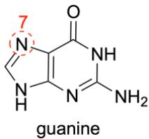

1. Using the dot notation shown below, **draw** the intrastrand and interstrand crosslinks on the given DNA template. **State** the kind of crosslink that is formed by a) cisplatin; b) transplatin.

> **Solution (Q24.1 — Pt–DNA crosslink geometry).**
> The Pt centre binds two adjacent guanine N7 atoms. In cisplatin the two leaving Cl⁻ are in *cis*-positions (~90°), so after aquation the two remaining Pt–N(guanine) bonds must also be *cis* — the Pt can only bridge **two neighbouring bases of the same strand** (1,2-intrastrand GG crosslink, the dominant adduct, ≥ 60 % of all cisplatin–DNA lesions; minor 1,2-AG and 1,3-GNG intrastrand adducts also form, all *intrastrand*).
>
> In transplatin the two coordination sites available for DNA are *trans* (180°). The geometrical distance between two adjacent N7 atoms on the same strand is too short to be spanned in a *trans* fashion without severe distortion, so transplatin instead bridges **G (or A/C) bases located on opposite strands** — an **interstrand crosslink**.
>
> Dot-notation (● = bound base, — = Pt bridge):
>
> ```
> cisplatin (cis-[PtCl2(NH3)2]):         5'- ...•G─Pt─G•... -3'
>                                     3'- ...  C   C   ... -5'   (1,2-intrastrand GG)
>
> transplatin (trans-[PtCl2(NH3)2]):     5'- ...•G           ... -3'
>                                              │
>                                              Pt
>                                              │
>                                     3'- ... •G           ... -5'   (interstrand G–G)
> ```
>
> a) cisplatin → $\boxed{\text{1,2-intrastrand (d(GpG)) crosslink}}$; b) transplatin → $\boxed{\text{interstrand crosslink}}$.
>
> 

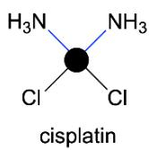

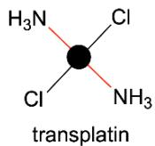

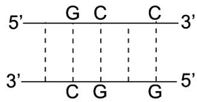

2. **Deduce** the effect of the formation of intrastrand and interstrand crosslinks on the melting temperature, $T_ {\mathrm{m}}$ . $T_ {\mathrm{m}}$ is the temperature at which half of DNA duplexes dissociate into singlestranded DNA.

> **Solution (Q24.2 — Effect on $T_\mathrm{m}$).**
> *Intrastrand crosslink (cisplatin, 1,2-GG).* Both Pt–N7 bonds are on the same strand, so the two complementary strands are **not** covalently linked. The adduct bends the duplex by ≈ 35–40° toward the major groove and unwinds it by ≈ 13°, disrupting local base-pair stacking and H-bonding. The duplex is therefore *destabilised*, and $T_{\mathrm{m}}$ **decreases** (typically by a few °C per adduct).
>
> *Interstrand crosslink (transplatin).* The Pt atom covalently tethers the two complementary strands. Even when all Watson–Crick H-bonds have melted, the strands cannot physically separate — the "duplex" cannot fully dissociate into two single strands. Apparent $T_{\mathrm{m}}$ therefore **increases markedly** (often > 10 °C, or melting becomes effectively irreversible on the experimental timescale, giving a broad/biphasic transition).
>
> $$\boxed{T_{\mathrm{m}}^{\text{intra}}<T_{\mathrm{m}}^{\text{native}}<T_{\mathrm{m}}^{\text{inter}}}$$

Dicycloplatin, a third-generation platinum-based anticancer drug, was developed to reduce the dose-limiting toxicities that restrict the clinical use of cisplatin. Dicycloplatin crystals precipitate from a saturated aqueous solution containing **Pt-4** and 1,1-cyclobutanedicarboxylic acid $( \mathrm{H}_{2} \mathrm{CBDCA} )$ ) in a 1:1 molar ratio. Dicycloplatin was found to have four hydrogen bonds in one structural unit.

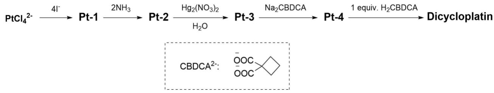

3. **Draw** the structural formulae of particles **Pt-1**, **Pt-2**, **Pt-3** and **Pt-4**. The mass percentage of platinum in $\mathbf{PtCl}_{4}^{2-}$ to **Pt-4** changes as $57.9\%\ 27.7\%\ 40.4\%\ 73.6\%\ 52.6\%$ respectively.

> **Solution (Q24.3 — Identification of Pt-1 … Pt-4, Dhara synthesis of carboplatin).**
> Let $M$ be the formula mass of each species; $w(\mathrm{Pt})=195.08/M$.
>
> | Species | $w(\mathrm{Pt})$ given | $M$ required | Assignment | Check |
> |---|---|---|---|---|
> | $[\mathrm{PtCl_4}]^{2-}$ | 57.9 % | 337.0 | $[\mathrm{PtCl_4}]^{2-}$ | 195.08/337.0 = 57.9 % ✓ |
> | **Pt-1** | 27.7 % | 704.3 | $\mathbf{[PtI_4]^{2-}}$ | 195.08 + 4·126.90 = 702.7, 27.76 % ✓ |
> | **Pt-2** | 40.4 % | 483.0 | *cis*-$\mathbf{[PtI_2(NH_3)_2]}$ | 195.08 + 2·126.90 + 2·17.03 = 482.94, 40.4 % ✓ |
> | **Pt-3** | 73.6 % | 265.1 | *cis*-$\mathbf{[Pt(NH_3)_2(H_2O)_2]^{2+}}$ | 195.08 + 2·17.03 + 2·18.02 = 265.18, 73.6 % ✓ |
> | **Pt-4** | 52.6 % | 371.2 | *cis*-$\mathbf{[Pt(NH_3)_2(CBDCA)]}$ (carboplatin) | 195.08 + 2·17.03 + 142.11 = 371.25, 52.5 % ✓ |
>
> This is the classical **Dhara synthesis**: $\mathrm{K_2[PtCl_4]}\xrightarrow{\text{KI (xs)}}\mathrm{K_2[PtI_4]}\xrightarrow{2\,\mathrm{NH_3}}\textit{cis}\text{-}[\mathrm{PtI_2(NH_3)_2}]\xrightarrow{2\,\mathrm{Hg_2(NO_3)_2/H_2O}}\textit{cis}\text{-}[\mathrm{Pt(NH_3)_2(H_2O)_2}]^{2+}\xrightarrow{\mathrm{CBDCA^{2-}}}\textit{cis}\text{-}[\mathrm{Pt(NH_3)_2(CBDCA)}]$.
> Iodide is used because I⁻ has a much stronger ***trans*-effect** than Cl⁻, so upon addition of the *first* NH₃ the two iodides left on Pt are *trans* to NH₃ (weak trans-effect) and are therefore preserved, while the second NH₃ enters *cis* with high selectivity — exactly what makes Dhara's route deliver *cis*-diammine isomer cleanly. The chelating CBDCA²⁻ then replaces the two aqua ligands.
>
> Structures (square-planar Pt(II), *cis* throughout) from Pt-2 to carboplatin:
>
> 

4. **Draw** the structural formula of dicycloplatin showing the hydrogen bonds.

> **Solution (Q24.4 — Structure of dicycloplatin).**
> Dicycloplatin is a 1:1 **H-bonded co-crystal** of carboplatin (Pt-4) with one free molecule of 1,1-cyclobutanedicarboxylic acid (H₂CBDCA); formula $\mathbf{[Pt(NH_3)_2(CBDCA)]\cdot H_2CBDCA}$. The free H₂CBDCA sits "above" the chelate plane and engages in exactly **four** hydrogen bonds per formula unit:
>
> - **2 × O–H···O** : each –COOH of the free H₂CBDCA donates its proton to one coordinated carboxylate O of carboplatin;
> - **2 × N–H···O** : each *cis*-NH₃ of carboplatin donates one N–H proton to a C=O oxygen of the free H₂CBDCA.
>
> Schematic (dotted lines = H-bonds):
>
> 
>
> More compactly, one structural unit is one carboplatin molecule plus one H₂CBDCA molecule, linked by the four H-bonds shown above — that is the "dicycloplatin" of Yang et al.
>
> 

**Pt-4** (carboplatin) was introduced into clinical use in the late 1980s and has been widely used in cancer treatment. One practical challenge with platinum-based drugs is that, in aqueous solution, they can undergo hydrolysis, which may affect their stability and reactivity.

5. **Explain** which drug, **Pt-4** or dicycloplatin, is more resistant to hydrolysis in aqueous solution.

> **Solution (Q24.5 — Hydrolytic stability: dicycloplatin > Pt-4).**
> The first (rate-limiting) step of carboplatin aquation is *ring-opening* of the Pt–O(CBDCA) chelate by water: one Pt–O(carboxylate) bond breaks to give an aqua-monodentate intermediate, after which the second Pt–O can be displaced by Cl⁻ or by a biological nucleophile.
>
> In **dicycloplatin** both coordinated carboxylate oxygens are locked into strong O–H···O hydrogen bonds with the free H₂CBDCA partner, and both *cis*-NH₃ ligands are tied down by N–H···O=C hydrogen bonds. Water attack on Pt must first disrupt this 4-H-bond supramolecular cage, which adds a significant enthalpic barrier (≈ 4 × 15–25 kJ mol⁻¹). In addition, ring-opening would require simultaneous loss of the H-bond partner — entropically unfavourable.
>
> Consequently, **dicycloplatin is more resistant to hydrolysis than Pt-4 (carboplatin)**. This translates to longer aqueous shelf-life and slower activation kinetics, which is precisely why dicycloplatin was developed as a third-generation analogue with reduced systemic toxicity.
>
> 

## Part 2 — Camptothecin and its derivatives

Alkaloid camptothecin and its derivatives form another group of drugs that show antitumor activity by inhibiting topoisomerase I, the enzyme that 'untangles' the DNA helix. Total synthesis of camptothecin derivative, **SN-38**, was carried out by coupling two building blocks **H** and **N**.

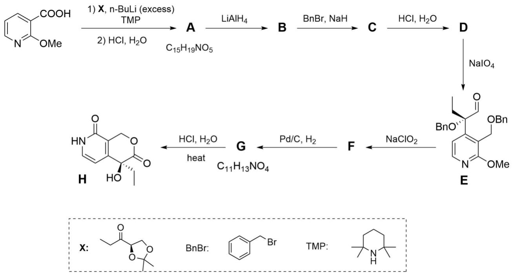

6. **Draw** the structural formulae of compounds **A**–**G** showing stereochemistry, if the step from **B** to **C** requires an excess of benzyl bromide.

> **Solution (Q24.6 — Building block H, intermediates A–G).**
> The "East" fragment **H** is the (S)-α-hydroxy-α-ethyl-δ-lactone fused to a 2-pyridinone — i.e. the D + E rings of camptothecin carrying the (S)-C20 pharmacophore. The route starts from **2-methoxynicotinic acid** (2-methoxypyridine-3-carboxylic acid). Reagent **7** is a chiral acetonide-protected α-ethyl ketone (a glyceraldehyde-acetonide-derived ethyl ketone): it delivers the ethyl group, the latent 1,2-diol, and the (S)-quaternary stereocentre in one shot.
>
> | Step | Reagent(s) | Transformation | Product |
> |---|---|---|---|
> | start → **A** | **X**, n-BuLi, TMP (55 %) | LiTMP (formed in situ from n-BuLi + 2,2,6,6-tetramethylpiperidine) directs ortho-lithiation of 2-methoxynicotinic acid; the aryl-Li adds to the ketone of **X**; the resulting tertiary alkoxide spontaneously lactonises onto the C3-CO₂H | **A** = pyridine-fused **γ-butyrolactone** bearing a new quaternary C with **Et** and the **(R)-2,2-dimethyl-1,3-dioxolan-4-yl** (acetonide) group; the (S)-quaternary stereocentre is set here |
> | A → **B** | LiAlH₄, THF (95 %) | exhaustive reduction of the γ-lactone (both C–O bonds) to the corresponding diol | **B** = diol — ring **CH₂OH** (from the former lactone C=O carbon, attached to the pyridine) and **tertiary C–OH** (from the former lactone-O attached to the quaternary C); acetonide still intact |
> | **B → C** | **BnBr (excess)**, NaH, THF (81 %, two steps) | **double benzylation** — both the primary CH₂OH **and** the hindered tertiary C-OH are O-benzylated; excess BnBr is essential because the tertiary alcohol is sterically slow | **C** = bis-benzyl ether (Ar-CH₂OBn + quaternary C-OBn); the acetonide is still untouched |
> | C → **D** | aq. HCl | selective hydrolysis of the acetonide (the OBn ethers and the 2-OMe-pyridine are stable to dilute aq. acid) | **D** = pendant **1,2-diol** (–CH(OH)–CH₂OH) on the quaternary carbon |
> | D → **E** | NaIO₄ (95 %) | oxidative cleavage of the vicinal diol: terminal –CH₂OH leaves as HCHO; the internal carbon is oxidised to **CHO** | **E** = α-OBn α-ethyl **aldehyde** appended to the (Ar-CH₂OBn)-pyridine |
> | E → **F** | NaClO₂ (**Pinnick**, 96 %) | chemoselective oxidation CHO → CO₂H | **F** = α-OBn α-ethyl **carboxylic acid** |
> | F → **G** | H₂, Pd/C (85 %) | global hydrogenolysis of **both** Bn ethers (CH₂OBn → CH₂OH and C-OBn → C-OH); the freshly liberated primary CH₂OH then **cyclises** onto the CO₂H | **G** = (S)-α-hydroxy-α-ethyl-**δ-lactone** fused to the 2-methoxypyridine (the camptothecin E-ring lactone is now in place) |
> | G → **H** | aq. HCl (75 %) | acid hydrolysis of the 2-methoxypyridine to the 2-pyridone (lactam) | **H** = (S)-4-ethyl-4-hydroxy lactone-fused **2-pyridone** (D + E rings of camptothecin, ready for N-alkylation in Q24.7) |
>
> Three teaching points: (i) the **(S)-C20** stereocentre is installed in step start → A by the chiral acetonide of **7** and is conserved through every subsequent step, because no bond at C20 is ever broken; (ii) the rationale for **excess BnBr** in B → C is that the tertiary alcohol is much slower than the primary — under stoichiometric conditions only the CH₂OH would react, so excess BnBr is required to push the hindered tertiary benzylation to completion; (iii) the F → G hydrogenolysis-then-lactonisation is the classical Curran/Comins/Fang "endgame": both Bn groups come off in one pot and the δ-lactone closes spontaneously by Le Chatelier as soon as the diol is unmasked.
>
> 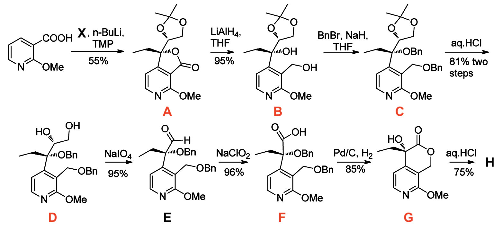

The second part of the synthesis is given below:

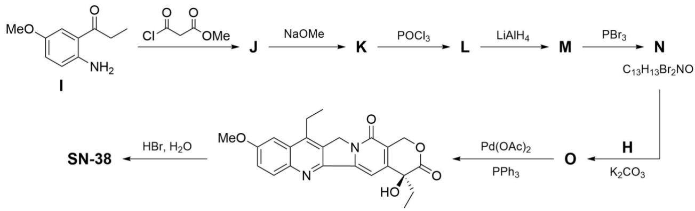

7. **Draw** the structural formulae of compounds **J**–**O** and **SN-38** showing stereochemistry where applicable.

> **Solution (Q24.7 — Assembly of SN-38 from H and N).**
> The "West" block **N** is a **2-bromo-3-(bromomethyl)-4-ethyl-6-methoxyquinoline** that carries the latent A/B/C-ring system of SN-38. It is built from the o-aminoaryl ketone **I** by a Knorr-type quinolinone synthesis, followed by chloro-dehydroxylation, ester-to-bromide manipulation. **N** is then coupled to **H** (Q24.6) twice — first by N-alkylation of the pyridone nitrogen, and then by an intramolecular Pd-catalysed Heck-type cyclisation that forges the central pentacycle. A final aryl demethylation reveals the 10-OH of SN-38.
>
> | Step | Reagent(s) | Transformation | Product |
> |---|---|---|---|
> | I → **J** | **ethyl malonyl chloride** (Cl-CO-CH₂-CO₂Et), 81 % | chemoselective **N-acylation** of the aromatic NH₂ (the ortho-propanoyl ketone is untouched) | **J** = **ethyl *N*-(2-propanoyl-4-methoxyphenyl)malonamate**, ArNH-CO-CH₂-CO₂Et |
> | J → **K** | NaOMe, 85 % | **Knorr quinolinone cyclisation**: deprotonation of the doubly-activated CH₂ between the two carbonyls; intramolecular Claisen-type aldol onto the ortho-aryl ketone; dehydration aromatises the new pyridone ring | **K** = ethyl **6-methoxy-4-ethyl-2-oxo-1,2-dihydroquinoline-3-carboxylate** (a 4-Et 3-CO₂Et 6-OMe quinolin-2(1*H*)-one) |
> | K → **L** | POCl₃, 66 % | conversion of the 2-quinolone (lactam) to the 2-chloroquinoline | **L** = ethyl **2-chloro-6-methoxy-4-ethylquinoline-3-carboxylate** |
> | L → **M** | **Red-Al** (Na[AlH₂(OCH₂CH₂OMe)₂]), 82 % | chemoselective reduction of the C3-ester to the primary alcohol; the aryl 2-Cl, the 6-OMe and the heteroaromatic ring are all inert | **M** = **2-chloro-3-(hydroxymethyl)-4-ethyl-6-methoxyquinoline** |
> | M → **N** | PBr₃, 70 % | Appel-style conversion of the benzylic alcohol to the benzylic bromide | **N** = **2-chloro-3-(bromomethyl)-4-ethyl-6-methoxyquinoline** (the West block, ready for N-alkylation) |
> | H + N → **O** | K₂CO₃, 90 % | **chemoselective N-alkylation** of the pyridone NH of **H** by the much more reactive C(sp³)–Br of **N** (the C(sp²)–Cl on the quinoline is untouched and is preserved for the next step) | **O** = the linked intermediate in which the 2-pyridone N of H is connected through –CH₂– to the C3 of the 2-chloroquinoline |
> | O → [10-MeO-SN-38] | Pd(OAc)₂, PPh₃, 70 % | **intramolecular Pd-catalysed Heck/C–H functionalisation**: oxidative addition of Pd(0) into the C2–Cl of the quinoline; ring-closure by carbopalladation onto the pyridone vinyl carbon; β-H elimination / re-aromatisation forges the new C–C bond and closes the central indolizino C-ring of camptothecin (pentacyclic ABCDE skeleton complete) | the **unlabelled** intermediate in the scheme = **10-methoxy-SN-38** (= 7-ethyl-10-methoxycamptothecin) |
> | [10-MeO-SN-38] → **SN-38** | aq. HBr, 87 % | **aromatic demethylation**: HBr·H₂O cleaves the aryl methyl ether (10-OMe → 10-OH) without touching the δ-lactone, the pyridone or the (S)-OH | **SN-38** = (S)-**7-ethyl-10-hydroxycamptothecin** |
>
> Stereochemistry: the **(S)-C20** quaternary carbon (α-Et α-OH δ-lactone centre, set in Q24.6 step start → A) survives every step here — Knorr cyclisation, POCl₃, Red-Al, PBr₃, K₂CO₃, Pd-Heck, and HBr — because no bond at C20 is ever broken. The pentacyclic ABCDE skeleton of camptothecin is assembled as: A/B = quinoline of N (steps I → N); D = pyridone of H (Q24.6); C-ring = forged in two stages — first the C12–N bond (K₂CO₃ N-alkylation, H + N → O), then the C7–C7a bond (Pd-catalysed cyclisation, O → 10-MeO-SN-38); E = the (S)-δ-lactone built in Q24.6.
>
> 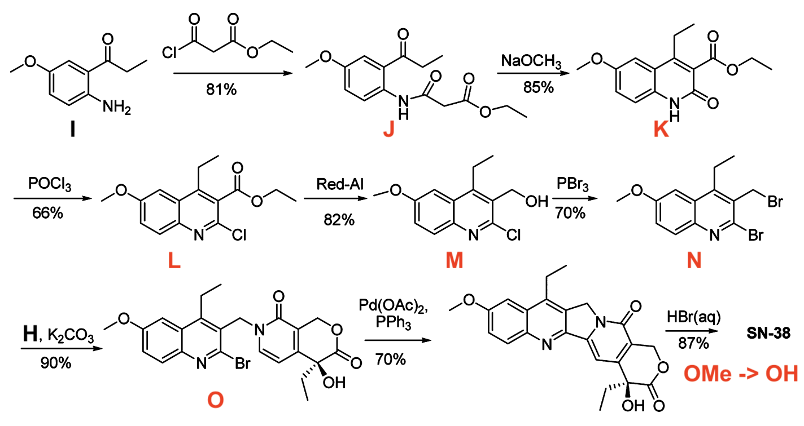
>
> Condensed structural formula of SN-38:
> **(S)-4,11-diethyl-4,9-dihydroxy-1H-pyrano[3′,4′:6,7]indolizino[1,2-b]quinoline-3,14(4H,12H)-dione.**

---

## 教学点评 / 解题分析

**典型的 IChO 主考卷"全栈式"综合大题**——铂配位化学（顺反异构、*trans*-效应、超分子共晶）+ 高级不对称有机合成（Curran/Comins 风格的喜树碱东片段）+ 杂环构筑（Knorr 喹啉酮）+ 后期金属催化（Pd 分子内 Heck）一站式串联。题面分两半（Pt vs. 喜树碱衍生物）但共享一个评分哲学——"**广度优先、深度适中**"：每个板块单独看都不算极致（没有题 3 那种"题眼深藏 + 冷门物种"的纵深陷阱），但**信息密度极高**——五个板块、十几个标志性反应、两套立体化学逻辑并行考核，对学生的**知识广度、节奏控制和板块切换能力**才是真正的检验。与题 3 苏联式"一根链推到底"的纵深风格形成鲜明对照，是"**能力型 ≫ 知识型**"的一道题。

**第一板块：cis vs. trans 的几何后果（Q24.1–2）。** 送分题，但藏着一个值得点出的"**几何 → 化学 → 物理**"三连推：

- **几何**：cis-Pt 两配位点夹角 $\approx 90°$、cross-span $\approx 3.4\,\text{Å}$；trans-Pt 两配位点夹角 $180°$；
- **化学**：$90°$ 跨度恰好覆盖**同一条链相邻碱基的两个 N7**，$180°$ 在同链相邻 N7 之间**几何不可达**——只能跨链；
- **物理**：链内交联使双链局部弯曲、堆积破坏 → $T_{\mathrm{m}}$ **下降**；链间交联**物理拴住**两条链 → 即便所有 H-bond 解开，链也无法分离 → $T_{\mathrm{m}}$ **大幅升高**甚至失去 sigmoid 解链曲线（变得 biphasic 或不可逆）。

**学生常见误区**："$T_{\mathrm{m}}$ 升高是因为 Pt-N 共价键比 H-bond 强"——错。$T_{\mathrm{m}}$ 衡量的是**链分离**而不是某根键的断裂；链间交联**根本不让链分开**，这才是 $T_{\mathrm{m}}$ "升高"的真正机理。**结构决定动力学，不是热力学**。

**第二板块：质量分数定结构 + Dhara 路线的 *trans*-效应控制（Q24.3）。** 经典的"**单参数反算分子量**"招式：

$$M_i \;=\; \frac{195.08}{w_i(\mathrm{Pt})}, \qquad i=0,1,\ldots,4$$

代入即得 $337/702/483/265/371$ → $[\mathrm{PtCl}_4]^{2-}$ / $[\mathrm{PtI}_4]^{2-}$ / *cis*-$[\mathrm{PtI}_2(\mathrm{NH}_3)_2]$ / *cis*-$[\mathrm{Pt(NH}_3)_2(\mathrm{H}_2\mathrm{O})_2]^{2+}$ / ***cis*-carboplatin**。一行公式、3 分钟搞定，比正面推断快 3 倍。

但题目真正的考点在**机理伏笔**：为什么 Dhara 非要先 $\mathrm{Cl}^- \to \mathrm{I}^-$？答案在 *trans*-effect 排序

$$\mathrm{I}^- \;>\; \mathrm{Br}^- \;>\; \mathrm{Cl}^- \;\gg\; \mathrm{NH}_3 \approx \mathrm{H}_2\mathrm{O}$$

在 $[\mathrm{PtI}_4]^{2-}$ 上加第一个 $\mathrm{NH}_3$ 没有 cis/trans 选择性可言；加**第二个** $\mathrm{NH}_3$ 时，*trans* 于 $\mathrm{NH}_3$ 的那个 I⁻ 受**弱** *trans*-effect 屏蔽——**最不活泼、被保留**；而 *trans* 于 I⁻ 的 I⁻ 受**强** *trans*-effect 加速——**优先被取代**。所以第二个 $\mathrm{NH}_3$ **几乎只能进 cis 位**，cis-选择性接近定量。**这是用 *trans*-effect 反向"屏蔽"异构化的精彩范例**——直接用 $\mathrm{Cl}^-$ 不行，因为 Cl⁻ 与 NH₃ 的 *trans*-effect 差距太小，cis/trans 比例混乱。**见到 Pt(II) 立体选择性题，先想 *trans*-effect 排序**——这是肌肉记忆。

**第三板块：双环铂的"$4 = 2 + 2$"氢键拓扑 + 水解护城河（Q24.4–5）。** 题眼一句：**"四个氢键"**——一个 carboplatin 单元自身配 4 个 H-bond 不通（NH₃ 的 H 朝外、配位 O 朝内，自配几何不允许），所以**必须外加一个 H₂CBDCA 分子**。共晶的 4 个 H-bond 严格 2+2 分配：

- $2\times \mathbf{O\text{–}H \cdots O}$：外加 H₂CBDCA 的两个 –COOH → carboplatin 的两个**配位羧基** O；
- $2\times \mathbf{N\text{–}H \cdots O}$：carboplatin 的两个 *cis*-NH₃ → 外加 H₂CBDCA 的两个 C=O。

**互锁手套**式的双向互补拓扑，唯一与"4 个 H-bond + 1:1 化学计量比"都自洽的几何。这又解释了 Q24.5：水分子要进攻 Pt 必须先**拆掉这层超分子保护壳**（额外 $\approx 4 \times 20\,\mathrm{kJ\,mol^{-1}} \approx 80\,\mathrm{kJ\,mol^{-1}}$ 的焓-熵代价），所以双环铂水解半衰期远长于裸 carboplatin——这就是**第三代铂药"低毒、缓释"的分子设计逻辑**：**超分子拓扑 → 解离动力学 → 临床安全性**。

**第四板块：H 块的 (S)-季碳合成——以"双苄化"为题眼（Q24.6）。** 这一板块最大的认知陷阱是 **"B → C 需要过量的 BnBr"**这一句的解读。**学生条件反射地猜成"BnBr 同时保护一个 –OH 和一个 –CO₂H"**——错。题面真实的反应序列里 B 是 LiAlH₄ 把 A 的 γ-内酯**完全还原**得到的**二醇**（1°-CH₂OH + 3°-C-OH 双羟基），所以"过量 BnBr"的真正含义是**两个 –OH 的双重苄化**：1° 容易、3° 极慢，必须"以量取胜"。**这是题眼**——错过此处则后续 D–G 整链全部 reroute。

正确的合成节律（Curran/Comins/Fang 经典策略）：

| 关键转化 | 角色 |
|---|---|
| **n-BuLi/TMP + 试剂 X**（手性丙酮缩醛保护的乙基酮） | 导向锂化 + 手性砌块 1,2-加成 + 自发内酯化——**一步装定 (S)-季碳** |
| **LiAlH₄** → 二醇 | 把 γ-内酯**完全还原**，露出 1°-OH + 3°-OH |
| **BnBr (excess)** → 双苄醚 | **题眼**：过量是为了缓慢的 3° 苄化 |
| **aq. HCl** → 邻位二醇 | 选择性脱缩醛，OBn 和 ArOMe 全部稳定 |
| **NaIO₄** → α-OBn 醛 | 邻位二醇 C–C 切断、丢一个 HCHO 单位 |
| **NaClO₂ (Pinnick)** → α-OBn 酸 | $\mathrm{CHO}\to\mathrm{CO_2H}$ |
| **H₂/Pd-C** → δ-内酯 + (S)-OH | **全去苄 + 自发 6-元关环**——一步到位 |
| **aq. HCl** → 2-吡啶酮 | 把 2-OMe-吡啶水解为 NH-内酰胺，**为 Q24.7 的 N-烷基化备好亲核中心** |

**(S)-C20 立体中心一旦在 A 装定就再不破坏**——后续每一步都"绕开"季碳周围的键，立体保留几乎免费。这是该路线的最大优雅之处：**一次设手性、零外消旋风险**——是不对称合成"**先设、后保**"哲学的典范。

**第五板块：N 块的 Knorr 喹啉酮 + Pd 分子内 Heck 闭环（Q24.7）。** 误判频发于此——很多学生看到"两个砌块 H + N 偶联"就条件反射写 **Friedländer 缩合**（–NH₂ + 醛/酮 → 喹啉），但本题图中 **N 根本不是 2-氨基-3-甲酰喹啉**，而是 **2-Cl-3-CH₂Br-4-Et-6-OMe-喹啉**——两根可活化的卤、一根 sp³-Br + 一根 sp²-Cl，意图非常明确：**两根键、两段关环**。

- **第一段键 (C12–N)**：H 的吡啶酮 N–H + N 的 **C(sp³)–Br**（苄位卤），$\mathrm{K_2CO_3}$ 推动的 **N-烷基化**。**Cl 是 sp²、且对极性 $\mathrm{S_N 2}$ 钝**，所以 K₂CO₃ 条件下**只动 Br、不动 Cl**——化学选择性的胜利。
- **第二段键 (C7–C7a)**：保留下来的 **C(sp²)–Cl** 在 $\mathrm{Pd(OAc)_2/PPh_3}$ 下做**分子内 Heck/C–H 活化**，关上喹啉与吡啶酮之间的中间六元环——这是喜树碱五环骨架的最后一根 C–C 键。**两段关环顺序不可逆**：先 N–C 后 C–C（"软键先关、硬键后关"），如果反过来 Pd(0) 会先吃掉 sp³-Br，化学性彻底混乱。

而 N 自身的合成是一段**教科书级喹啉酮经典**：

$$\mathrm{ArNH}_2 \xrightarrow{\mathrm{ClC(O)CH_2CO_2Et}} \textbf{J}\xrightarrow{\mathrm{NaOMe}}\textbf{K}\;(\text{Knorr})\xrightarrow{\mathrm{POCl}_3}\textbf{L}\xrightarrow{\mathrm{Red\text{-}Al}}\textbf{M}\xrightarrow{\mathrm{PBr}_3}\textbf{N}$$

每一步**都是必修招式**：邻氨基芳基酮 + 丙二酰半酯氯 → N-酰胺；NaOMe-诱导的活泼亚甲基 + 邻位芳基酮 → 缩合为 4-Et-3-CO₂Et 的 2-喹啉酮（Knorr 关环）；POCl₃ 把 2-酮变 2-Cl；Red-Al 选择性还原酯（不动 Ar-Cl 和 Ar-OMe）；PBr₃ 把 1° 醇变 Br——**没有一个反应不是常规、却没有一个反应可以替换**。

**最后的 OMe → OH (HBr·H₂O)** 是一个**保护基全局规划**的范例：**整条路线把 OMe 当 OH 的临时面具**——OMe 不会被 NaH/BnBr/Red-Al/PBr₃/Pd-Heck 任意打扰、却能在最后一步用 HBr **一锅揭开**。这种"**提前设保护、最后一刻揭面具**"的全局策略，是高级合成的**节奏感**——不是每一步局部最优，而是整条路线**协调一致**。

---

**经验总结。**

1. **板块切换比单点深度更值钱。**——全栈式 IChO 主考卷题里没有任何单点比题 3 的 BrO₄⁻ 更冷门，但你必须**在 Pt 配位、Knorr 喹啉酮、Pd-Heck 之间无缝切换 5 分钟**。**Why:** IChO 评分曲线显示，丢分往往不是某点不会，而是切换时"惯性思维"把上一板块的方法套到下一板块（如把 Q24.7 当 Friedländer）。**How to apply:** 平时刻意做"无机—有机—生化—金属催化"穿插的多板块题，建立**心理切换的肌肉记忆**。

2. **trans-effect 是 Pt(II) 化学的硬约束。**——Dhara 用 I⁻ 而非 Cl⁻ 不是偶然，是 *trans*-effect $\mathrm{I^->NH_3}$ 在驱动**第二个 NH₃ 几乎只能进 cis 位**。**见到 Pt(II) 立体选择性题，先想 *trans*-effect 排序**，比正面机理推断快 10 倍。

3. **超分子稳定性 = 共价稳定性的额外护城河。**——双环铂抗水解不是因为 Pt-X 键变强，而是因为水进攻前必须先**拆 4 个 H-bond**。**节律：超分子拓扑 → 解离动力学 → 临床稳定性**——这条因果链是第三代铂药、抗体偶联药物（ADC）、prodrug 设计的统一逻辑。

4. **题面"过量"二字往往是题眼。**——BnBr 过量 = 两个 OH 双重保护，**不是** OH+CO₂H。**Why:** 题面里**任何不寻常的化学计量学线索**（"excess"、"5 equiv."、"catalytic amount"）都隐含对**反应位点数**的强约束。**How to apply:** 读题时把 stoichiometry 信号圈出来，反推"为什么不是 1 当量？"——答案就是反应位点数。

5. **手性砌块 + 不动手性中心 = 零外消旋风险。**——H 块路线的优雅之处在于 (S)-C20 一次设、永不动；后面所有反应都设计成"绕开 C20 周围的键"。**看到长合成链问"立体如何保留"，先逆向追溯立体中心的引入步骤，再正向核查每一步是否动到该中心的任意一根键**。

6. **关环顺序不可逆——"软键先关、硬键后关"。**——Pd-Heck 之前必须先做 K₂CO₃ N-烷基化，否则 Pd(0) 会优先消耗 sp³-Br、化学性混乱。**双卤化物分子内并行偶联题，永远先核对每个卤的反应顺序**：sp³-Br/I（亲核取代型）先、sp²-Cl（氧化加成型）后。

7. **保护基的全局规划 > 局部最优。**——OMe 全程当 OH 面具，HBr 最后一刻揭穿；这是合成节奏感的核心。**评估一条路线的优劣，不要只看最短的几步，要看保护基的"装-用-脱"是否对齐**。"过早脱保护"是中级学生的典型病灶。

8. **质量分数算分子量是经典苏联招式，IChO 也照用。**——$w_i(\mathrm{Pt}) = 195/M_i$ 一行公式连撸 5 个 Pt 物种，**速度**比正面推断快 3 倍。**这种"反算 M 法"在 Pt/Pd/Cu/Fe 等高原子量金属物种推断里几乎万试万灵**——计算器一定要练熟。

---

**难度评级：★★★★☆**——单点深度都不算极致（每个板块都有标准范式），但**广度跨越 Pt 配位/超分子/不对称合成/金属催化四大板块**、**节奏切换是真考验**。对熟练 IChO 主考卷风格的学生 ★★★☆☆；对只见过苏联式纵深推断题的学生顶到 ★★★★★（不是因为某点难，而是因为**没准备过这种"全栈"切换**）。Q24.6 试剂 **X** 看错或 Q24.7 误判为 Friedländer 则瞬间崩盘——是**"踩坑就完蛋、不踩就送分"**的两极分化型题，命题设计的"门槛过滤"特征非常典型。

---

## 中文版 / Chinese translation

# 第24题 抗癌药物

世界卫生组织 (WHO) 报告指出，全球人口的终生患癌风险约为 $20\%$ 。当前，癌症治疗日益趋向个体化，综合应用手术、放疗和化疗，结合生物标志物指导下的靶向药物及免疫疗法，可为某些癌症提供持久疗效。本题将探讨几类用于癌症治疗的药物。

##  第一部分：铂配合物

铂类化合物通过与 DNA 共价结合阻止其复制，从而表现出抗肿瘤活性。第一代铂类药物顺-二氯二氨合铂 (II)（顺铂）对癌症具有高效治疗作用，而其反式异构体（反铂）则无此效果。其中一个原因是，它们与DNA 的交联类型不同。

配合物可通过鸟嘌呤的 N7 位点与DNA 形成两类交联：链内交联和链间交联。链内交联发生在同一条DNA 链的两个碱基之间，而链间交联则是连接两条互补链上的碱基。

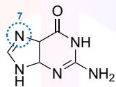


鸟嘌呤


24-1 使用下述点状标记法，在给定的DNA模板上绘制链内交联与链间交联，并说明顺铂与反铂分别形成的交联类型。

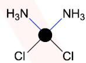


顺铂


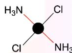


反铂


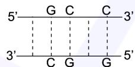


24-2 推断链内交联与链间交联对熔解温度 $T_ {\mathrm{m}}$ 的影响， $T_ {\mathrm{m}}$ 指半数DNA 双链解离为单链时的温度。

双环铂 (Dicycloplatin) 是一种第三代铂类抗癌药物，其研发旨在解决顺铂毒性过大而临床使用受限的问题。将 Pt-4 与 1,1-环丁烷二羧酸 $\mathrm {( H_{2} C B D C A )}$ 按 1 : 1 摩尔比配成饱和水溶液，可析出该药物晶体。研究发现，双环铂在一个结构单元中存在四个氢键。

$$
\mathrm{PtCl}_{4}^{2-} \xrightarrow {4 \mathrm{I}^{-}} \mathrm{Pt} - 1 \xrightarrow {2 \mathrm{NH}_{3}} \mathrm{Pt} - 2 \xrightarrow {\mathrm{Hg}_{2} (\mathrm{NO}_{3})_{2}} \mathrm{Pt} - 3 \xrightarrow {\mathrm{Na}_{2} \mathrm{CBDCA}} \mathrm{Pt} - 4 \xrightarrow {\text{1 e q . H}_{2} \mathrm{CBDCA}} \text{双 环 铂}
$$

$$
\boxed {C B D C A^{2-} = \bigotimes_ {\substack {C O O^{-} \\ C O O^{-}}}}
$$

24-3 从 $\mathrm{PtCl}_{4} {}^{2-}$ −到Pt-4的各物种中，铂的质量分数依次为 $57.9\% \longrightarrow 27.7\% \longrightarrow 40.4\% \longrightarrow 73.6\% \longrightarrow 52.6\%$ 绘制 Pt-1、Pt-2、Pt-3、Pt-4 的结构式。

24-4 绘制包含氢键的双环铂结构式。

Pt-4（卡铂）于 20 世纪 80 年代末期引入临床应用，并已广泛用于癌症治疗。铂类药物在实际应用中有一个问题，在水溶液中可能水解，从而影响其稳定性和反应活性。

24-5 解释哪种药物（Pt-4或双环铂）在水溶液中抗水解能力更强。

##  第二部分：喜树碱及衍生物

生物碱类化合物喜树碱及其衍生物也是一类抗肿瘤药物。它通过抑制拓扑异构酶 I（一种负责解开DNA螺旋的酶）而发挥抗肿瘤活性。喜树碱衍生物SN-38全合成中的关键步骤，是两个结构单元化合物H和N的偶联。

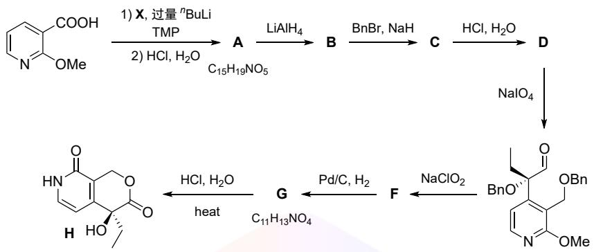


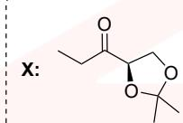


BnBr :


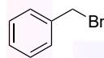


TMP:


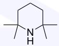


24-6 已知 $\mathbf{B} \to \mathbf{C}$ 需要过量的苄基溴，绘制化合物A–G的结构式，需适当标注立体构型。

合成的第二部分如下所示：

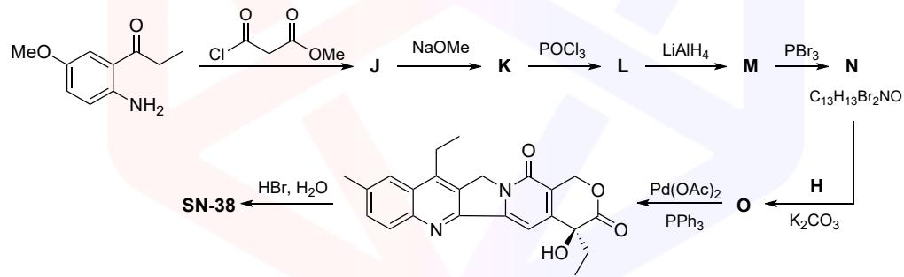


24-7 绘制化合物J–O和SN-38的结构式，需适当标注立体构型。
