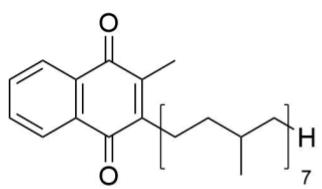
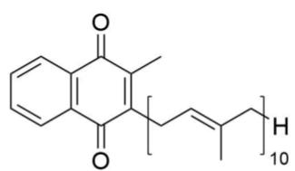
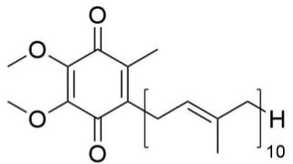
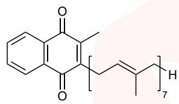
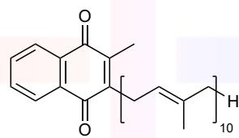
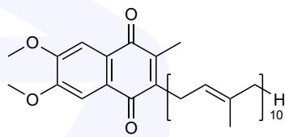

::: {.callout-note appearance="simple" icon=false}
**Found an issue?** Post the problem number (**P2.27**) and the **step** on Discord.
[💬 Discuss on Discord →](https://discord.gg/CHANGE-ME){.discord-cta}
:::

Archaea, along with bacteria and eukaryotes, constitute a distinct domain of living organisms. Archaea were previously grouped with bacteria, but this classification is now considered obsolete, as it has been established that archaea have their own independent evolutionary history and are characterised by many biochemical features that distinguish them from other life forms. Archaea appeared on Earth 3.5–4 billion years ago during the Archean Eon and have evolved continuously since then.

1. **Select** from the options provided a measurable, planetary-scale quantitative parameter that has not changed within reasonable accuracy throughout the entire evolution of archaea and to changes to which they can quickly adapt:

a) Chemical parameters: the concentration of a gaseous substance in the atmosphere (oxygen, nitrogen or carbon dioxide), the composition of the environment (reservoirs) as the ratio of various compounds (salinity, pH, buffer capacity), etc.

b) Physical parameters: temperature, atmospheric pressure, radioactivity, gravitational force, total luminosity of the Sun.

> **Solution (Q1 — Invariant planetary parameter).**
>
> Over ~4 Gyr the Earth has undergone enormous swings of O₂ (virtually zero in the Archean, then the Great Oxidation Event, rising to today's 21 %), CO₂ (orders of magnitude decrease), N₂ (moderate change), salinity, pH and buffer capacity of individual reservoirs, surface temperature (snowball Earth to hothouse), atmospheric pressure (order-unity fluctuations), and solar luminosity (the "faint young Sun" was ≈ 70 % of today's output). Natural radioactivity has decreased as ²³⁵U, ⁴⁰K, etc. decayed. Archaea themselves survived by adapting rapidly to all of these.
>
> The **only parameter in the list that has remained essentially constant throughout the entire evolution of archaea (to within any reasonable measurement accuracy) is the gravitational acceleration / gravitational force at the Earth's surface**. The Earth's mass and radius have changed by a negligible amount over 4 Gyr, so *g* ≈ 9.8 m s⁻² to high precision throughout. Archaea — like every other organism — are of course adapted to this constant, but unlike all the chemical and physical variables listed above, it is not something they need to "adapt to" because it has never changed.
>
> **Answer: gravitational force (physical parameter).**

To demonstrate the differences between the three main domains of living organisms, one can cite as an example the quinone derivatives that play a role in oxidation-reduction processes in archaea (menaquinone MK-7), bacteria (menaquinone MK-10), and eukaryotes (ubiquinone, presented in the form of coenzyme Q10, CoQ10):



MK-7



MK-10



coenzyme Q10

2. **Draw** the structure of the two-electron reduction product of MK-7.

> **Solution (Q2 — Menaquinol MK-7).**
>
> The 2-electron / 2-proton reduction of a 1,4-naphthoquinone reduces both ring carbonyls to hydroxyls, giving the 1,4-naphthohydroquinone (menaquinol, MKH₂-7). The 3-methyl and the heptaprenyl (all-trans (C₅H₈)₇ + H) side chain at position 2 are retained unchanged:
>
> ```
>          OH
>          │
>     ┌────┴────┐
>     │         │──CH₃
>     │         │
>     │         │──CH₂–(CH=C(CH₃)–CH₂–CH₂)₆–CH=C(CH₃)–CH₃
>     └────┬────┘
>          │
>          OH
> ```
> i.e. 2-methyl-3-[(2E,6E,10E,14E,18E,22E)-3,7,11,15,19,23,27-heptamethyl-octacosa-2,6,10,14,18,22,26-heptaenyl]-1,4-dihydroxynaphthalene (menaquinol-7, MK-7H₂).
>
> $$\text{MK-7 (quinone)}\;+\;2\,\mathrm{H}^{+}\;+\;2\,e^{-}\;\rightarrow\;\text{MK-7H}_2\;(\text{hydroquinone}).$$

The standard biochemical redox potentials, $E°$ , of some redox pairs are given in the table below.

| **Redox pair** | **E°’ / V** |
|---|---|
| 0.5 O₂ / H₂O | 0.82 |
| cytochrome c (+3) / cytochrome c (+2) | 0.22 |
| CoQ₁₀ / CoQ₁₀H₂ | 0.10 |
| fumarate / succinate | 0.03 |
| MK-10 / MKH₂-10 | −0.07 |
| acetaldehyde / ethanol | −0.20 |

3. Based on the information provided, qualitatively **explain** why menaquinone was displaced by ubiquinone in the ancestors of modern eukaryotes and is currently not found in eukaryotes, with a few exceptions.

> **Solution (Q3 — Why ubiquinone replaced menaquinone in eukaryotes).**
>
> The ancestral anoxic world used menaquinone as the mobile carrier in the electron transport chain, because the reactions it had to couple were low-potential (e.g. fumarate/succinate, E°′ = +0.03 V; nitrate, DMSO, etc.). With E°′(MK/MKH₂) ≈ −0.07 V the menaquinone pool sits *below* the terminal acceptors of anaerobic respiration and can donate electrons to them with a favourable ΔG.
>
> When cyanobacterial oxygenic photosynthesis filled the atmosphere with O₂, the new terminal acceptor had a very high potential (½ O₂/H₂O, E°′ = +0.82 V). A low-potential carrier like MK creates two problems in an aerobic chain:
>
> 1. **Too large a potential drop in one step.** The energy gap between MKH₂ (−0.07 V) and O₂ (+0.82 V) is ≈ 0.89 V, forcing the chain to dissipate too much free energy as heat in one or two steps instead of harvesting it as a proton gradient.
> 2. **Autoxidation.** Reduced menaquinone is thermodynamically far below O₂ (ΔE°′ ≈ 0.9 V) and kinetically labile: it reduces O₂ non-enzymatically to the damaging species O₂•⁻ and H₂O₂. It is, in effect, too reducing to coexist with dioxygen.
>
> Ubiquinone sits much higher (UQ/UQH₂ ≈ +0.10 V), which (i) gives a smaller, better-harvestable gap to O₂, (ii) slots neatly between the dehydrogenase and cytochrome bc₁ segments of the chain, and (iii) is kinetically much more resistant to autoxidation by O₂. Eukaryotic ancestors (and their α-proteobacterial mitochondrial endosymbiont) that ran aerobic respiration therefore replaced MK by UQ. The few eukaryotic exceptions are organisms or tissues that still perform anaerobic respiration with fumarate (intestinal parasites, anoxic sediment eukaryotes), where the low-potential MK remains functional.

Natural ubiquinol (reduced form of ubiquinone), obtained from eukaryotic cell culture, is a hydrophobic unsaturated compound that can be incorporated into the standard method for determining bromine value (strictly in the dark!).

4. **Suggest** at least two chemical structural features of natural samples of ubiquinol that distinguish it from, for example, the triacylglycerol of linoleic acid, often called linolein, and that should be considered when analysing the obtained results of interaction with molecular bromine.

> **Solution (Q4 — Peculiarities of ubiquinol in a Br₂ (bromine-value) titration).**
>
> 
>
> 
>
> The standard bromine-value method treats the sample as if the only reactive groups toward Br₂ were isolated, non-conjugated C=C double bonds of fatty-acid chains undergoing pure electrophilic addition. Linolein, the triacylglycerol of linoleic acid, contains **six** such double bonds in total: two *cis* C=C bonds in each of its three linoleoyl chains. For natural ubiquinol this simple picture is wrong in at least two respects that must be corrected for when interpreting the Br₂ uptake:
>
> 1. **A free hydroquinone ring.** Natural ubiquinol carries two phenolic OHs on an electron-rich 1,4-dimethoxy-methyl-benzenediol nucleus, but every one of the six ring carbons is substituted (1-OH, 2-OMe, 3-OMe, 4-OH, 5-CH₃, 6-decaprenyl) — no aromatic C–H remains for electrophilic substitution. The relevant ring-side pathway is therefore *oxidation of the hydroquinone back to the quinone* by Br₂, with liberation of 2 HBr (ubiquinol + Br₂ → ubiquinone + 2 HBr). This consumes Br₂ *without* adding it across a C=C bond, so the observed bromine "number" overestimates the degree of unsaturation of the side-chain. (This is also part of why the reaction is done in the dark — to suppress radical side reactions and photolytic HBr elimination at allylic prenyl positions.)
>
> 2. **An all-*trans* isoprenoid polyprenyl tail.** Natural CoQ10H2 has a decaprenyl side chain with **ten** non-conjugated, mostly trisubstituted isoprenoid C=C bonds. Compared with the *cis*-disubstituted, kinetically more uniform C=C bonds of linoleic acid:
>    * electrophilic Br₂ addition to a trisubstituted alkene goes via a tertiary bromonium/carbocation that is prone to Wagner–Meerwein / prenyl rearrangement and to HBr elimination, so 1 mol Br₂ per C=C is not always cleanly consumed;
>    * the all-*trans* geometry and the steric bulk of the flanking methyl groups slow addition, so the reaction is kinetically slower than with linolein and not every double bond is titrated in the standard time window.
>
> (A third, secondary feature worth noting: the chromanol-like ring oxygens can act as radical traps/antioxidants, so the reaction must be run in the dark to avoid radical chain bromination of allylic prenyl CH₂ and CH₃ groups, which would further inflate the bromine number.)

The unique habitat of archaea, from their very inception, has led some species to possess an enzyme involved in the metabolism of extremely intriguing substrates – substances **X**, **Y**, and **Z**, which exhibit similar chemical properties. Thus, structural isomers **X** and **Y** react in vitro with menaquinol $\mathrm {( M K H_{2} – 7}$ ), catalysed by an enzyme commonly referred to as $\mathbf{Z}$ -reductase, according to the following reaction equations:

$$
\mathbf{X} + \mathrm{MKH}_{2} \rightarrow \mathbf{X} 1 + \mathbf{X} 2 + \mathrm{MK} \tag {1}
$$

$$
\mathbf{Y} + \mathrm{MKH}_{2} \rightarrow \mathbf{Y} 1 + \mathbf{Y} 2 + \mathrm{MK} \tag {2}
$$

For the molar masses of unknown substances rounded to the nearest integer, three strict inequalities hold: $M ( \mathbf{X} ) < 250\ \mathrm{g/mol} ; M ( \mathbf{X} \mathbf{I} ) > M ( \mathbf{X} \mathbf{2} ) ; M ( \mathbf{Y} \mathbf{1} ) > M ( \mathbf{Y} \mathbf{2} ) .$ $M ( \mathbf{X} ) < 250\ \mathrm{g/mol}$

5. Using only the information above, **find** the upper limit of the range of possible integer molar masses of **X2**.

> **Solution (Q5 — Upper limit on M(X2)).**
>
> Mass balance for reaction (1) gives
> $$M(X)+2 \;=\; M(X1)+M(X2).$$
> The extra 2 mass units are the two H atoms delivered by $\mathrm{MKH_2}$. Since $M(X1)>M(X2)$,
> $$2M(X2)<M(X)+2.$$
> Using the strict condition $M(X)<250$,
> $$M(X2)\;<\;\tfrac12(250+2)\;=\;126.$$
> Thus the integer upper limit is
> $$\boxed{M(X2)\le 125\ \mathrm{g\,mol^{-1}}}.$$

**X1** and **X2** each contain $22\%$ of element **E1** and $1.0\%$ of element **E2** by mass, while **X** contains $23.4\%$ oxygen by mass.

6. **Calculate** the percentage by mass of **E2** in **X** to the nearest whole number.

> **Solution (Q6 — %E2 in X).**
>
> From Q5, even the lighter product cannot exceed 125 g mol$^{-1}$. An element that contributes only 1.0% to such a product must have atomic mass close to 1, so **E2 is hydrogen**. The reaction is a two-electron/two-proton reductive cleavage: the two H atoms found in the two products are supplied by $\mathrm{MKH_2}$, not by the substrate. Therefore **E2 = H**, and X contains no hydrogen.
>
> $$\boxed{w_{\mathrm{E2}}(X)=w_{\mathrm{H}}(X)=0\%}$$

7. Without disclosing any elements other than **E2**, **narrow** the range of possible whole-number molecular masses of **X2** as much as possible, taking into account the mass fractions given above.

> **Solution (Q7 — Narrower range for M(X2)).**
>
> The oxygen mass fraction quantises the mass of X:
> $$\frac{16n_O}{M(X)}=0.234.$$
> With $M(X)<250$, the only possible rounded masses are approximately
> $$n_O=1,2,3 \quad\Rightarrow\quad M(X)\approx 68,\ 137,\ 205.$$
> Because each product contains 1.0% H, each product must contain one H atom and therefore have a mass near 100. The $M(X)=68$ and $137$ branches cannot give two such products, so the only viable branch is
> $$M(X)=205,\qquad M(X1)+M(X2)=207.$$
>
> Now use the equal 22% mass fraction of E1 in both products, without naming E1. The only periodic-table fit in the 100-mass region is one atom of an element with atomic mass near 23 in each product. The two product masses must therefore be the adjacent integers 104 and 103:
> $$\boxed{M(X1)=104,\qquad M(X2)=103.}$$
> This is the narrowest possible range: $M(X2)$ is fixed to the single integer value **103 g mol⁻¹**.

8. **Suggest** two potential explanations for the apparent logical inconsistency between the equal mass fractions of elements in two compounds despite different whole-number molecular masses; **discriminate** against one of them for the purposes of the problem.

> **Solution (Q8 — Resolving the "same %, different M" paradox).**
>
> If the percentages were exact, different integer molar masses would make equal percentages suspicious. Two explanations are possible.
>
> 1. **The percentages are rounded.** This is the intended explanation. For the actual products found below, one product has $22.09\%$ E1 and $0.969\%$ H, while the other has $22.33\%$ E1 and $0.979\%$ H. These both round to 22% and 1.0%.
> 2. **The products have exactly proportional elemental compositions**, for example one is a simple multiple of the empirical formula of the other.
>
> The second explanation is rejected here. X1 and X2 are different cleavage products from one molecule of X; they are not monomer/dimer forms of the same species. In addition, the one-H-atom and 103/104 mass constraints leave no room for a proportional-composition pair. Thus the apparent contradiction is just a rounding effect.

Despite the lack of any direct information, the problem statement provides sufficient information to unambiguously determine the structures of **Y1** and **Y2**.

9. **Draw** the molecular formulae of **Y1** and **Y2**, and **propose** the structural formulae of substrates **X** and **Y**.

> **Solution (Q9 — Structures of X, Y and molecular formulae of Y1, Y2).**
>
> The element with atomic mass near 23 is **sodium**, so
> $$\mathrm{E1=Na,\qquad E2=H.}$$
> The product masses found in Q7 are matched by
> $$X1=\mathrm{NaHSO_3}\quad(M=104),\qquad X2=\mathrm{NaHSe}\quad(M=103).$$
> Check:
> $$w_{\mathrm{Na}}(\mathrm{NaHSO_3})=22.09\%,\quad w_{\mathrm{H}}=0.969\%;$$
> $$w_{\mathrm{Na}}(\mathrm{NaHSe})=22.33\%,\quad w_{\mathrm{H}}=0.979\%.$$
> The substrate X must therefore be the sodium salt whose reductive cleavage gives hydrogenselenide and hydrogensulfite:
> $$\boxed{X=\mathrm{Na_2[Se-SO_3]}\;=\;\mathrm{Na_2SSeO_3}}$$
> i.e. sodium selenosulfate, with the connectivity $\mathrm{^{-}Se-SO_3^{-}}$.
>
> Reaction (1) is
> $$\mathrm{Na_2[Se-SO_3]+MKH_2\rightarrow NaHSe+NaHSO_3+MK}.$$
>
> Since Y is the structural isomer of X, the only alternative is to exchange which chalcogen bears the three oxygens:
> $$\boxed{Y=\mathrm{Na_2[S-SeO_3]}\;=\;\mathrm{Na_2SSeO_3}}$$
> with connectivity $\mathrm{^{-}S-SeO_3^{-}}$.
>
> Therefore reaction (2) gives
> $$\mathrm{Na_2[S-SeO_3]+MKH_2\rightarrow NaHS+NaHSeO_3+MK}.$$
> Hence
> $$\boxed{Y1=\mathrm{NaHSeO_3}\;(M=151),\qquad Y2=\mathrm{NaHS}\;(M=56).}$$

Compounds **X** and **Y**, unlike compound **Z**, are not found in nature.

10. Based on the principles of enzymatic catalysis, **propose** the molecular formula of **Z**.

> **Solution (Q10 — Molecular formula of Z).**
>
> The enzyme is a **thiosulfate reductase**. X and Y are selenium analogues/isomers of thiosulfate and are not natural metabolites; the natural substrate Z is thiosulfate itself:
> $$\boxed{Z=\mathrm{Na_2S_2O_3}}$$
> or, as the biologically relevant anion,
> $$\boxed{\mathrm{S_2O_3^{2-}}=\mathrm{^{-}S-SO_3^{-}}.}$$
> Its reduction is the sulfur analogue of reaction (1):
> $$\mathrm{Na_2[S-SO_3]+MKH_2\rightarrow NaHS+NaHSO_3+MK}.$$

Surprisingly, there is a substrate **W** that, when catalysed by the enzyme **Z**-reductase, yields two products with identical molecular masses when rounded to the nearest whole number.

11. **Suggest** two variants of the molecular formula of **W**, both containing **E1**.

> **Solution (Q11 — Two possible W's).**
>
> E1 is sodium, so W should be another sodium salt of the same formal type, $\mathrm{Na_2[A-B-O_3]}$, whose reductive cleavage gives $\mathrm{NaHAO_3}$ and $\mathrm{NaHB}$ with equal rounded molar masses. The condition is
> $$M(A)+48\approx M(B).$$
>
> Two possible formulae are:
>
> | W | Reductive products | Rounded product masses |
> |---|---|---|
> | $\mathrm{Na_2PSeO_3}$ | $\mathrm{NaHPO_3+NaHSe}$ | 103 and 103 |
> | $\mathrm{Na_2SBrO_3}$ | $\mathrm{NaHSO_3+NaHBr}$ | 104 and 104 |
>
> These are formal substrate analogues: the question asks for possible molecular formulae, not for naturally occurring substrates.

12. **Describe** the metabolic characteristics and habitat of the archaea species whose metabolic fragment was discussed above.

> **Solution (Q12 — The archaea in question).**
>
> The relevant organisms are **anaerobic sulfur-respiring archaea**, especially hyperthermophilic or thermophilic lineages that use low-potential quinones such as menaquinone and reduce sulfur oxyanions.
>
> **Metabolism.**
>
> * They conserve energy anaerobically by using sulfur compounds as terminal electron acceptors. Thiosulfate reductase reduces thiosulfate to sulfite and sulfide:
>   $$\mathrm{S_2O_3^{2-}+2H^++2e^-\rightarrow SO_3^{2-}+H_2S}$$
>   or, in the sodium-salt bookkeeping used here, $\mathrm{Na_2S_2O_3\rightarrow NaHSO_3+NaHS}$ after delivery of two H atoms.
> * The electron donor can be $\mathrm{H_2}$ or reduced organic substrates, and the membrane quinone pool, represented in the problem by MK-7/MKH2-7, links oxidation of the donor to reduction of the sulfur oxyanion.
> * They retain archaeal membrane features: ether-linked isoprenoid lipids, high thermal and chemical stability, and anaerobic redox metabolism rather than oxygen-based respiration.
>
> **Habitat.** Such archaea are strict or facultative anaerobes in sulfur-rich, low-oxygen environments: hydrothermal vents, terrestrial hot springs, geothermal sediments, sulfidic marine sediments, and other high-temperature anoxic niches. Examples include sulfur-reducing or sulfate/thiosulfate-reducing archaea such as *Archaeoglobus* and *Pyrobaculum* species.

Most of the IChO 2026 problem authors are recent medalists of the International Chemistry Olympiads. Try testing your skills by creating an Olympiad problem based on the composition you've just solved. Your goal is to simplify this problem somewhat, guiding the participants' thinking toward the correct answers.

13. **Analyse** the reaction equations (1) and (2) and, based on the interesting coincidences/patterns you’ve identified, **offer** two hints to make the problem easier for the solvers without oversimplifying it.

> **Solution (Q13 — Two didactic hints).**
>
> Two useful hints are:
>
> * **Hint A.** "Treat $\mathrm{MKH_2}$ as adding exactly two H atoms. Combine $M(X)+2=M(X1)+M(X2)$ with the 23.4% oxygen content before trying to guess any structures." This leads solvers to $M(X)=205$ and $M(X1)+M(X2)=207$.
> * **Hint B.** "A 1.0% mass fraction in a 100-mass product usually means one hydrogen atom; a 22% mass fraction in both 103/104-mass products points to one atom of a common alkali-metal element. Then compare the resulting products with the known reduction of thiosulfate." This points toward $\mathrm{NaHSO_3}$ and $\mathrm{NaHSe}$ without saying sodium selenosulfate outright.
>
> The nice pattern is that oxygen accounting fixes the total mass, hydrogen accounting fixes the reductive cleavage, and the isomer relation distinguishes $\mathrm{^{-}Se-SO_3^{-}}$ from $\mathrm{^{-}S-SeO_3^{-}}$.

---

## 中文版 / Chinese translation
## 第27题 古菌代谢

本题所有分子的相对分子质量均修约至整数。

古菌域，细菌域以及真核生物域，共同构成现代生物学分类框架中的三域系统。古菌曾被归入细菌，但这一分类现已过时。如今已证实古菌具有独立的演化历史，并具备诸多与其他生命形式不同的生化特征。古菌于 35–40 亿年前的太古宙时期便已诞生，并自此持续演化至今。

27-1 从提供的选项中选择一项行星尺度上可定量测量的参数，在整个古菌进化过程中基本保持不变，而即使变化，古菌也能快速适应：

(a)化学参数：大气中 $\mathrm{O}_{2}$ 、 $\mathrm{N}_{2}$ 、 $\mathrm{CO}_{2}$ 等气体浓度；水体环境的盐度、 $\mathrm{pH}$ 、缓冲容量等组分特征。

(b) 物理参数：温度、大气压、放射性、重力、太阳总光度。

下面的例子可以展现生物学三大域的生化差异：古菌中参与氧化还原过程的醌类衍生物是甲基萘醌MK-7；细菌中则使用甲基萘醌 MK-10；而真核生物中则是泛醌（以辅酶 $\mathrm{Q}_{10}$ 形式存在， $\mathrm{CoQ}_{10}$ ）：




MK-7





MK-10





辅酶 $\mathsf Q_{10}$


译者注：原图MK-7少了一根双键，此处已修正。

27-2 绘制MK-7 的双电子还原产物结构。

部分氧化还原电对的标准生化氧化还原电位 $E°'$ 如下表所示：

| 氧化还原电对 | E°' / V |
|---|---|
| 0.5 O₂ / H₂O | 0.82 |
| 细胞色素c(+3) / 细胞色素c(+2) | 0.22 |
| CoQ₁₀ / CoQ₁₀H₂ | 0.10 |
| 富马酸 / 丁二酸 | 0.03 |
| MK-10 / MKH₂-10 | −0.07 |
| 乙醛 / 乙醇 | −0.20 |

27-3 现代真核生物的祖先用泛醌取代了甲基萘醌。目前除少数例外，真核生物体内几乎不存在甲基萘醌。根据所提供的信息，定性解释其原因。

真核细胞培养物可提取到天然的泛醇（泛醌的还原形式）。它是疏水性不饱和化合物，因此可纳入溴值测定的标准分析流程（需要严格避光）。

27-4 泛醇的天然样品与亚油酸甘油三酯等物质的化学结构特征有所差异。在分析与溴单质的反应结果时，应考虑到某些特征差异，指明至少两点这样的化学结构特征。

古菌独特的生存环境，促使部分物种自诞生之初便演化出一种特殊的酶，可以代谢X、Y、Z这三个化学性质相似的有趣底物。结构异构体 $\pmb {\times}$ 和 $\pmb {\gamma}$ 在体外与甲基萘醌 $\left( \mathrm{MKH}_{2} – 7 \right) ,$ ) 发生反应，该反应由 Z-还原酶催化：

$$
\mathbf{X} + \mathrm{MKH}_{2} \rightarrow \mathbf{X1} + \mathbf{X2} + \mathrm{MK} \tag {1}
$$

$$
\mathbf{Y} + \mathrm{MKH}_{2} \rightarrow \mathbf{Y} \mathbf{1} + \mathbf{Y} \mathbf{2} + \mathrm{MK} \tag {2}
$$

已知下述条件： $M ( \mathbf{X} ) < 250\ \mathrm{g/mol}$ $\begin{array} {r} {{\cal I} ( {\pmb X} ) < 250\ \mathrm{g/mol} ; \qquad {\cal M} ( {\pmb X} \pmb 1 ) > {\cal M} ( {\pmb X} \pmb 2 ) ; \qquad {\cal M} ( \pmb {\mathsf{Y}} \pmb 1 ) > {\cal M} ( \pmb {\mathsf{Y}} \pmb 2 )_{\circ}} \end{array}$ 。

27-5 仅使用上述信息，求出X2整数分子量可能取到的最大值。

X1 和 X2 均含有 $22\%$ E1元素、 $1.0\%$ E2元素，而 $\pmb {\times}$ 含有 $23.4\%$ 氧元素（按质量计）。

27-6 计算 $\pmb {\times}$ 中E2的质量分数，并修约至整数。

27-7 不引入E2以外任何元素的信息，结合上述质量分数，尽可能压缩X2整数分子量的取值范围。

27-8 X1 和 X2 中元素质量分数相等，但分子量不同，对此提出两种可能的解释，并根据题目中的信息排除其中一种。

尽管缺乏任何直接信息，但题目中的信息已足以确定Y1和Y2的结构。

27-9 写出Y1和 Y2的分子式，并绘制底物X和Y的结构式。

化合物 X和Y在自然界中并不存在，而Z是天然产物。

27-10 基于酶催化原理，给出Z的分子式。

令人惊讶的是，存在一种含元素 E1 的底物 W，在 Z-还原酶催化下生成两种产物，分子量取整后相同。

27-11 提出W分子式的两种可能形式。

27-12 描述上述讨论的代谢片段所属古菌物种的代谢特征与栖息环境。

IChO 2026 的题目设计者多为近期获奖者。不妨挑战自我，根据你刚解出的题目，对其稍作简化，引导参赛者逐步推导出正确答案。

27-13 分析反应方程式(1)和(2)，基于你发现的有趣巧合或规律，提供两条有助于解题且不过于直白的提示。

---

## 教学点评 / 解题分析

本题是一道**横跨进化论、生物能学、分析化学、无机推断**四大板块的综合性巨题——表面是"古菌代谢"的科普包装，内里却是一道**逐级压缩取值范围**的元素侦探题。13 个小问的难度分布极不均匀：Q1 是反直觉送分题，Q2-Q3 是教科书生化常识，Q4 是分析化学陷阱题，Q5-Q9 是真正的硬核推断链（环环相扣，一步错全错），Q10-Q13 是基于推断结果的延伸（自然类比、形式构造、生态学、出题学）。**全题最大的考验在 Q5-Q9 的"%元素 → 整数原子量"的推断节奏**。

**题眼。** 全题有**四条钥匙线索**，分散在不同板块：

- **Q1 题眼 = "to changes to which they can quickly adapt"**——这句限定语是命题人的诡计。学生看到"基本不变"会条件反射地搜索"化学参数"（氧分压、CO₂ 浓度、pH⋯⋯），但后半句"对其变化又能快速适应"暗含答案应是**古菌从未需要适应的参数**——因为它从未变过。在所给的物理/化学选项中，**唯有重力**满足"4 Gyr 内基本恒定"。这是一道**反学科预期**的送分题。
- **Q4 题眼 = "strictly in the dark"**——"严格避光"的提示是命题人额外给出的钥匙：暗示溴值滴定除简单 C=C 加成之外还存在干扰。配合泛醇的结构（**氢醌型** + **全反式十聚异戊二烯**链），学生需要识破两个**非加成消耗 Br₂**的途径。
- **Q5-Q7 题眼 = "1.0% E2 + 22% E1 + 23.4% O 三组百分比 + M(X) < 250"**——命题人埋下的"百分比 × 整数原子量"密码。1.0% 在 ~100 质量内 ⇒ 1 个 H 原子（原子量 ~1）；22% × ~100 ⇒ 1 个原子量 ~23 的原子 ⇒ Na；23.4% × M ⇒ M ∈ {68, 137, 205}（n_O = 1, 2, 3）。**整套推断完全靠"百分比的整数解"驱动**，不需任何化学知识即可走完算式。
- **Q10 题眼 = "X 与 Y 在自然界中不存在，而 Z 是天然产物"**——这是"硫代硫酸盐"答案的直接钥匙。X = Na₂SeSO₃ 是合成的硒类似物，Z 必然是把 Se 替换回 S 的"天然原型"——硫代硫酸钠 Na₂S₂O₃。

**推断链。**

- **Q1**：唯一在 4 Gyr 进化中"基本不变"的行星参数 = **重力加速度 g**。其他物理量都明显变化：温度（雪球地球 ↔ 超热室）、放射性（²³⁵U 与 ⁴⁰K 衰变后总放射性下降）、太阳光度（早期"暗弱年轻太阳"约为今日的 70%）、大气压（数量级波动）；化学量更不必说（O₂ 的 GOE 大氧化事件就是分水岭）。重力仅依赖于地球质量与半径，二者在 4 Gyr 内变化可忽略。
- **Q2**：MK-7 的 2e⁻/2H⁺ 还原 → 1,4-萘氢醌型 MKH₂-7。2-甲基与 3-庚异戊二烯侧链保留不变，仅环上两个 C=O 被还原为 C-OH。
- **Q3**：低电位 MK（−0.07 V）与高电位 O₂（+0.82 V）之间 **0.89 V 的能差一步释放过大**，能量浪费为热而非质子梯度；同时 MKH₂ 易被 O₂ 自氧化产生超氧自由基与 H₂O₂。UQ（+0.10 V）的电位"中位"恰好嵌入呼吸链段间（脱氢酶端 → bc₁ 段），且对 O₂ 抗自氧化更强。少数厌氧真核生物（如肠道寄生虫）仍保留 MK 用于富马酸呼吸——这是该规则的反证。
- **Q4**：泛醇的两个"非 C=C 加成"消耗 Br₂ 途径：
  1. **氢醌 → 醌的氧化**：ubiquinol + Br₂ → ubiquinone + 2 HBr。**关键洞察**：CoQ10 的环上 6 个碳全部取代（1-OH, 2-OMe, 3-OMe, 4-OH, 5-CH₃, 6-癸异戊二烯基）——**没有芳环 C-H 可供亲电取代**，所以唯一的环侧途径就是氧化。
  2. **三取代烯烃的 Wagner-Meerwein 重排 + HBr 消除**：异戊二烯链的 10 个 C=C 都是三取代，Br₂ 加成中间体是三级溴鎓/碳正，易发生骨架重排或 HBr 消除，使得"1 mol Br₂ 对应 1 mol C=C"的理想计量被破坏。"严格避光"是为了避免烯丙位 C-H 的自由基溴化进一步虚高溴值。
- **Q5-Q9（无机推断链——本题的脊梁）**：
  - **Q5**：M(X) + 2 = M(X1) + M(X2)；M(X1) > M(X2) ⇒ 2M(X2) < M(X) + 2 < 252 ⇒ M(X2) ≤ 125。
  - **Q6**：1.0% E2 在 ~100 质量的产物里 ⇒ E2 = H（原子量 ≈ 1）。所有 H 来自 MKH₂，所以 X 本身不含 H：w_H(X) = 0%。
  - **Q7**：23.4% O × M(X) = 16 n_O ⇒ M(X) ∈ {68, 137, 205}。1 H/产物 ⇒ 产物质量 ≈ 100，唯有 M(X) = 205 满足 M(X1) + M(X2) = 207，两个产物质量 ≈ 100。22% E1 × ~100 ⇒ 1 个 ~23 原子量的原子。整数对：M(X1) = 104, M(X2) = 103。
  - **Q8**："百分比相同 + 质量不同"的悖论由**修约**解释（NaHSO₃ 的 Na% = 22.09%、NaHSe 的 Na% = 22.33%，都修约到 22%）；"成比例组成"的另一种解释被排除（X1/X2 是同一 X 的裂解片段，不是单体/二聚体对）。
  - **Q9**：E1 = Na、E2 = H。M = 104 ⇒ NaHSO₃；M = 103 ⇒ NaHSe。**X = Na₂[Se-SO₃] = 硒代硫酸钠**（Se 外侧、SO₃ 居中）；**Y = Na₂[S-SeO₃]**（互换硫与硒的位置，即 S 外侧、SeO₃ 居中——同分异构体）。反应 (2) 给出 Y1 = NaHSeO₃ (151), Y2 = NaHS (56)；两式总质量都验证 M + 2 = 207。
- **Q10**：自然类似物 = 硫代硫酸盐 **Z = Na₂S₂O₃**，把 X/Y 中的 Se 全部换回 S。酶 = **硫代硫酸盐还原酶（thiosulfate reductase）**。
- **Q11**：要求 W 的两种产物质量相同 ⇒ **M(B) − M(A) = 48**（因为 NaHAO₃ 比 NaHB 多了 3 个 O = 48 Da）。两种形式上合理的组合：
  - **Na₂PSeO₃** → NaHPO₃ (103) + NaHSe (103)；
  - **Na₂SBrO₃** → NaHSO₃ (104) + NaHBr (104)。
  两者都不是天然物，但题目只要分子式，不限自然存在性。
- **Q12**：厌氧硫呼吸超嗜热古菌（*Archaeoglobus*、*Pyrobaculum*），栖于热泉、海底热液口、硫化沉积物等高温缺氧环境；醌池用低电位 MK 而非 UQ，膜由醚连接的异戊二烯类脂构成。
- **Q13**：两条提示——(A) 把 MKH₂ 当作"恰好给出 2 个 H"；(B) "1% H + 22% E1 在 100 质量产物" 等价于"1 个 H + 1 个 Na"，把视野引向 NaHSO₃ + NaHSe。

**板块。**

| 板块 | 小问 | 核心知识 |
|---|---|---|
| 进化与行星科学 | Q1 | 4 Gyr 内的恒定参数 = 重力 |
| 醌-氢醌生物能学 | Q2-Q3 | 萘醌还原 + 电位差 + 自氧化 |
| 分析化学陷阱 | Q4 | 氢醌氧化消耗 Br₂ + 三取代烯烃重排 |
| 无机推断链 | Q5-Q9 | %元素 × M ⇒ 整数原子量 + 质量平衡 |
| 自然类比 + 形式构造 | Q10-Q11 | 硫代硫酸盐 + B − A = 48 的同质量对 |
| 古菌生态 + 出题学 | Q12-Q13 | 嗜热厌氧硫呼吸 + 教学提示 |

**经验总结。**

1. **"恒定 + 不需适应"的双重过滤**——Q1 的反直觉答案 = 重力。看到"行星尺度参数 + 古菌进化"的关键词，先反问"古菌从未需要适应的是什么"，而不是惯性搜索"化学物质浓度"。这是命题人故意设置的学科陷阱。
2. **"%元素 × 整数原子量"三件套**——Q5-Q9 的核心算式：1.0% × 100 ≈ 1 H（原子量 1）；22% × 100 ≈ 1 Na（原子量 23）；23.4% × M = 16 n_O。这三个量化关系把 M(X) 一步缩小到 205。**任何一道带百分比的元素推断题都应先做"百分比 × 试探质量 ≈ 原子量"的对照表**。
3. **质量平衡 M(底物) + n_H(还原剂) = ΣM(产物)** ——MKH₂ 携带 2 个 H 给底物侧，方程 M(X) + 2 = M(X1) + M(X2) 是 Q5-Q9 推断链的支柱。每出现"X + 还原剂/氧化剂 → 产物"的反应，先写质量平衡。
4. **氢醌-醌的可逆氧化**是溴值滴定的经典干扰——氢醌 + Br₂ → 醌 + 2 HBr 消耗 Br₂ 但不增加饱和度。CoQ10 的环上 6 个碳全部取代（无 C-H），所以亲电取代被排除，氧化是唯一的"环侧消耗"。**先盘点环上取代数**是分析"芳环 + Br₂"反应的必备步骤。
5. **三取代烯烃 + 全反式 polyprenyl 链**对 Br₂ 加成不友好——Wagner-Meerwein 重排与 HBr 消除使得"1:1 Br₂:C=C" 的化学计量被破坏；"严格避光"是抑制烯丙位自由基副反应的必要条件。
6. **"自然 vs 合成类似物"的逻辑跳跃**——题目给出"X/Y 不存在于自然，Z 存在"⇒ Z 就是 X/Y 的"天然原型"，把 Se 替换回 S 即得硫代硫酸盐。这种"合成类似物 ↔ 天然底物"的对照是无机生化命题的常见技巧。
7. **"同质量对"的代数控制**——Q11 的 M(B) − M(A) = 48 是构造同质量产物对的代数约束。从周期表上找差 48 的元素对（P-Se 或 S-Br），可以系统地枚举所有形式上有效的 W 分子式。
8. **跨学科节奏控制**——Q1-Q4 是"温和的生化 + 反直觉的进化"，Q5-Q9 是"无机推断硬核冲刺"，Q10-Q13 是"延伸 + 出题学"。学生需要在约 25 分钟内完成 Q1-Q4，然后留出 35-40 分钟攻坚 Q5-Q9，最后 15 分钟处理 Q10-Q13。**任何一段时间分配不当都会拖累整题**。

**难度评级：★★★★☆**——典型的"复合题型"。对**生物化学训练扎实 + 元素分析功底好**的学生属于 ★★★☆☆（Q1-Q4 是送分题，Q5-Q9 经过几次"百分比 × 原子量"的演算即可推完）；对仅有通识基础的学生顶到 ★★★★★（Q1 的反直觉陷阱、Q4 的氢醌氧化盲点、Q5-Q9 的强串联性都是拦路虎）。**全题最考验"跨学科节奏控制 + 元素分析的算式直觉"**，与 P2.10（前生命化学）形成"长串联推断"对子，但 P2.27 的串联是无机 + 生化复合，P2.10 是有机 + 物理化学复合，思维侧重点不同。
